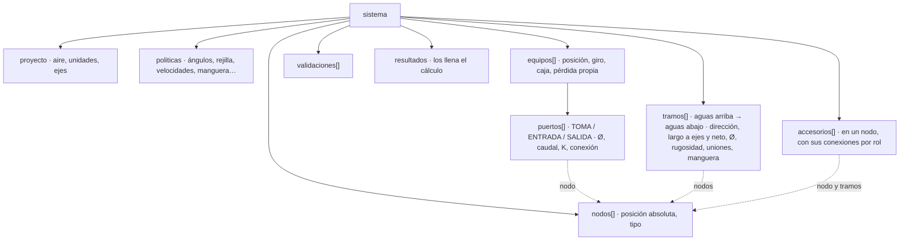

# Trazado unifilar isométrico de redes de extracción

> **Especificación funcional y técnica · COTIZAP · 9-oct-2026.** Para desarrolladores full-stack, diseñadores de producto CAD y proyectistas de ingeniería industrial.
> La acompañan el esquema de datos [`docs/trazado-isometrico.schema.json`](trazado-isometrico.schema.json), el ejemplo resuelto [`docs/ejemplos/trazado-isometrico-ejemplo.json`](ejemplos/trazado-isometrico-ejemplo.json) y la prueba de contrato [`tests/trazado_isometrico_contrato.test.js`](../tests/trazado_isometrico_contrato.test.js). La prueba verifica que el ejemplo cumple el esquema y cada regla de §2 (posiciones, ángulos, manguera, accesorios contra el motor de COTIZAP, caudales, velocidades, choques y fricción), y que este documento trae el esquema y el ejemplo tal como están en sus archivos.

## Índice

0. [Alcance, convenciones y relación con lo que ya existe](#0-alcance-convenciones-y-relación-con-lo-que-ya-existe)
1. [Flujo de usuario paso a paso](#1-flujo-de-usuario-paso-a-paso)
2. [Reglas de negocio y geometría](#2-reglas-de-negocio-y-geometría)
3. [Esquema de datos](#3-esquema-de-datos)
4. [Wireframe textual y layout de la interfaz](#4-wireframe-textual-y-layout-de-la-interfaz)
5. [Implementación por etapas sobre COTIZAP](#5-implementación-por-etapas-sobre-cotizap)
6. [Autoevaluación](#6-autoevaluación)

---

## 0. Alcance, convenciones y relación con lo que ya existe

### 0.1 Qué cubre

El módulo con el que un proyectista arma en isométrico una red de extracción (colección de polvo, material abrasivo, humos o ventilación) desde cada máquina hasta el colector. Las piezas se colocan como bloques que se ajustan solos a lo que se puede fabricar, y el resultado es un grafo con todo lo que necesitan el cálculo de caída de presión y el balanceo.

No calcula las pérdidas: deja el modelo listo para la etapa de cálculo (§3.4). Tampoco es un BIM: la estructura del edificio entra sólo como cajas de obstáculos.

### 0.2 Qué ya existe en COTIZAP y qué agrega esta especificación

**Dibujar unifilar** ([docs/dibujo-unifilar.md](dibujo-unifilar.md)) ya arma la red con trazos y la convierte en partidas con las reglas del unifilar. Esta especificación conserva sus reglas y sus mensajes y las generaliza:

| Tema | Hoy (Dibujar unifilar) | Con esta especificación |
| --- | --- | --- |
| Sentido del trazo | Crece desde el colector hacia las máquinas | Desde cualquier puerto o extremo, en cualquier sentido; el flujo se orienta solo al llegar al colector (§2.9) |
| Equipos | Van al final de un ramal, sin posición propia | Con posición X, Y, Z, giro y caja; varias tomas por máquina, cada una con Ø, caudal y dirección (§1.1) |
| Acople | Clase del equipo (con manguera o con brida) | Manguera resuelta con altura, desvío, radio y punto de transición; brida alineada con el cuello (§2.8) |
| Direcciones | Horizontales cada 15° y verticales | Además inclinadas a ±30°, ±45° y ±60°: 170 direcciones (§2.1) |
| Derivaciones | Injerto lateral a 30° o 45° sobre tronco horizontal | También por arriba y sobre verticales; T a 90° y pantalón como políticas (hoy apagadas); entrada por abajo prohibida (§2.5) |
| Reducciones | Concéntricas | Concéntricas o excéntricas de cara plana abajo según la posición del tramo (§2.4) |
| Diámetros | Los elige el ingeniero | También por caudal y velocidad de transporte, con candado por tramo (§2.6) |
| Puntos fijos | No hay: cambiar un largo mueve lo que sigue | Tomas con brida y bocas del colector son fijas; las mangueras absorben movimiento; las ediciones compensan o se rechazan (§1.3, paso 10) |
| Validación | Giros, injertos, Ø, choques entre ductos | Además velocidades, choques con equipos, altura libre, manguera, distancias entre derivaciones (§2.11) |
| Salida | Lectura del unifilar → despiece y partidas | Grafo para pérdidas y balanceo (§3), y la misma salida a partidas |

### 0.3 Unidades, ejes y sentido

- **Unidades:** longitudes en mm (se muestran en m donde conviene), diámetros en pulgadas de la lista comercial (o mm), caudal en m³/h, velocidad en m/s y presión en Pa.
- **Ejes:** X al este, Y al norte y Z hacia arriba. Z = 0 es el piso terminado. El origen es un punto de la nave que el proyecto nombra.
- **Direcciones:** azimut *a*, contra las manecillas desde +X visto desde arriba, y elevación *e* sobre la horizontal. El vector unitario es u(a, e) = (cos e·cos a, cos e·sen a, sen e). En una vertical (e = ±90°) el azimut vale 0.
- **Sentido:** un tramo se guarda de **aguas arriba** (lado de la toma) a **aguas abajo** (lado del colector), y su dirección es la del aire.

### 0.4 Proyección isométrica

```text
u = (x − y)·cos 30°
v = (x + y)·sen 30° + z
pantalla:  sx = ox + k·u     sy = oy − k·v        (k = px por mm, el acercamiento)
```

- **Ejes en pantalla** (ángulos contra las manecillas desde la horizontal derecha): +X a 30°, +Y a 150° y +Z a 90°; −X a 210°, −Y a 330° y −Z a 270°.
- **Escala:** 1 en los tres ejes. Es dibujo isométrico, no proyección isométrica verdadera: no se aplica el factor 0.816. Una horizontal fuera de los ejes se ve acortada, por ejemplo a 0.707 de su largo a 45°.
- **Lo que no se distingue en pantalla:** la dirección (1, 1, −1) se ve como un punto, y una horizontal a rumbo 45° o 225° se ve vertical, igual que el eje Z. Por eso un trazo nunca se resuelve sólo con la pantalla: siempre hay un **plano de trabajo** (§2.1).
- **Cuatro orientaciones** (cubo de vista): NE es la fórmula de arriba. NO, SO y SE aplican la misma fórmula después de girar el mundo 90°, 180° o 270° sobre Z. Cambiar la vista no cambia los datos.
- **Vistas auxiliares:** planta (x, −y) y elevaciones X–Z (x, −z) e Y–Z (y, −z). En planta una vertical se dibuja como un círculo con su altura.

**Del puntero al espacio.** La pantalla tiene dos coordenadas y el espacio tres, así que el puntero se cruza con el plano de trabajo:

- **Plano horizontal z = z₀:** x − y = u / cos 30° y x + y = 2·(v − z₀).
- **Plano vertical** por P₀ que contiene la horizontal h = (cos a, sen a, 0): P = P₀ + s·h + t·Z, con s = (u − u₀) / ((cos a − sen a)·cos 30°) y t = (v − v₀) − s·(cos a + sen a)·sen 30°.
- **Plano degenerado:** si |cos a − sen a| < 0.25 (rumbo cercano a 45° o 225°), ese plano vertical se ve de canto. La herramienta lo dice y pide girar la vista (teclas Q y E) o pasar a una elevación.

### 0.5 Políticas

Las reglas leen sus límites de las políticas. En COTIZAP salen de las tablas maestras, y el proyecto puede cambiarlas (queda registrado en el JSON). La columna **Origen** dice si el valor ya es del taller o es una referencia por calibrar.

| Política | Por omisión | Origen | Para qué |
| --- | --- | --- | --- |
| `angulos_codo_deg` | 30, 45, 60, 90 | Taller (`proceso.angulos_codo_deg`) | Codos que se fabrican |
| `radio_codo_D` | 1.5 | Taller (`k_R_defecto`) | R = 1.5·D |
| `angulos_injerto_deg` | 30, 45 | Taller (`proceso.angulos_injerto_deg`) | Ángulo β del ramal contra el tronco |
| `permite_t_90` | no | Diseño | En polvo una T a 90° pierde mucho y asienta material |
| `permite_pantalon` | no | Taller (el pantalón se retiró) | Y simétrica |
| `angulos_pantalon_deg` | 30 | Referencia | Ángulo de cada pierna contra el eje |
| `entradas_permitidas` | SUPERIOR, LATERAL | Diseño | Nunca por abajo en tronco horizontal |
| `rejilla` | 15° de azimut; elevaciones 0, ±30, ±45, ±60, ±90 | Diseño | Las direcciones dibujables |
| `paso_largo_mm` · `largo_min_tramo_mm` | 100 · 100 | Diseño | Ajuste del largo y tramo más corto |
| `recto_min_entre_accesorios_mm` | 150 | Taller (bridas) | Tramo recto mínimo entre dos piezas; menos, se pegan (armado de piezas) |
| `recto_antes_de_derivacion_D` | 2 | Referencia | Recto aguas arriba de un injerto, después de un codo (aviso) |
| `distancia_min_entre_derivaciones_D` | 1 | Referencia | Entre dos injertos del mismo tronco |
| `holgura_min_mm` | 50 | Referencia (brida de 1½″ y margen) | Entre ductos y contra equipos |
| `altura_libre_min_mm` | 2 100 | Referencia | Bajo un tramo horizontal |
| `velocidad_min_m_s` · `velocidad_max_m_s` | 18 · 23 (aserrín) | Referencia, por material | Transporte sin asentar y sin desgaste |
| `semiangulo_reduccion_deg` | 15 | Taller (`semiangulo_max_deg`) | Pendiente máxima del cono |
| `reduccion_horizontal` | excéntrica de cara plana abajo (polvo y abrasivo); concéntrica (ventilación y humos) | Diseño | Forma de la reducción en un tramo horizontal |
| `relacion_reduccion_min` | 0.5 | Taller (aviso de COTIZAP) | D₂/D₁ menor que esto se avisa |
| `manguera` | radio mínimo 1.5·D, largo máximo 3 000 mm, puño de 100 mm, rugosidad 1.5 mm | Referencia (fabricante) | Manguera de la toma |
| `rugosidad_mm` | galvanizado 0.09, acero 0.045, inoxidable 0.015 | Referencia | Fricción |
| `diametros_comerciales_in` | 3″ a 24″ | Taller | Diámetros que se fabrican |

---

## 1. Flujo de usuario paso a paso


Las fases son un indicador de pasos arriba del lienzo: se puede volver a cualquiera. La Fase 3 se puede empezar en cuanto haya un puerto.

### 1.0 Fase 0 · Proyecto (una vez)

1. **Nuevo trazado** abre un formulario: nombre, servicio (Polvo, Abrasivo, Ventilación o Humos) y material transportado. El material fija la velocidad mínima y máxima.
2. **Aire:** temperatura y altitud. De ahí salen la presión, la densidad y la viscosidad (§3.4), que se pueden editar.
3. **Unidades de Ø** (pulgadas o mm), descripción del origen y orientación del isométrico (NE por omisión).
4. **Políticas:** vienen de las tablas del taller y se muestran en sólo lectura. **Cambiar para este proyecto** las abre para editarlas.

Sale: `proyecto` y `politicas`.

### 1.1 Fase 1 · Posicionamiento de maquinaria y equipos

1. **Colocar.** De la paleta *Equipos* (Colector, Máquina, Campana o Ventilador) se **arrastra** el bloque al lienzo. Su caja fantasma se apoya en el plano del piso (z = 0, o el nivel activo) y su centro se ajusta a la rejilla del piso cada 100 mm. La barra de estado muestra X e Y mientras se mueve; **soltar** lo coloca. También vale clic en el bloque y luego clic en el lienzo.
2. **Ajuste fino**, con el equipo seleccionado:
   - Flechas: 100 mm en X o Y (Mayús: 10 mm; Alt: 1 mm).
   - RePág y AvPág: suben o bajan la base 100 mm (por ejemplo, para un mezzanine).
   - R gira 15° sobre Z; Mayús+R gira 90°.
   - En el inspector: X, Y, Z, giro, largo × ancho × alto de la caja, nombre y tipo.
3. **Tomas.** Con la máquina seleccionada, **+ Toma** (tecla P) y clic sobre una cara de la caja.
   - El punto se ajusta al centro de la cara, al medio de sus aristas o a una rejilla de 50 mm sobre la cara.
   - La dirección de la toma es la normal de esa cara hacia fuera (cara superior: +Z). En el inspector se puede elegir otra de la rejilla, por ejemplo una toma inclinada a 45°.
   - Una máquina puede tener **varias tomas**; cada una es un puerto independiente.
4. **Datos de cada toma:**
   - Ø de la lista comercial.
   - Caudal de diseño en m³/h.
   - Coeficiente de entrada K (por omisión, el del tipo de campana).
   - Nombre.

   Al escribir el caudal, el inspector muestra v = Q / A con un semáforo: verde si está entre la velocidad mínima y la máxima; ámbar si no, con el Ø comercial que la acerca («Con 6″: 19.8 m/s»).
5. **Colector.** Su boca (una o varias) se define como una toma pero con rol ENTRADA: posición en una cara y Ø. También lleva su caída propia (filtro) en Pa.

**Validaciones de la fase:**

| Situación | Resultado |
| --- | --- |
| Cajas de equipos que se cruzan con su holgura | ERROR |
| Toma sin Ø o sin caudal | No se puede dimensionar (Fase 4) |
| Velocidad fuera de rango | AVISO |

### 1.2 Fase 2 · Acoplamiento y geometría de la conexión

Al seleccionar una toma, el inspector muestra **Acople** con dos opciones: [Manguera] [Brida].

**Manguera flexible**

1. Aparecen dos tiradores sobre la toma:
   - un **rombo**: el **punto de transición** (PT) a ducto rígido, sobre el eje de la toma;
   - un **círculo**: el **desvío** del PT en el plano perpendicular a la toma.
2. **Arrastrar el rombo** a lo largo del eje fija la altura *h* del PT sobre la toma, en pasos de 50 mm. **Arrastrar el círculo** mueve el PT de lado: el desvío *e*, en pasos de 50 mm, en la dirección del puntero. Los campos equivalentes son «Altura del PT», «Desvío» y «Dirección del desvío».
3. **En vivo** se dibuja la manguera (recta, S de dos curvas o codo; §2.8) con su radio, su ángulo y su largo, y un semáforo:
   - **Verde:** radio ≥ radio mínimo y largo ≤ largo máximo.
   - **Ámbar:** el radio alcanza pero el largo pasa del máximo (AVISO MANGUERA_LARGA).
   - **Rojo, con el porqué:** «El desvío de 400 mm en 500 mm de altura pide un radio de 156 mm; la manguera de 5″ necesita 190.5 mm: suba el PT o reduzca el desvío». Con puños de 100 mm quedan h′ = 300 mm y R = (400² + 300²) / (4·400) = 156.25 mm (§2.8.2).
4. El PT queda como **puerto de arranque** de la Fase 3, con la dirección de la toma. El ducto rígido empieza ahí con extremo liso para la abrazadera.

**Conexión directa por bridas**

1. El puerto de arranque es la toma misma. El primer tramo rígido sale con la dirección de la toma; esa dirección no se puede cambiar (**alineado con el cuello**).
2. Antes del primer accesorio va un cuello recto de al menos `recto_min_entre_accesorios_mm`.
3. Si el Ø del ducto no es el de la toma, se inserta un **adaptador** (reducción) pegado a la brida.
4. Se registran los barrenos de la brida del equipo (número, círculo y Ø) si se conocen; si no, se preguntan al cotizar.
5. La toma con brida es un **punto fijo** (§1.3, paso 10).

**Sin acople:** la toma queda pendiente (AVISO) y no impide trazar.

### 1.3 Fase 3 · Trazado unifilar isométrico (juego de construcción)

1. **Empezar.** Se presiona sobre un puerto (PT de una manguera, toma con brida o boca del colector), sobre un extremo libre o sobre un tramo existente para injertar. Sobre algo donde se puede empezar, el cursor se vuelve «+» y el elemento se resalta.
2. **Arrastrar.** Sale un tramo fantasma con el ancho real del Ø activo.
   - La dirección salta a la permitida más cercana al puntero dentro del plano de trabajo, y el largo al paso de 100 mm (§2.1).
   - Junto al cursor, una etiqueta dice «3.40 m · 6″ · codo de 90°».
   - El color del fantasma dice si se puede: verde, ámbar (se puede, con aviso) o rojo (no se puede, con el motivo).
3. **Soltar.** Crea el tramo y el codo si hubo giro. El cursor queda en el extremo nuevo (**modo cadena**): el siguiente arrastre o clic sigue desde ahí. Esc termina la cadena. También funciona clic para empezar y clic para terminar.
4. **Teclear medidas.** Mientras se arrastra, lo que se escribe va a la caja de valores de la barra de estado; Entrar lo aplica:

   | Se escribe | Hace |
   | --- | --- |
   | `3.25` o `3250mm` | Largo de 3.25 m |
   | `<45` | El codo de 45° más cercano al puntero |
   | `@135` | Azimut de 135° |
   | `^45` | Elevación de 45° |

5. **Cambiar de plano o fijar el eje:**

   | Tecla | Hace |
   | --- | --- |
   | ↑ | Fija el eje Z (sube o baja) |
   | → | Fija el eje X |
   | ← | Fija el eje Y |
   | H | Fija el plano horizontal (para trazar una horizontal a 45°, que en pantalla se ve vertical) |
   | V | Plano vertical que contiene el último tramo |
   | Tab | Recorre las tres mejores direcciones |
   | Mayús (sostenida) | Conserva la dirección actual |

6. **Llegar al tronco (imán de derivación).** Al acercar el puntero a menos de 16 px de un tramo cuyo flujo se conoce, la herramienta propone la derivación permitida (§2.5.4):
   - calcula el punto de entrada y, si hace falta, un codo intermedio para que el último tramo entre al ángulo del injerto (30° o 45°), a favor del flujo y por arriba o de lado;
   - muestra la propuesta punteada con sus números; Tab la alterna con las otras (hasta 3);
   - soltar la acepta;
   - si el tronco cambia de Ø ahí, la pieza sale como reducción con injerto.
7. **Llegar al colector.** El imán de la boca hace lo mismo: el último tramo tiene que llegar alineado con el cuello de la boca y, si no, la herramienta propone el codo.
8. **Diámetro del trazo.** Un selector en la barra fija el Ø activo; [ y ] lo bajan o suben un tamaño. La opción «Automático por caudal» (§2.6) lo calcula. Un cambio de Ø entre dos tramos rectos inserta la reducción en el nodo (§2.4).
9. **Seleccionar y ver.** Clic en un tramo o un nodo muestra en el inspector sus medidas, su pieza, su caudal y su velocidad, y la cota neta con lo que ocupa cada accesorio.
10. **Editar con puntos fijos.** Los puntos fijos son las tomas con brida, las bocas del colector y los nodos que el ingeniero ancle. Las mangueras son elásticas: se vuelven a resolver.

    | Edición | Qué hace | Cuándo no se puede |
    | --- | --- | --- |
    | **Cambiar el largo** de un tramo | Traslada lo que queda del lado libre | Si los dos lados llegan a puntos fijos. Entonces el inspector propone **compensar**: reparte el cambio entre tramos paralelos de la misma cadena (§2.2) o lo rechaza con el porqué (FIJO_SE_MUEVE) |
    | **Mover segmento** (M y arrastrar) | Desplaza un tramo en paralelo; sus dos vecinos se alargan o acortan | Si los vecinos no son paralelos al movimiento (por ejemplo, el tramo de en medio de una U se sube o se baja) |
    | **Cambiar el ángulo** de un codo | Gira el lado libre | Con las mismas condiciones de los puntos fijos |
    | **Mover un equipo** | Mueve sus tomas: una manguera se vuelve a resolver; una brida se compensa en su ramal | Si no hay con qué compensar: queda en rojo |

11. **Borrar.** Supr quita el tramo seleccionado y los accesorios que quedan sin uso. Lo que queda aguas arriba es una subred sin colector (ERROR hasta reconectarla). Mayús+Supr quita el ramal completo hasta sus tomas (las máquinas se quedan).
12. **Deshacer.** Ctrl+Z y Ctrl+Y; cada operación, con lo que insertó solo, es un paso (hasta 100).

### 1.4 Fase 4 · Validar y dimensionar

1. **Orientar.** Al quedar conectado a la boca de un colector, cada componente se orienta solo: flechas en los tramos muestran el sentido del aire, y se calcula el caudal de cada tramo.
2. **Dimensionar por caudal** propone el Ø de cada tramo (§2.6) respetando los candados. Antes de aplicar muestra la lista de cambios («TR-003: 6″ → 8″, 33.5 → 18.8 m/s»), con **Aplicar todo** o uno por uno.
3. **Problemas:** la lista por severidad (§2.11). Clic en uno lo selecciona y lo centra. **Corregir** aparece cuando hay un arreglo automático: «Cambiar a 8″», «Insertar adaptador», «Entrar de lado».
4. **Exportar** no se puede mientras haya algo BLOQUEANTE o un ERROR.

### 1.5 Fase 5 · Salida

- **El JSON del sistema** (§3): Copiar o Descargar. En COTIZAP se guarda con la cotización.
- **Partidas de COTIZAP:** pasa por las reglas del unifilar como lectura de origen USUARIO, igual que Dibujar unifilar. Las mangueras salen como compradas y los adaptadores como reducciones.
- **Etapa de cálculo:** recibe el JSON y llena `resultados` (§3.4).

### 1.6 Recorrido del ejemplo, paso a paso

El ejemplo resuelto ([docs/ejemplos/trazado-isometrico-ejemplo.json](ejemplos/trazado-isometrico-ejemplo.json)) se arma así. También sirve como prueba de aceptación de la interfaz.

**Fase 0**

1. Polvo, aserrín y viruta de madera; 20 °C a 2 240 m. Sale ρ = 0.9169 kg/m³.

**Fase 1**

2. **Colector** al origen: caja de 1 500 × 1 500 × 4 000 mm y pérdida de 1 250 Pa. **+ Entrada** en la cara +X a 3 000 mm de altura, Ø 8″.
3. **Máquina** en X = 10 750, Y = 0: caja de 1 200 × 800 × 1 200 mm, «Sierra de banco».
   - **+ Toma** al centro de la cara superior (dirección +Z), Ø 6″ y 1 300 m³/h. Sale 19.8 m/s, en verde.
   - Acople: **Brida**, 6 barrenos en un círculo de 190 mm.
4. **Máquina** en X = 7 000, Y = −3 000: caja de 1 000 × 600 × 1 000 mm, «Cepillo».
   - Toma superior Ø 5″ y 900 m³/h: 19.7 m/s.
   - Acople: **Manguera**. Rombo a 900 mm sobre la toma y círculo a 250 mm hacia +Y. Sale una S de dos curvas de 39.31°, radio 552.5 mm (mínimo 190.5 mm) y 958 mm de largo: verde.

**Fase 3: el tronco**

5. Presionar sobre la toma de la sierra y pulsar ↑ (eje Z). Teclear `1.8` y Entrar: subida de 1.8 m.
6. Arrastrar hacia −X (abajo a la izquierda en pantalla, 210°): codo de 90°.
7. Seguir hasta la boca del colector. El imán la toma a los 10 m y el tramo llega alineado con su cuello. Todo el tronco va de 6″.

**Fase 3: el ramal**

8. Presionar sobre el PT del cepillo, pulsar ↑, teclear `1.1` y Entrar: subida a 3 000 mm.
9. Arrastrar hacia el tronco. El imán propone: codo de 90° y un tramo horizontal a rumbo 135° que entra de lado (izquierda, mirando aguas abajo) a 45°, en X = 4 250, con 3.889 m.
10. Tab mostraría la alternativa a 30°, que entra en X = 2 237 con 5.5 m. Soltar acepta la de 45°.

**Fase 4**

11. **Dimensionar por caudal.** El tronco del injerto al colector lleva 2 200 m³/h: con 6″ irían 33.5 m/s, más que el máximo; con 7″, 24.6 m/s, todavía más. Se propone 8″ (18.8 m/s).
12. Al aplicar, el injerto se vuelve **reducción con injerto** de 8″ a 6″ con ramal de 5″. Su cono ocupa 211.4 mm del tronco (la mitad de cada lado) y su ramal 326.5 mm.
13. Sin problemas.

**Fase 5**

14. El JSON es el del ejemplo. La fricción por camino es 232.04 Pa desde la sierra y 230.65 Pa desde el cepillo (§3.4).

---

## 2. Reglas de negocio y geometría

### 2.1 Direcciones, plano de trabajo y ajuste (snapping)

**2.1.1 Rejilla de direcciones.** D = {u(a, e)}, con a ∈ {0°, 15°, …, 345°} y e ∈ {−60°, −45°, −30°, 0°, 30°, 45°, 60°}, más ±Z: 24 × 7 + 2 = **170 direcciones**. La política `rejilla` las restringe:

| Modo | Direcciones | Cuáles |
| --- | --- | --- |
| Ejes | 6 | ±X, ±Y, ±Z: las de 30°, 90° y 150° en pantalla |
| Ejes y 45° | 26 | Rumbo cada 45° y elevación 0° o ±45° |
| Fina | 170 | Todas |

**2.1.2 Plano de trabajo Π** por el punto de arranque P₀, en este orden:

1. Si hay una tecla de fijar activa (↑ → ← H V), esa.
2. Si el tramo que llega a P₀ es vertical: el plano horizontal.
3. Si el arrastre en pantalla está a menos de ±12° de la vertical y la vertical o una inclinada son permitidas desde P₀: el plano vertical que contiene la proyección horizontal del tramo que llega. Sin tramo que llega, el de la vista que más se ve de frente, X–Z o Y–Z.
4. Si no: el plano horizontal z = z(P₀).

**2.1.3 Candidatas C(P₀).** Son las direcciones d de D contenidas en Π (d·n_Π = 0) que cumplen la regla del punto:

- **En un extremo libre,** con el tramo que llega d_in: el giro θ(d_in, d) es 0° o un ángulo de codo (§2.3).
- **En un puerto con brida o en un PT:** sólo la dirección del puerto.
- **En la mitad de un tramo:** las de la derivación (§2.5).
- **En un arranque abierto:** cualquiera de la rejilla.

**2.1.4 Elección de la dirección.** Q es el cruce del rayo del puntero con Π; v = Q − P₀; d* = la d de C con el mayor v̂·d (el menor ángulo). Hay histéresis de 3°: la dirección elegida sólo cambia si otra es mejor por 3° o más, para que no parpadee. Si C está vacío, el fantasma sale rojo con el motivo («Desde aquí el ducto puede seguir recto, dar vuelta a 30°, 45°, 60° o 90°, subir o bajar»).

**2.1.5 Largo.** L = redondeo((v·d*) / p)·p, con p = `paso_largo_mm` (Mayús: 10 mm; Alt: 1 mm), y L ≥ `largo_min_tramo_mm`. Un valor tecleado manda.

**2.1.6 Ajuste a puntos.** Radio de captura de 12 px con ratón o 20 px con el dedo. En orden de prioridad:

1. Puertos.
2. Extremos libres.
3. Un punto sobre un tramo (derivación).
4. Alineaciones: misma x, y o z que un nodo a menos de 8 px, con una guía punteada del color del eje.
5. Dirección y largo.

Un punto capturado fija el largo exacto, sin redondear, sólo si queda sobre el rayo P₀ + t·d* (a menos de 0.5 mm). Si no queda, se activa el imán (§2.5.4).

**2.1.7 Tolerancias.** Coincidencia geométrica: 0.5 mm. Ángulos: 10⁻⁶ rad. Las posiciones se guardan a 0.001 mm.

### 2.2 Longitudes

- **Convención a ejes:** un tramo va de nodo a nodo, y cada nodo es el cruce de los ejes de los tramos que llegan (el punto de inflexión del codo).
- **Longitud neta** = longitud a ejes − lo que ocupan los accesorios de sus extremos:

  | Accesorio | Ocupa |
  | --- | --- |
  | Codo | R·tan(θ/2) de cada lado |
  | Reducción entre dos tramos | L_red/2 de cada lado |
  | Reducción pegada a un codo o a un equipo | Todo L_red en el tramo menor |
  | Injerto simple | L_cuerpo/2 de cada lado del tronco y L_ramal en el ramal |
  | Reducción con injerto | L_cono/2 de cada lado y L_ramal en el ramal |

  Son los largos que calcula el motor de COTIZAP.
- **Mínimos:**
  - Neta ≥ `recto_min_entre_accesorios_mm`.
  - Entre 0 y ese mínimo: AVISO TRAMO_CORTO, con dos salidas: pegar las dos piezas (armado de piezas, sin bridas en esas caras) o fabricar el tramo corto.
  - Neta < 0: ERROR ACCESORIOS_NO_CABEN.
- **Largos exactos:** los que salen de una restricción (llegar a un puerto, el imán, la compensación) son reales exactos; los de un arrastre libre van al paso.
- **Compensación entre puntos fijos.** Un desplazamiento w de una cadena entre dos puntos fijos se reparte entre sus tramos: w = Σ λᵢ·dᵢ, usando hasta tres direcciones linealmente independientes de la cadena (las de los tramos más largos). Cada tramo debe quedar con Lᵢ + λᵢ ≥ su mínimo. Si las direcciones de la cadena no generan w, no se puede: FIJO_SE_MUEVE.

### 2.3 Codos

- **Ángulo:** θ = arccos(d_in·d_out) debe estar en `angulos_codo_deg` (30°, 45°, 60°, 90°).
  - θ = 0° no lleva pieza: es una unión o una reducción.
  - θ > 90° no se hace de una pieza: la herramienta ofrece dos codos con el recto mínimo entre ellos (135° = 90° + 45°).
- **Geometría:** R = `radio_codo_D`·D; tangente T = R·tan(θ/2); desarrollo R·θ. Los gajos salen de la tabla del taller: con 5 gajos a 90°, el motor de COTIZAP da R = 228.6 mm para 6″. El plano del codo es n = d_in × d_out: sirve para el plano de fabricación (hacia dónde gira la pieza), no para la pérdida.
- **En el espacio:** el ángulo entre dos direcciones de la rejilla no siempre es uno del taller. De una horizontal a rumbo 0° a una inclinada a rumbo 15° y 30° de elevación hay 33.2°, así que esa dirección no aparece como candidata. Sí aparecen combinaciones como de rumbo 0° horizontal a rumbo 45° con 45° de elevación, que dan 60°.
- **Codos seguidos:** con el recto mínimo entre ellos, o pegados (armado de piezas) si el taller lo permite. Un «codo compuesto» es simplemente dos codos en el espacio.
- **Codo con cambio de Ø:** el codo lleva el Ø mayor (aguas abajo) y la reducción va pegada aguas arriba, como en COTIZAP.

### 2.4 Cambios de diámetro y reducciones

- **Dónde se insertan, solas:**
  - en un nodo recto entre dos tramos de distinto Ø;
  - pegada a un codo;
  - en un puerto cuyo Ø no es el del ducto (adaptador);
  - en una derivación: la reducción con injerto.
- **Sentido:** en extracción el Ø **crece hacia el colector**. En todo camino recto, D(aguas abajo) ≥ D(aguas arriba); si no, es BLOQUEANTE (DIAMETRO_DECRECE).
- **Forma:**

  | Tramo | Forma |
  | --- | --- |
  | Vertical o inclinado | Concéntrica |
  | Horizontal, polvo o abrasivo | Excéntrica de **cara plana abajo**: el fondo del ducto sigue parejo y no queda un escalón donde se asiente el material |
  | Horizontal, ventilación o humos | Concéntrica |

- **Largo,** con α = `semiangulo_reduccion_deg`:
  - Concéntrica: L = (D₁ − D₂) / (2·tan α).
  - Excéntrica de cara plana: L = (D₁ − D₂) / tan α. Es el doble, para que la cara inclinada no pase de α. Hoy COTIZAP fabrica la excéntrica (CARA_PLANA) con el largo de la concéntrica, y su cara inclinada queda cerca de 28°: está por confirmar con el taller (§5).
- **Reducción brusca:** D₂/D₁ < `relacion_reduccion_min` es AVISO.

### 2.5 Derivaciones

**2.5.1 Definiciones en el nodo J:**

- t_in: el tronco que entra (aguas arriba).
- t_out: el tronco que sale (hacia el colector).
- b: el ramal.
- m̂ = dir(t_out): la dirección del aire en el tronco. El tronco pasa **recto**: dir(t_in) = m̂ exactamente.
- b̂ = dir(b): la dirección del aire del ramal al llegar a J.
- Ángulo de entrada: **β = arccos(b̂·m̂)**. β < 90° es a favor del flujo.
- Plano de la derivación: n = b̂ × m̂ normalizado.

**2.5.2 Tipos**

| Tipo | Condición | Política |
| --- | --- | --- |
| Injerto simple (`RAMAL` de COTIZAP) | β en `angulos_injerto_deg`; D(t_in) = D(t_out); D(b) ≤ D(t_in) | Siempre |
| Reducción con injerto | El mismo β; D(t_out) > D(t_in) ≥ D(b); el ramal entra sobre el cono | Siempre |
| T a 90° | β = 90° | Con `permite_t_90`. En polvo, no. En ventilación, sí, con AVISO de pérdida alta |
| Pantalón (Y simétrica) | Dos ramales simétricos, cada uno a un ángulo de `angulos_pantalon_deg` del eje, sin tronco recto | Con `permite_pantalon`. Hoy no (el taller lo retiró): se propone el injerto |
| Contra el flujo | β > 90° | Nunca |
| Dos ramales en el mismo punto, o injerto en un codo | — | Nunca: injertos separados (§2.5.5). Excepción: desde un codo de 30° o 45° se puede seguir recto, y el codo queda como injerto (regla de COTIZAP) |

**2.5.3 Por dónde entra el ramal.** En un tronco horizontal, mirando aguas abajo:

- w = la componente de −b̂ perpendicular a m̂;
- **giro φ = atan2(w·(m̂ × Z), w·Z)**: 0° arriba, 90° a la derecha, 270° a la izquierda.

| Entrada | Giro φ | Política |
| --- | --- | --- |
| SUPERIOR | φ ≤ 45° o φ ≥ 315° | Permitida |
| LATERAL | Entre 45° y 135°, o entre 225° y 315° | Permitida |
| INFERIOR | Entre 135° y 225° | Prohibida en polvo: el material cae al ramal y lo tapa |

Con la rejilla fina, para β de 30° o 45° se llega exactamente a tres entradas:

- **Por arriba:** el ramal baja con elevación −β, en el plano vertical del tronco.
- **Por cada lado:** el ramal es horizontal y su aire va a rumbo(m̂) ± β. En el ejemplo el tronco va a 180° y el ramal a 135° (β = 45°, entra por la izquierda).

En un tronco vertical no hay arriba ni abajo: vale cualquier rumbo con β permitido (el ramal con elevación 90° − β respecto del aire que sube).

**2.5.4 El imán de derivación.** Se activa con el puntero a menos de 16 px de un tramo T de eje A + s·m̂ y flujo conocido.

Para cada β permitido y cada entrada permitida se obtiene la dirección final b̂ (de la rejilla), y se buscan dos rutas:

- **(a) Directa.** El rayo P₀ + t·b̂ cruza el eje de T (coplanares, a menos de 0.5 mm) en un s dentro del tramo, dejando lo que ocupan los accesorios en sus extremos. Además, t cabe con sus accesorios y θ(d_in, b̂) es 0° o un ángulo de codo. Sale un tramo, más un codo en P₀ si θ > 0.
- **(b) Con un codo K.** Se resuelve P₀ + t₀·d₀ + t₁·b̂ = A + s·m̂, con d₀ en C(P₀) y θ(d₀, b̂) un ángulo de codo.
  - Con d₀, b̂ y m̂ independientes, son tres ecuaciones con tres incógnitas.
  - Si son coplanares (todo horizontal), son dos ecuaciones: s es la proyección del puntero sobre T y se resuelven t₀ y t₁.
  - Es posible si t₀ y t₁ caben con sus accesorios y s queda dentro del tramo.

**Orden de las propuestas:** menos codos, luego ruta más corta, luego β menor (menos pérdida). Se muestran tres; Tab las recorre. Mover el puntero a lo largo de T cambia s en las rutas (b).

En el ejemplo, desde lo alto de la subida del cepillo:

| Propuesta | Entra en | Largo del último tramo | Codos extra |
| --- | --- | --- | --- |
| 45°, de lado | X = 4 250 | 3.889 m | Ninguno |
| 30°, de lado | X = 2 237 | 5.5 m | Ninguno |

**2.5.5 Distancias:**

- Entre dos derivaciones del mismo tronco: sus cuerpos no se enciman (ERROR) y el recto entre ellas es ≥ `distancia_min_entre_derivaciones_D`·D (AVISO).
- Después de un codo, antes de un injerto: recto ≥ `recto_antes_de_derivacion_D`·D (AVISO).

**2.5.6 Sobre un nodo que ya existe:**

- Una derivación sobre un nodo de reducción lo vuelve reducción con injerto.
- Sobre un codo no se puede, salvo la excepción del codo de 30° o 45° (§2.5.2).

**2.5.7 Flujo conocido.** Una derivación sólo se crea sobre un tramo cuyo sentido del aire ya se sabe: conectado a un colector, o con tomas aguas arriba. Si no, el imán no aparece y la barra de estado lo dice: «Conecte primero este tramo al colector para saber hacia dónde va el aire».

### 2.6 Diámetros, caudales y velocidades

- **Caudal:** Q(tramo) = la suma de los caudales de las tomas aguas arriba. Se calcula al orientar.
- **Velocidad:** v = Q / A, con A = π·D²/4 (D interior). Debe quedar entre `velocidad_min_m_s` y `velocidad_max_m_s`; fuera es AVISO (VELOCIDAD_BAJA asienta material; VELOCIDAD_ALTA desgasta y hace ruido).
- **Dimensionamiento automático,** por tramo y sin tocar los que tienen candado:
  1. D* = el **mayor** Ø comercial con v ≥ v mín. Es el de menor pérdida que todavía transporta.
  2. Si ningún Ø comercial cae en el rango, se toma ese y se avisa.
  3. Se impone la monotonía: si por el redondeo un tramo aguas abajo queda menor que el de arriba, se sube.
  4. Un ramal no puede ser mayor que el tronco que entra (regla del taller). Si el caudal lo pide, se avisa TRONCO_MENOR_QUE_RAMAL: conviene que el ramal sea el tronco. La geometría no se cambia sola.
- **Toma de otro Ø:** si la toma tiene un Ø distinto del ducto, se inserta un adaptador (INFO).

### 2.7 Alturas y elevaciones

- **Piso:** todo punto del ducto debe quedar sobre el piso: z ≥ D/2. Si no, BLOQUEANTE (BAJO_PISO).
- **Altura libre:** bajo un tramo horizontal o inclinado, el fondo z − D/2 ≥ `altura_libre_min_mm` (AVISO). Se puede ajustar por zonas.
- **Niveles con nombre** («Nivel de ductería 3 000»): RePág y AvPág mueven el plano de trabajo un paso. El trazo se ajusta a la z de los niveles y de los nodos cercanos.
- **Pendiente:** en polvo no se pide. Para humos con condensado iría a ≥ 1 % hacia un drenaje (fuera de alcance; quedaría como política).

### 2.8 Tomas y conexiones

**2.8.1 Brida directa**

- El primer tramo empieza en el puerto, con la dirección del puerto exactamente.
- Su Ø es el del puerto, o lleva un adaptador.
- Su extremo es BRIDA_EQUIPO, con el cuello mínimo antes del primer accesorio.
- La toma es un punto fijo.
- En la boca del colector es lo mismo, al revés: el último tramo llega con la dirección contraria a la de la boca.

**2.8.2 Manguera.** Va de la toma P_t, saliendo en la dirección û_t, al punto de transición P_r, donde el ducto rígido sigue en la dirección û_r (la del aire en el primer tramo rígido).

- **Puertos paralelos (û_r = û_t),** el caso de una toma superior con su bajante:
  - h = (P_r − P_t)·û_t y e = ‖(P_r − P_t) − h·û_t‖;
  - h′ = h − 2·puño (lo recto que abrazan las abrazaderas).

  | Caso | Forma | Cálculo | Es posible si |
  | --- | --- | --- | --- |
  | e = 0 | RECTA | L = h | — |
  | e > 0 | S de dos arcos iguales y contrarios | **R = (e² + h′²) / (4·e)**, **α = 2·atan(e / h′)**, **L = 2·R·α + 2·puño** | h′ > 0 y R ≥ `radio_min_D`·D. Con L > `largo_max_mm` se puede, con AVISO MANGUERA_LARGA |

  Comprobación: dos arcos de radio R y ángulo α avanzan 2R·sen α y se desvían 2R·(1 − cos α). Hay otras soluciones, con radios menores y un tramo recto entre los arcos, pero la S más suave es como se acomoda la manguera y es la que se usa para la pérdida.

  En el ejemplo: e = 250 mm, h = 900 mm, puño de 100 mm, h′ = 700 mm. Salen R = 552.5 mm, α = 39.31° y L = 958.1 mm, contra un mínimo de 190.5 mm para 5″.
- **Puertos perpendiculares,** por ejemplo una salida lateral que luego sube: los dos ejes deben cruzarse en un punto K. Con a = ‖K − P_t‖ y b = ‖P_r − K‖, ambos ≥ R mín + puño, es un arco de 90° (forma CODO) con R = min(a, b) − puño y L = (a − R) + (b − R) + π·R/2.
- **Caso general** (otros ángulos o puertos que no están en un plano): forma LIBRE. Es una curva de Bézier cúbica tangente a û_t y a û_r, con manijas de ⅓ de la distancia, muestreada en 64 puntos. El radio de curvatura debe ser ≥ R mín en todos y el largo es la suma de las cuerdas. Si no está en un plano: AVISO MANGUERA_TORCIDA.
- El rígido empieza **liso** (LISA) en el PT y la manguera es un tramo FLEXIBLE con abrazaderas, su rugosidad y las curvas que pierden según R/D.
- **Mover la máquina o el PT** vuelve a resolver la manguera. El PT no es punto fijo; el ducto rígido que sale de él sí sigue las reglas.

### 2.9 Topología

- **Bosque de árboles:** la red es un conjunto de árboles, cada uno con raíz en la boca de un colector.
  - De cada nodo sale a lo más un tramo (aguas abajo).
  - Las tomas son hojas.
  - Un nodo es PUERTO, TRANSICION (PT), VERTICE (codo), UNION (recto: sin pieza si el Ø es igual, reducción si no), DERIVACION (dos que entran y uno que sale) o EXTREMO (abierto).
- **Circuitos:** al unir un trazo con algo que ya existe se revisan las componentes (union-find). Unir dos nodos de la misma componente cerraría un circuito: BLOQUEANTE (CIRCUITO). Una red de extracción es un árbol.
- **Subredes sin colector:** se permiten mientras se dibuja, con el flujo provisional que dan sus tomas. No se pueden exportar (ERROR).
- **Identificadores:** estables y nunca reutilizados (las respuestas y las partidas van por identificador).
- **Fusión:** dos tramos seguidos, rectos, del mismo Ø, sin pieza ni derivación entre ellos, son uno, salvo que el ingeniero haya anclado el nodo (por ejemplo, para un soporte).

### 2.10 Choques

| Revisión | Regla | Resultado |
| --- | --- | --- |
| Ducto contra ducto | Para dos tramos rígidos que no comparten nodo, la distancia mínima entre sus ejes ≥ (D₁ + D₂)/2 + `holgura_min_mm`. Los codos se toman como sus dos tangentes (del lado seguro) | ERROR CHOQUE_DUCTOS |
| Ducto contra equipo | Distancia del eje a la caja girada del equipo ≥ D/2 + holgura, salvo el equipo al que llega el tramo | ERROR CHOQUE_EQUIPO |
| Manguera contra equipo | — | AVISO |
| Piso y altura libre | §2.7 | — |

- **Cálculo:**
  - Segmento contra segmento: los puntos más cercanos en forma cerrada (la función `distanciaSegmentos` de COTIZAP).
  - Segmento contra caja: en el sistema de la caja, contra la caja crecida en el radio más la holgura (prueba de losas del segmento).
  - Fase gruesa: rejilla uniforme de 2 m. Cada segmento entra en las celdas que toca su caja crecida, y sólo se prueba lo que tocó la última operación.
- **Presupuesto:** menos de 8 ms por operación con 500 tramos. Durante el arrastre, el fantasma se prueba contra todo: un choque lo pone ámbar y deja soltar (se puede mover lo otro después), pero impide exportar.

### 2.11 Catálogo de validaciones

| Código | Severidad | Cuándo | Mensaje (ejemplo) | Corrección |
| --- | --- | --- | --- | --- |
| GIRO_NO_FABRICABLE | BLOQUEANTE | θ fuera de `angulos_codo_deg` | «En N-005 el ducto da vuelta 75°: el taller hace codos a 30°, 45°, 60° o 90°.» | El permitido más cercano o dos codos |
| SIN_DIRECCION | BLOQUEANTE | Ninguna candidata en el plano | «Desde N-004 el ducto puede seguir recto, dar vuelta a 30°, 45°, 60° o 90°, subir o bajar.» | Cambiar de plano |
| DERIVACION_NO_PERMITIDA | BLOQUEANTE | T a 90°, pantalón, dos ramales en un punto o injerto en un codo | «El taller no hace T a 90° en polvo: el ramal entra a 30° o 45°.» | Proponer injerto |
| CONTRA_FLUJO | BLOQUEANTE | β > 90° | «El ramal entraría contra el aire del tronco.» | Voltear la entrada |
| ENTRADA_INFERIOR | BLOQUEANTE | φ entre 135° y 225° en tronco horizontal | «Un ramal no entra por abajo: el material lo taparía.» | Arriba o de lado |
| RAMAL_MAYOR | BLOQUEANTE | D(b) > D(t_in) | «Un injerto no puede ser mayor que su tronco (6″).» | Bajar el ramal o cambiar el tronco |
| DIAMETRO_DECRECE | BLOQUEANTE | D aguas abajo < D aguas arriba | «Hacia el colector el diámetro no baja: el tramo anterior es de 8″.» | Subir el Ø |
| CIRCUITO | BLOQUEANTE | Unir dos puntos de la misma red | «Esta unión cerraría un circuito: una red de extracción es un árbol.» | — |
| PUERTO_OCUPADO | BLOQUEANTE | Un puerto que ya tiene ducto | «La toma ya está conectada.» | — |
| BRIDA_DESALINEADA | BLOQUEANTE | El primer tramo no sigue la dirección de la toma | «La brida va alineada con el cuello de la toma (+Z).» | — |
| MANGUERA_IMPOSIBLE | BLOQUEANTE | R < R mín o h′ ≤ 0 | «El desvío de 400 mm en 500 mm de altura pide un radio de 156 mm; la manguera de 5″ necesita 190.5 mm.» | Subir el PT o reducir el desvío |
| BAJO_PISO | BLOQUEANTE | z < D/2 | «El ducto quedaría bajo el piso.» | — |
| LARGO_FUERA_DE_RANGO | BLOQUEANTE | L < mínimo o > 100 m | «El largo de un tramo va de 0.1 m a 100 m.» | — |
| FIJO_SE_MUEVE | BLOQUEANTE | Una edición movería un punto fijo sin con qué compensar | «La sierra (brida) quedaría a 250 mm de su ducto: ningún tramo paralelo puede compensarlo.» | Mover segmento |
| ACCESORIOS_NO_CABEN | ERROR | Neta < 0 | «Los accesorios del tramo TR-006 ocupan más que su largo.» | Alargar o pegar |
| CHOQUE_DUCTOS · CHOQUE_EQUIPO | ERROR | §2.10 | «TR-002 y TR-007 se cruzan: sus ejes pasan a 120 mm y necesitan 330 mm.» | Mover segmento o cambiar el nivel |
| EQUIPOS_ENCIMADOS | ERROR | Cajas que se cruzan | — | — |
| SUBRED_SIN_COLECTOR | ERROR | Una parte no llega a un colector | — | Conectarla |
| TOMA_SIN_CONEXION · TOMA_SIN_DATOS | ERROR | Toma sin acople o sin ducto; sin Ø o sin caudal | — | — |
| VELOCIDAD_BAJA · VELOCIDAD_ALTA | AVISO | Fuera del rango | «TR-003 va a 33.5 m/s (máximo 23): con 8″, 18.8 m/s.» | Dimensionar |
| TRAMO_CORTO | AVISO | 0 < neta < mínimo | «Entre CO-002 y RI-001 quedan 80 mm.» | Pegar o tramo corto |
| DERIVACION_CERCA_DE_CODO · DERIVACIONES_CERCANAS | AVISO | §2.5.5 | — | — |
| ALTURA_LIBRE | AVISO | §2.7 | — | — |
| REDUCCION_BRUSCA | AVISO | D₂/D₁ < 0.5 | — | — |
| T_90_ALTA_PERDIDA | AVISO | Una T permitida (ventilación) | — | — |
| MANGUERA_LARGA · MANGUERA_TORCIDA | AVISO | §2.8.2 | — | — |
| EXTREMO_ABIERTO | AVISO | Un extremo libre sin equipo | — | Equipo o tapa |
| TRONCO_MENOR_QUE_RAMAL | AVISO | §2.6 | — | — |
| REDUCCION_INSERTADA · ADAPTADOR_INSERTADO · CODO_INSERTADO · DIAMETRO_AUTOMATICO · MANGUERA_RESUELTA | INFO | Lo que la herramienta puso sola | «Manguera en S de dos curvas de 39.31°: radio 552.5 mm, 958 mm.» | — |

Donde COTIZAP ya tiene la regla se conserva su mensaje:

| Aquí | En COTIZAP hoy |
| --- | --- |
| GIRO_NO_FABRICABLE | GIRO_NO_PERMITIDO |
| DERIVACION_NO_PERMITIDA | INJERTO_NO_PERMITIDO y CRUCE |
| DIAMETRO_DECRECE | DIAMETRO_CRECE (dicho desde el colector) |
| RAMAL_MAYOR | INJERTO_MAYOR |
| CHOQUE_DUCTOS | CHOQUE |
| EXTREMO_ABIERTO | EXTREMO_SIN_EQUIPO |
| TRAMO_CORTO y ACCESORIOS_NO_CABEN | ACCESORIOS_ENCIMADOS |

**Severidades:**

| Severidad | Qué pasa |
| --- | --- |
| BLOQUEANTE | La operación no se hace: el fantasma sale rojo y al soltar no pasa nada |
| ERROR | Se hace, pero queda marcado e impide exportar |
| AVISO | No impide nada |
| INFO | Registra lo que la herramienta hizo sola |

---

## 3. Esquema de datos

### 3.1 Estructura



### 3.2 Decisiones

- **Objetos cerrados y todo requerido.** Lo opcional va como null y no hay recursión. Así sirve para salidas estructuradas de un modelo (como el esquema de la lectura de unifilares) y se valida estrictamente.
- **Posición absoluta y dirección paramétrica a la vez.** Cada nodo trae su posición y cada tramo su dirección de la rejilla y su largo a ejes. Es redundante a propósito: el cálculo y la exportación leen posiciones, la edición lee direcciones y largos, y el invariante de §3.3 las ata.
- **Tramos orientados en el sentido del aire.** El caudal se acumula siguiendo `nodo_aguas_abajo`.
- **Accesorios en los nodos con sus conexiones por rol** (ENTRADA, SALIDA, RAMAL). Su `geometria` trae lo que pide su modelo de pérdida y lo que pide fabricarlo; `familia_cotizap` lo liga a la partida.
- **Manguera como tramo FLEXIBLE** con su geometría resuelta. El punto de transición es un nodo propio.
- **Unidades en los nombres** (`_mm`, `_in`, `_m3_h`, `_Pa`).

### 3.3 Invariantes que el esquema no puede expresar

Los verifica [`tests/trazado_isometrico_contrato.test.js`](../tests/trazado_isometrico_contrato.test.js) sobre el ejemplo, y los debe verificar la herramienta al guardar:

1. **Identificadores** únicos; toda referencia existe; un nodo PUERTO, y sólo él, lleva su puerto.
2. **Árbol:** de cada nodo sale a lo más un tramo, todo nodo llega a la boca de un colector, de la boca no sale nada y las tomas son hojas.
3. **Posiciones:**
   - puerto = posición del equipo + local girada;
   - en un rígido, aguas abajo = aguas arriba + L·u(dirección), a 0.01 mm;
   - en una vertical el azimut es 0;
   - toda dirección está en la rejilla.
4. **Bridas:** el primer tramo de una toma sale con su dirección y el último llega a la boca con la contraria; su unión es BRIDA_EQUIPO.
5. **Manguera:** h y e salen de las posiciones; R, α y L cumplen las fórmulas de §2.8.2; R ≥ R mín, y L ≤ L máx o el AVISO MANGUERA_LARGA en `validaciones`; el rígido sigue LISA.
6. **Codos:** θ = ángulo entre sus tramos, en la política; R = radio_codo_D·D; T = R·tan(θ/2) descontado de cada lado; gajos y largos iguales a los del motor de COTIZAP.
7. **Derivaciones:**
   - tronco recto; β en la política y < 90°;
   - giro φ y entrada permitidos;
   - Ø: salida ≥ entrada ≥ ramal;
   - plano = ramal × salida;
   - largo del cono y del ramal iguales a los del motor.
8. **Longitudes:** neta = a ejes − Σ descuentos ≥ recto mínimo.
9. **Diámetros y caudales:**
   - Ø interior = Ø·25.4;
   - comerciales;
   - caudal = Σ tomas aguas arriba;
   - velocidad en su rango;
   - Ø no baja hacia el colector;
   - al colector llega la suma de las tomas.
10. **Choques:** entre ductos, contra equipos y altura libre.

### 3.4 Lo que necesita el cálculo de pérdidas, y cómo lo usa

| Término | Datos del JSON | Cálculo |
| --- | --- | --- |
| Aire | `proyecto.aire` | p = 101 325·(1 − 2.25577·10⁻⁵·h)^5.25588; ρ = p / (287.05·T); μ de Sutherland = 1.458·10⁻⁶·T^1.5 / (T + 110.4) |
| Velocidad y presión dinámica | `caudal_m3_h`, `diametro_interior_mm` | v = Q/A; pv = ρ·v²/2 |
| Fricción de cada tramo (rígido o manguera) | `longitud_neta_mm`, `rugosidad_mm` | Re = ρ·v·D/μ; f de Swamee-Jain = 0.25 / [log₁₀(ε/(3.7·D) + 5.74/Re^0.9)]²; Δp = f·(L/D)·pv |
| Codo | `geometria.angulo_deg`, `radio_eje_mm`, `gajos` | Δp = K(θ, R/D, gajos)·pv |
| Reducción o expansión | Ø de sus conexiones, `semiangulo_deg`, `forma`, sentido (por los roles) | K(α, A₁/A₂) sobre la pv de la sección menor |
| Injerto, reducción con injerto, T, pantalón | `angulo_deg` (β), Ø de ENTRADA, SALIDA y RAMAL; caudales de esos tramos | K_ramal y K_paso de tablas de confluencia en función de β, Q_ramal/Q_salida, A_ramal/A_salida y A_entrada/A_salida, sobre la pv de la salida |
| Manguera | El tramo FLEXIBLE (L, ε) y sus curvas (`radio_mm`, `angulo_curva_deg`, `curvas`) | Fricción más K de curva por R/D |
| Toma | `coef_entrada_K` | Presión estática en la campana = (1 + K)·pv (acelerar el aire más la entrada) |
| Colector | `perdida_Pa` | Se suma al camino crítico |

**Camino y balanceo.** Para cada toma, `por_toma.camino` es la lista de tramos hasta el colector, y su pérdida es la suma de fricción y locales. En cada derivación se comparan las presiones estáticas de las dos corrientes que llegan (método de balance por diseño del manual *Industrial Ventilation* de la ACGIH):

| Relación SP mayor / SP menor | Acción |
| --- | --- |
| ≤ 1.2 | Subir el caudal de la corriente de menor pérdida: Q′ = Q·√(SP_mayor / SP_menor) (AJUSTAR_CAUDAL) |
| > 1.2 | Redimensionar esa corriente (REDIMENSIONAR) |
| Alternativa | Compuerta de regulación (COMPUERTA); poco recomendable con polvo abrasivo |

El ventilador se elige con el camino de mayor pérdida más el colector.

**El ejemplo, sólo con fricción** (`resultados.por_tramo`, calculado con lo que trae el JSON; las pérdidas locales quedan para la tabla de coeficientes):

| Tramo | Q (m³/h) | v (m/s) | pv (Pa) | Re | f | Neta (mm) | Δp fricción (Pa) |
| --- | --- | --- | --- | --- | --- | --- | --- |
| TR-001 subida de la sierra (6″) | 1 300 | 19.796 | 179.66 | 152 577 | 0.0199 | 1 571.4 | 36.81 |
| TR-002 tronco 6″ | 1 300 | 19.796 | 179.66 | 152 577 | 0.0199 | 6 165.69 | 144.42 |
| TR-003 tronco 8″ al colector | 2 200 | 18.844 | 162.80 | 193 656 | 0.0187 | 3 394.29 | 50.81 |
| TR-004 manguera 5″ | 900 | 19.735 | 178.56 | 126 757 | 0.0408 | 958.08 | 54.91 |
| TR-005 bajante 5″ | 900 | 19.735 | 178.56 | 126 757 | 0.0208 | 909.5 | 26.54 |
| TR-006 ramal 5″ a 45° | 900 | 19.735 | 178.56 | 126 757 | 0.0208 | 3 372.05 | 98.39 |

Por camino: **232.04 Pa** desde la sierra (TR-001, TR-002, TR-003) y **230.65 Pa** desde el cepillo (TR-004, TR-005, TR-006, TR-003). Con los K de los dos codos, la entrada de cada toma y la confluencia se completan las presiones de cada corriente en N-002 y se aplica el balanceo.

### 3.5 Esquema completo

[`docs/trazado-isometrico.schema.json`](trazado-isometrico.schema.json):

```json
{
  "$schema": "https://json-schema.org/draft/2020-12/schema",
  "$id": "https://cotizap.local/esquemas/trazado-isometrico.schema.json",
  "title": "Red de extracción trazada en isométrico (docs/trazado-isometrico.md §3)",
  "description": "Árbol dirigido hacia el colector: equipos con sus puertos, nodos con posición absoluta, tramos rígidos y flexibles orientados en el sentido del aire, accesorios en los nodos y lo necesario para calcular pérdidas y balancear. Objetos cerrados y todo requerido (lo opcional va como null).",
  "type": "object",
  "additionalProperties": false,
  "required": ["version", "proyecto", "politicas", "equipos", "nodos", "tramos", "accesorios", "validaciones", "resultados"],
  "properties": {
    "version": { "const": "1.0" },
    "proyecto": { "$ref": "#/$defs/proyecto" },
    "politicas": { "$ref": "#/$defs/politicas" },
    "equipos": { "type": "array", "minItems": 1, "items": { "$ref": "#/$defs/equipo" } },
    "nodos": { "type": "array", "items": { "$ref": "#/$defs/nodo" } },
    "tramos": { "type": "array", "items": { "$ref": "#/$defs/tramo" } },
    "accesorios": { "type": "array", "items": { "$ref": "#/$defs/accesorio" } },
    "validaciones": { "type": "array", "items": { "$ref": "#/$defs/validacion" } },
    "resultados": { "anyOf": [{ "type": "null" }, { "$ref": "#/$defs/resultados" }] }
  },
  "$defs": {
    "id_equipo": { "type": "string", "pattern": "^EQ-[0-9]{2,3}$" },
    "id_puerto": { "type": "string", "pattern": "^PU-[0-9]{2,3}$" },
    "id_nodo": { "type": "string", "pattern": "^N-[0-9]{3,4}$" },
    "id_tramo": { "type": "string", "pattern": "^TR-[0-9]{3,4}$" },
    "id_accesorio": { "type": "string", "pattern": "^(CO|RE|AD|IN|RI|PA|TE|CP)-[0-9]{3,4}$" },
    "id_elemento": { "type": "string", "pattern": "^(EQ|PU|N|TR|CO|RE|AD|IN|RI|PA|TE|CP)-[0-9]{2,4}$" },
    "nodo_o_null": { "anyOf": [{ "type": "null" }, { "$ref": "#/$defs/id_nodo" }] },
    "tramo_o_null": { "anyOf": [{ "type": "null" }, { "$ref": "#/$defs/id_tramo" }] },
    "accesorio_o_null": { "anyOf": [{ "type": "null" }, { "$ref": "#/$defs/id_accesorio" }] },
    "puerto_o_null": { "anyOf": [{ "type": "null" }, { "$ref": "#/$defs/id_puerto" }] },
    "numero_o_null": { "type": ["number", "null"] },
    "vector_mm": {
      "type": "object",
      "additionalProperties": false,
      "required": ["x", "y", "z"],
      "description": "Milímetros. X al este, Y al norte, Z hacia arriba; Z = 0 es el piso terminado.",
      "properties": { "x": { "type": "number" }, "y": { "type": "number" }, "z": { "type": "number" } }
    },
    "vector_unitario": {
      "type": "object",
      "additionalProperties": false,
      "required": ["x", "y", "z"],
      "properties": { "x": { "type": "number", "minimum": -1, "maximum": 1 }, "y": { "type": "number", "minimum": -1, "maximum": 1 }, "z": { "type": "number", "minimum": -1, "maximum": 1 } }
    },
    "direccion": {
      "type": "object",
      "additionalProperties": false,
      "required": ["azimut_deg", "elevacion_deg"],
      "description": "Una dirección de la rejilla: u = (cos e·cos a, cos e·sen a, sen e). Azimut contra las manecillas desde +X, en pasos de politicas.rejilla.paso_azimut_deg; en una vertical (±90°) el azimut es 0.",
      "properties": {
        "azimut_deg": { "type": "number", "minimum": 0, "maximum": 345, "multipleOf": 15 },
        "elevacion_deg": { "type": "number", "enum": [-90, -60, -45, -30, 0, 30, 45, 60, 90] }
      }
    },
    "union": {
      "type": "string",
      "enum": ["BRIDA", "BRIDA_EQUIPO", "ENGARGOLADA", "SOLDADA", "ABRAZADERA", "LISA", "ABIERTA"],
      "description": "Cómo termina un tramo: brida del taller, contra la brida de un equipo, pegado a un accesorio (engargolado o soldado), con abrazadera (manguera), liso para la manguera o abierto."
    },
    "proyecto": {
      "type": "object",
      "additionalProperties": false,
      "required": ["id", "nombre", "servicio", "material_transportado", "aire", "unidades", "ejes", "origen", "vista_iso"],
      "properties": {
        "id": { "type": "string" },
        "nombre": { "type": "string" },
        "servicio": { "type": "string", "enum": ["POLVO", "ABRASIVO", "VENTILACION", "HUMOS"] },
        "material_transportado": { "type": ["string", "null"] },
        "aire": {
          "type": "object",
          "additionalProperties": false,
          "required": ["temperatura_C", "altitud_m", "presion_Pa", "densidad_kg_m3", "viscosidad_Pa_s"],
          "properties": {
            "temperatura_C": { "type": "number" },
            "altitud_m": { "type": "number" },
            "presion_Pa": { "type": "number", "minimum": 0 },
            "densidad_kg_m3": { "type": "number", "minimum": 0 },
            "viscosidad_Pa_s": { "type": "number", "minimum": 0 }
          }
        },
        "unidades": {
          "type": "object",
          "additionalProperties": false,
          "required": ["longitud", "diametro", "caudal", "presion", "velocidad"],
          "properties": {
            "longitud": { "const": "mm" },
            "diametro": { "type": "string", "enum": ["in", "mm"] },
            "caudal": { "const": "m3/h" },
            "presion": { "const": "Pa" },
            "velocidad": { "const": "m/s" }
          }
        },
        "ejes": { "const": "X_ESTE_Y_NORTE_Z_ARRIBA" },
        "origen": { "type": "string", "description": "Qué punto de la nave es (0, 0, 0)." },
        "vista_iso": { "type": "string", "enum": ["NE", "NO", "SE", "SO"], "description": "Desde dónde se mira el isométrico (sólo cambia el dibujo, no los datos)." }
      }
    },
    "politicas": {
      "type": "object",
      "additionalProperties": false,
      "description": "Lo que el taller fabrica y los criterios de diseño. Salen de las tablas maestras; cambiar una política cambia lo que el trazo ofrece y lo que se valida.",
      "required": ["angulos_codo_deg", "radio_codo_D", "angulos_injerto_deg", "permite_t_90", "permite_pantalon", "angulos_pantalon_deg", "entradas_permitidas", "rejilla",
        "paso_largo_mm", "largo_min_tramo_mm", "recto_min_entre_accesorios_mm", "recto_antes_de_derivacion_D", "distancia_min_entre_derivaciones_D", "holgura_min_mm",
        "altura_libre_min_mm", "velocidad_min_m_s", "velocidad_max_m_s", "semiangulo_reduccion_deg", "reduccion_horizontal", "relacion_reduccion_min", "manguera",
        "rugosidad_mm", "diametros_comerciales_in"],
      "properties": {
        "angulos_codo_deg": { "type": "array", "minItems": 1, "items": { "type": "number", "minimum": 1, "maximum": 90 } },
        "radio_codo_D": { "type": "number", "minimum": 0.5 },
        "angulos_injerto_deg": { "type": "array", "minItems": 1, "items": { "type": "number", "minimum": 1, "maximum": 90 } },
        "permite_t_90": { "type": "boolean" },
        "permite_pantalon": { "type": "boolean" },
        "angulos_pantalon_deg": { "type": "array", "items": { "type": "number", "minimum": 1, "maximum": 90 }, "description": "Ángulo de cada pierna contra el eje del pantalón." },
        "entradas_permitidas": { "type": "array", "items": { "type": "string", "enum": ["SUPERIOR", "LATERAL", "INFERIOR"] } },
        "rejilla": {
          "type": "object",
          "additionalProperties": false,
          "required": ["paso_azimut_deg", "elevaciones_deg"],
          "properties": {
            "paso_azimut_deg": { "type": "number", "enum": [15, 45, 90] },
            "elevaciones_deg": { "type": "array", "items": { "type": "number", "enum": [-90, -60, -45, -30, 0, 30, 45, 60, 90] } }
          }
        },
        "paso_largo_mm": { "type": "number", "minimum": 1 },
        "largo_min_tramo_mm": { "type": "number", "minimum": 0 },
        "recto_min_entre_accesorios_mm": { "type": "number", "minimum": 0 },
        "recto_antes_de_derivacion_D": { "type": "number", "minimum": 0 },
        "distancia_min_entre_derivaciones_D": { "type": "number", "minimum": 0 },
        "holgura_min_mm": { "type": "number", "minimum": 0 },
        "altura_libre_min_mm": { "type": "number", "minimum": 0 },
        "velocidad_min_m_s": { "type": "number", "minimum": 0 },
        "velocidad_max_m_s": { "type": "number", "minimum": 0 },
        "semiangulo_reduccion_deg": { "type": "number", "minimum": 1, "maximum": 45 },
        "reduccion_horizontal": { "type": "string", "enum": ["CONCENTRICA", "EXCENTRICA_PLANA_ABAJO"] },
        "relacion_reduccion_min": { "type": "number", "minimum": 0, "maximum": 1 },
        "manguera": {
          "type": "object",
          "additionalProperties": false,
          "required": ["radio_min_D", "largo_max_mm", "puno_mm", "rugosidad_mm"],
          "properties": {
            "radio_min_D": { "type": "number", "minimum": 0 },
            "largo_max_mm": { "type": "number", "minimum": 0 },
            "puno_mm": { "type": "number", "minimum": 0, "description": "Lo recto de cada punta que abraza la abrazadera." },
            "rugosidad_mm": { "type": "number", "minimum": 0 }
          }
        },
        "rugosidad_mm": {
          "type": "object",
          "additionalProperties": false,
          "required": ["GALVANIZADO", "ACERO_CARBON", "INOX_304", "INOX_316"],
          "properties": {
            "GALVANIZADO": { "type": "number", "minimum": 0 }, "ACERO_CARBON": { "type": "number", "minimum": 0 },
            "INOX_304": { "type": "number", "minimum": 0 }, "INOX_316": { "type": "number", "minimum": 0 }
          }
        },
        "diametros_comerciales_in": { "type": "array", "minItems": 1, "items": { "type": "number", "minimum": 1 } }
      }
    },
    "equipo": {
      "type": "object",
      "additionalProperties": false,
      "required": ["id", "tipo", "nombre", "posicion_mm", "rotacion_z_deg", "caja_mm", "perdida_Pa", "puertos"],
      "properties": {
        "id": { "$ref": "#/$defs/id_equipo" },
        "tipo": { "type": "string", "enum": ["COLECTOR", "MAQUINA", "CAMPANA", "VENTILADOR"] },
        "nombre": { "type": "string" },
        "posicion_mm": { "$ref": "#/$defs/vector_mm", "description": "El centro de la base del equipo." },
        "rotacion_z_deg": { "type": "number", "minimum": 0, "maximum": 345, "multipleOf": 15 },
        "caja_mm": {
          "type": "object",
          "additionalProperties": false,
          "required": ["largo", "ancho", "alto"],
          "description": "La caja que ocupa el equipo, en sus ejes locales (largo en x, ancho en y, alto en z): para los choques.",
          "properties": { "largo": { "type": "number", "minimum": 0 }, "ancho": { "type": "number", "minimum": 0 }, "alto": { "type": "number", "minimum": 0 } }
        },
        "perdida_Pa": { "$ref": "#/$defs/numero_o_null", "description": "Caída de presión propia (el filtro del colector); null en una máquina." },
        "puertos": { "type": "array", "minItems": 1, "items": { "$ref": "#/$defs/puerto" } }
      }
    },
    "puerto": {
      "type": "object",
      "additionalProperties": false,
      "required": ["id", "rol", "nombre", "posicion_local_mm", "direccion_local", "posicion_mm", "direccion", "diametro_in", "caudal_m3_h", "coef_entrada_K", "nodo", "conexion"],
      "properties": {
        "id": { "$ref": "#/$defs/id_puerto" },
        "rol": { "type": "string", "enum": ["TOMA", "ENTRADA", "SALIDA"], "description": "TOMA: punto de captura de una máquina. ENTRADA: boca del colector. SALIDA: descarga (ventilador)." },
        "nombre": { "type": "string" },
        "posicion_local_mm": { "$ref": "#/$defs/vector_mm" },
        "direccion_local": { "$ref": "#/$defs/direccion", "description": "Hacia dónde sale el ducto del puerto, hacia fuera del equipo." },
        "posicion_mm": { "$ref": "#/$defs/vector_mm", "description": "posicion_mm del equipo + la local girada rotacion_z_deg." },
        "direccion": { "$ref": "#/$defs/direccion" },
        "diametro_in": { "type": "number", "minimum": 1 },
        "caudal_m3_h": { "$ref": "#/$defs/numero_o_null", "description": "TOMA: el caudal de diseño. ENTRADA o SALIDA: null (se calcula)." },
        "coef_entrada_K": { "$ref": "#/$defs/numero_o_null", "description": "Pérdida de entrada de la toma en presiones dinámicas; null si no aplica." },
        "nodo": { "$ref": "#/$defs/id_nodo" },
        "conexion": { "$ref": "#/$defs/conexion" }
      }
    },
    "conexion": {
      "type": "object",
      "additionalProperties": false,
      "required": ["tipo", "nodo_transicion", "tramo_flexible", "adaptador", "barrenos"],
      "properties": {
        "tipo": { "type": "string", "enum": ["MANGUERA", "BRIDA"] },
        "nodo_transicion": { "$ref": "#/$defs/nodo_o_null", "description": "MANGUERA: el punto de transición, donde empieza el ducto rígido." },
        "tramo_flexible": { "$ref": "#/$defs/tramo_o_null", "description": "MANGUERA: el tramo FLEXIBLE." },
        "adaptador": { "$ref": "#/$defs/accesorio_o_null", "description": "La reducción o ampliación en el puerto, si su Ø no es el del ducto." },
        "barrenos": {
          "anyOf": [
            { "type": "null" },
            {
              "type": "object",
              "additionalProperties": false,
              "required": ["numero", "circulo_mm", "diametro_mm"],
              "properties": { "numero": { "type": "integer", "minimum": 0 }, "circulo_mm": { "type": "number", "minimum": 0 }, "diametro_mm": { "type": "number", "minimum": 0 } }
            }
          ],
          "description": "BRIDA: el patrón de la brida del equipo, si se conoce."
        }
      }
    },
    "nodo": {
      "type": "object",
      "additionalProperties": false,
      "required": ["id", "tipo", "posicion_mm", "puerto", "accesorios", "tramos"],
      "properties": {
        "id": { "$ref": "#/$defs/id_nodo" },
        "tipo": { "type": "string", "enum": ["PUERTO", "TRANSICION", "VERTICE", "UNION", "DERIVACION", "EXTREMO"] },
        "posicion_mm": { "$ref": "#/$defs/vector_mm", "description": "Absoluta, al eje: el punto de intersección de los ejes de los tramos que llegan." },
        "puerto": { "$ref": "#/$defs/puerto_o_null" },
        "accesorios": { "type": "array", "items": { "$ref": "#/$defs/id_accesorio" } },
        "tramos": { "type": "array", "items": { "$ref": "#/$defs/id_tramo" } }
      }
    },
    "tramo": {
      "type": "object",
      "additionalProperties": false,
      "required": ["id", "tipo", "nodo_aguas_arriba", "nodo_aguas_abajo", "direccion", "longitud_ejes_mm", "descuentos", "longitud_neta_mm", "diametro_in", "diametro_interior_mm",
        "diametro_bloqueado", "material", "calibre", "rugosidad_mm", "uniones", "flexible", "caudal_m3_h", "velocidad_m_s"],
      "properties": {
        "id": { "$ref": "#/$defs/id_tramo" },
        "tipo": { "type": "string", "enum": ["RIGIDO", "FLEXIBLE"] },
        "nodo_aguas_arriba": { "$ref": "#/$defs/id_nodo", "description": "De donde viene el aire (lado de la toma)." },
        "nodo_aguas_abajo": { "$ref": "#/$defs/id_nodo", "description": "Hacia donde va el aire (lado del colector)." },
        "direccion": { "anyOf": [{ "type": "null" }, { "$ref": "#/$defs/direccion" }], "description": "RIGIDO: la del aire. FLEXIBLE: null (es una curva)." },
        "longitud_ejes_mm": { "type": "number", "minimum": 0, "description": "RIGIDO: de nodo a nodo. FLEXIBLE: el largo de la manguera sobre su eje." },
        "descuentos": {
          "type": "array",
          "items": {
            "type": "object",
            "additionalProperties": false,
            "required": ["accesorio", "mm"],
            "properties": { "accesorio": { "$ref": "#/$defs/id_accesorio" }, "mm": { "type": "number", "minimum": 0 } }
          }
        },
        "longitud_neta_mm": { "type": "number", "description": "longitud_ejes_mm − Σ descuentos: el tramo recto que se fabrica (y el que tiene fricción)." },
        "diametro_in": { "type": "number", "minimum": 1 },
        "diametro_interior_mm": { "type": "number", "minimum": 0 },
        "diametro_bloqueado": { "type": "boolean", "description": "El ingeniero lo fijó: el dimensionamiento automático no lo cambia." },
        "material": { "type": "string", "enum": ["GALVANIZADO", "ACERO_CARBON", "INOX_304", "INOX_316", "MANGUERA"] },
        "calibre": { "type": ["integer", "null"] },
        "rugosidad_mm": { "type": "number", "minimum": 0 },
        "uniones": {
          "type": "object",
          "additionalProperties": false,
          "required": ["aguas_arriba", "aguas_abajo"],
          "properties": { "aguas_arriba": { "$ref": "#/$defs/union" }, "aguas_abajo": { "$ref": "#/$defs/union" } }
        },
        "flexible": { "anyOf": [{ "type": "null" }, { "$ref": "#/$defs/flexible" }] },
        "caudal_m3_h": { "$ref": "#/$defs/numero_o_null", "description": "La suma de las tomas aguas arriba (se calcula al orientar el árbol)." },
        "velocidad_m_s": { "$ref": "#/$defs/numero_o_null" }
      }
    },
    "flexible": {
      "type": "object",
      "additionalProperties": false,
      "required": ["forma", "radio_mm", "angulo_curva_deg", "curvas", "desvio_mm", "altura_mm", "tramo_recto_mm", "puno_mm", "normal_plano"],
      "description": "La manguera de la toma al punto de transición (§2.8).",
      "properties": {
        "forma": { "type": "string", "enum": ["RECTA", "S", "CODO", "LIBRE"] },
        "radio_mm": { "$ref": "#/$defs/numero_o_null" },
        "angulo_curva_deg": { "$ref": "#/$defs/numero_o_null" },
        "curvas": { "type": "integer", "minimum": 0 },
        "desvio_mm": { "type": "number", "minimum": 0, "description": "e: lo que se separan los ejes de la toma y del punto de transición." },
        "altura_mm": { "type": "number", "description": "h: la distancia a lo largo de la dirección de la toma." },
        "tramo_recto_mm": { "type": "number", "minimum": 0 },
        "puno_mm": { "type": "number", "minimum": 0 },
        "normal_plano": { "anyOf": [{ "type": "null" }, { "$ref": "#/$defs/vector_unitario" }] }
      }
    },
    "accesorio": {
      "type": "object",
      "additionalProperties": false,
      "required": ["id", "tipo", "nodo", "conexiones", "geometria", "perdida", "familia_cotizap"],
      "properties": {
        "id": { "$ref": "#/$defs/id_accesorio" },
        "tipo": { "type": "string", "enum": ["CODO", "REDUCCION", "ADAPTADOR", "INJERTO", "REDUCCION_INJERTO", "PANTALON", "T_90", "COMPUERTA"] },
        "nodo": { "$ref": "#/$defs/id_nodo" },
        "conexiones": {
          "type": "array",
          "minItems": 2,
          "items": {
            "type": "object",
            "additionalProperties": false,
            "required": ["rol", "tramo", "diametro_in"],
            "properties": {
              "rol": { "type": "string", "enum": ["ENTRADA", "SALIDA", "RAMAL", "RAMAL_2"], "description": "En el sentido del aire: ENTRADA (aguas arriba del tronco), SALIDA (hacia el colector), RAMAL." },
              "tramo": { "$ref": "#/$defs/id_tramo" },
              "diametro_in": { "type": "number", "minimum": 1 }
            }
          }
        },
        "geometria": { "$ref": "#/$defs/geometria_accesorio" },
        "perdida": {
          "type": "object",
          "additionalProperties": false,
          "required": ["modelo", "K_paso", "K_ramal", "referencia"],
          "description": "Con qué se calcula su pérdida local; los K los llena la etapa de cálculo con la tabla de coeficientes.",
          "properties": {
            "modelo": { "type": "string", "enum": ["CODO_GAJOS", "EXPANSION", "CONTRACCION", "CONFLUENCIA_RAMAL", "CONFLUENCIA_PANTALON", "CONFLUENCIA_T", "COMPUERTA"] },
            "K_paso": { "$ref": "#/$defs/numero_o_null" },
            "K_ramal": { "$ref": "#/$defs/numero_o_null" },
            "referencia": { "type": ["string", "null"] }
          }
        },
        "familia_cotizap": { "type": ["string", "null"], "enum": ["CODO", "REDUCCION", "RAMAL", "REDUCCION_INJERTO", "PANTALON", "TRANSICION", null] }
      }
    },
    "geometria_accesorio": {
      "type": "object",
      "additionalProperties": false,
      "required": ["angulo_deg", "radio_eje_mm", "tangente_mm", "gajos", "normal_plano", "giro_entrada_deg", "entrada", "forma", "semiangulo_deg", "largo_mm", "largo_ramal_mm"],
      "properties": {
        "angulo_deg": { "$ref": "#/$defs/numero_o_null", "description": "CODO: θ. INJERTO, REDUCCION_INJERTO, T_90: β (ramal contra el tronco). PANTALON: cada pierna contra el eje." },
        "radio_eje_mm": { "$ref": "#/$defs/numero_o_null" },
        "tangente_mm": { "$ref": "#/$defs/numero_o_null", "description": "CODO: R·tan(θ/2), lo que ocupa de cada tramo." },
        "gajos": { "type": ["integer", "null"] },
        "normal_plano": { "anyOf": [{ "type": "null" }, { "$ref": "#/$defs/vector_unitario" }], "description": "El plano del codo o de la derivación (para el plano de fabricación)." },
        "giro_entrada_deg": { "$ref": "#/$defs/numero_o_null", "description": "Derivación en tronco horizontal: dónde entra el ramal, mirando aguas abajo; 0 arriba, 90 a la derecha, 270 a la izquierda." },
        "entrada": { "type": ["string", "null"], "enum": ["SUPERIOR", "LATERAL", "INFERIOR", null] },
        "forma": { "type": ["string", "null"], "enum": ["CONCENTRICA", "EXCENTRICA_PLANA_ABAJO", "EXCENTRICA_PLANA_ARRIBA", null] },
        "semiangulo_deg": { "$ref": "#/$defs/numero_o_null" },
        "largo_mm": { "$ref": "#/$defs/numero_o_null", "description": "Largo del cuerpo (reducción, cono de la reducción con injerto, cuerpo del injerto)." },
        "largo_ramal_mm": { "$ref": "#/$defs/numero_o_null" }
      }
    },
    "validacion": {
      "type": "object",
      "additionalProperties": false,
      "required": ["codigo", "severidad", "elementos", "mensaje", "sugerencia"],
      "properties": {
        "codigo": { "type": "string", "pattern": "^[A-Z0-9_]+$" },
        "severidad": { "type": "string", "enum": ["BLOQUEANTE", "ERROR", "AVISO", "INFO"] },
        "elementos": { "type": "array", "items": { "$ref": "#/$defs/id_elemento" } },
        "mensaje": { "type": "string" },
        "sugerencia": { "type": ["string", "null"] }
      }
    },
    "resultados": {
      "type": "object",
      "additionalProperties": false,
      "required": ["metodo", "por_tramo", "por_toma", "balance"],
      "description": "Lo que llena la etapa de cálculo; el trazo lo deja en null.",
      "properties": {
        "metodo": { "type": "string" },
        "por_tramo": {
          "type": "array",
          "items": {
            "type": "object",
            "additionalProperties": false,
            "required": ["tramo", "caudal_m3_h", "velocidad_m_s", "presion_dinamica_Pa", "reynolds", "factor_friccion", "perdida_friccion_Pa", "perdida_local_Pa"],
            "properties": {
              "tramo": { "$ref": "#/$defs/id_tramo" },
              "caudal_m3_h": { "type": "number" },
              "velocidad_m_s": { "type": "number" },
              "presion_dinamica_Pa": { "type": "number" },
              "reynolds": { "type": "number" },
              "factor_friccion": { "type": "number" },
              "perdida_friccion_Pa": { "type": "number" },
              "perdida_local_Pa": { "$ref": "#/$defs/numero_o_null" }
            }
          }
        },
        "por_toma": {
          "type": "array",
          "items": {
            "type": "object",
            "additionalProperties": false,
            "required": ["puerto", "camino", "perdida_friccion_Pa", "perdida_total_Pa"],
            "properties": {
              "puerto": { "$ref": "#/$defs/id_puerto" },
              "camino": { "type": "array", "items": { "$ref": "#/$defs/id_tramo" } },
              "perdida_friccion_Pa": { "type": "number" },
              "perdida_total_Pa": { "$ref": "#/$defs/numero_o_null" }
            }
          }
        },
        "balance": {
          "type": "array",
          "items": {
            "type": "object",
            "additionalProperties": false,
            "required": ["nodo", "sp_ramal_Pa", "sp_tronco_Pa", "relacion", "accion"],
            "properties": {
              "nodo": { "$ref": "#/$defs/id_nodo" },
              "sp_ramal_Pa": { "type": "number" },
              "sp_tronco_Pa": { "type": "number" },
              "relacion": { "type": "number" },
              "accion": { "type": "string", "enum": ["NINGUNA", "AJUSTAR_CAUDAL", "REDIMENSIONAR", "COMPUERTA"] }
            }
          }
        }
      }
    }
  }
}
```

### 3.6 Ejemplo resuelto

[`docs/ejemplos/trazado-isometrico-ejemplo.json`](ejemplos/trazado-isometrico-ejemplo.json): la sierra con brida y el cepillo con manguera, el tronco de 6″ a 8″ con reducción con injerto a 45° y el colector.

<details>
<summary>Ver el JSON completo</summary>

```json
{
  "version": "1.0",
  "proyecto": {
    "id": "EJ-TRAZADO-01",
    "nombre": "Ejemplo: sierra y cepillo a un colector",
    "servicio": "POLVO",
    "material_transportado": "Aserrín y viruta de madera",
    "aire": {
      "temperatura_C": 20,
      "altitud_m": 2240,
      "presion_Pa": 77155,
      "densidad_kg_m3": 0.9169,
      "viscosidad_Pa_s": 0.00001813
    },
    "unidades": {
      "longitud": "mm",
      "diametro": "in",
      "caudal": "m3/h",
      "presion": "Pa",
      "velocidad": "m/s"
    },
    "ejes": "X_ESTE_Y_NORTE_Z_ARRIBA",
    "origen": "Centro de la base del colector, sobre el piso terminado",
    "vista_iso": "NE"
  },
  "politicas": {
    "angulos_codo_deg": [
      30,
      45,
      60,
      90
    ],
    "radio_codo_D": 1.5,
    "angulos_injerto_deg": [
      30,
      45
    ],
    "permite_t_90": false,
    "permite_pantalon": false,
    "angulos_pantalon_deg": [
      30
    ],
    "entradas_permitidas": [
      "SUPERIOR",
      "LATERAL"
    ],
    "rejilla": {
      "paso_azimut_deg": 15,
      "elevaciones_deg": [
        -90,
        -60,
        -45,
        -30,
        0,
        30,
        45,
        60,
        90
      ]
    },
    "paso_largo_mm": 100,
    "largo_min_tramo_mm": 100,
    "recto_min_entre_accesorios_mm": 150,
    "recto_antes_de_derivacion_D": 2,
    "distancia_min_entre_derivaciones_D": 1,
    "holgura_min_mm": 50,
    "altura_libre_min_mm": 2100,
    "velocidad_min_m_s": 18,
    "velocidad_max_m_s": 23,
    "semiangulo_reduccion_deg": 15,
    "reduccion_horizontal": "EXCENTRICA_PLANA_ABAJO",
    "relacion_reduccion_min": 0.5,
    "manguera": {
      "radio_min_D": 1.5,
      "largo_max_mm": 3000,
      "puno_mm": 100,
      "rugosidad_mm": 1.5
    },
    "rugosidad_mm": {
      "GALVANIZADO": 0.09,
      "ACERO_CARBON": 0.045,
      "INOX_304": 0.015,
      "INOX_316": 0.015
    },
    "diametros_comerciales_in": [
      3,
      4,
      5,
      6,
      7,
      8,
      9,
      10,
      11,
      12,
      14,
      16,
      18,
      20,
      22,
      24
    ]
  },
  "equipos": [
    {
      "id": "EQ-01",
      "tipo": "COLECTOR",
      "nombre": "Colector de polvo",
      "posicion_mm": {
        "x": 0,
        "y": 0,
        "z": 0
      },
      "rotacion_z_deg": 0,
      "caja_mm": {
        "largo": 1500,
        "ancho": 1500,
        "alto": 4000
      },
      "perdida_Pa": 1250,
      "puertos": [
        {
          "id": "PU-01",
          "rol": "ENTRADA",
          "nombre": "Boca del colector",
          "posicion_local_mm": {
            "x": 750,
            "y": 0,
            "z": 3000
          },
          "direccion_local": {
            "azimut_deg": 0,
            "elevacion_deg": 0
          },
          "posicion_mm": {
            "x": 750,
            "y": 0,
            "z": 3000
          },
          "direccion": {
            "azimut_deg": 0,
            "elevacion_deg": 0
          },
          "diametro_in": 8,
          "caudal_m3_h": null,
          "coef_entrada_K": null,
          "nodo": "N-001",
          "conexion": {
            "tipo": "BRIDA",
            "nodo_transicion": null,
            "tramo_flexible": null,
            "adaptador": null,
            "barrenos": null
          }
        }
      ]
    },
    {
      "id": "EQ-02",
      "tipo": "MAQUINA",
      "nombre": "Sierra de banco",
      "posicion_mm": {
        "x": 10750,
        "y": 0,
        "z": 0
      },
      "rotacion_z_deg": 0,
      "caja_mm": {
        "largo": 1200,
        "ancho": 800,
        "alto": 1200
      },
      "perdida_Pa": null,
      "puertos": [
        {
          "id": "PU-02",
          "rol": "TOMA",
          "nombre": "Toma superior",
          "posicion_local_mm": {
            "x": 0,
            "y": 0,
            "z": 1200
          },
          "direccion_local": {
            "azimut_deg": 0,
            "elevacion_deg": 90
          },
          "posicion_mm": {
            "x": 10750,
            "y": 0,
            "z": 1200
          },
          "direccion": {
            "azimut_deg": 0,
            "elevacion_deg": 90
          },
          "diametro_in": 6,
          "caudal_m3_h": 1300,
          "coef_entrada_K": 0.5,
          "nodo": "N-004",
          "conexion": {
            "tipo": "BRIDA",
            "nodo_transicion": null,
            "tramo_flexible": null,
            "adaptador": null,
            "barrenos": {
              "numero": 6,
              "circulo_mm": 190,
              "diametro_mm": 9.5
            }
          }
        }
      ]
    },
    {
      "id": "EQ-03",
      "tipo": "MAQUINA",
      "nombre": "Cepillo",
      "posicion_mm": {
        "x": 7000,
        "y": -3000,
        "z": 0
      },
      "rotacion_z_deg": 0,
      "caja_mm": {
        "largo": 1000,
        "ancho": 600,
        "alto": 1000
      },
      "perdida_Pa": null,
      "puertos": [
        {
          "id": "PU-03",
          "rol": "TOMA",
          "nombre": "Toma superior",
          "posicion_local_mm": {
            "x": 0,
            "y": 0,
            "z": 1000
          },
          "direccion_local": {
            "azimut_deg": 0,
            "elevacion_deg": 90
          },
          "posicion_mm": {
            "x": 7000,
            "y": -3000,
            "z": 1000
          },
          "direccion": {
            "azimut_deg": 0,
            "elevacion_deg": 90
          },
          "diametro_in": 5,
          "caudal_m3_h": 900,
          "coef_entrada_K": 0.5,
          "nodo": "N-007",
          "conexion": {
            "tipo": "MANGUERA",
            "nodo_transicion": "N-006",
            "tramo_flexible": "TR-004",
            "adaptador": null,
            "barrenos": null
          }
        }
      ]
    }
  ],
  "nodos": [
    {
      "id": "N-001",
      "tipo": "PUERTO",
      "posicion_mm": {
        "x": 750,
        "y": 0,
        "z": 3000
      },
      "puerto": "PU-01",
      "accesorios": [],
      "tramos": [
        "TR-003"
      ]
    },
    {
      "id": "N-002",
      "tipo": "DERIVACION",
      "posicion_mm": {
        "x": 4250,
        "y": 0,
        "z": 3000
      },
      "puerto": null,
      "accesorios": [
        "RI-001"
      ],
      "tramos": [
        "TR-002",
        "TR-003",
        "TR-006"
      ]
    },
    {
      "id": "N-003",
      "tipo": "VERTICE",
      "posicion_mm": {
        "x": 10750,
        "y": 0,
        "z": 3000
      },
      "puerto": null,
      "accesorios": [
        "CO-001"
      ],
      "tramos": [
        "TR-001",
        "TR-002"
      ]
    },
    {
      "id": "N-004",
      "tipo": "PUERTO",
      "posicion_mm": {
        "x": 10750,
        "y": 0,
        "z": 1200
      },
      "puerto": "PU-02",
      "accesorios": [],
      "tramos": [
        "TR-001"
      ]
    },
    {
      "id": "N-005",
      "tipo": "VERTICE",
      "posicion_mm": {
        "x": 7000,
        "y": -2750,
        "z": 3000
      },
      "puerto": null,
      "accesorios": [
        "CO-002"
      ],
      "tramos": [
        "TR-005",
        "TR-006"
      ]
    },
    {
      "id": "N-006",
      "tipo": "TRANSICION",
      "posicion_mm": {
        "x": 7000,
        "y": -2750,
        "z": 1900
      },
      "puerto": null,
      "accesorios": [],
      "tramos": [
        "TR-004",
        "TR-005"
      ]
    },
    {
      "id": "N-007",
      "tipo": "PUERTO",
      "posicion_mm": {
        "x": 7000,
        "y": -3000,
        "z": 1000
      },
      "puerto": "PU-03",
      "accesorios": [],
      "tramos": [
        "TR-004"
      ]
    }
  ],
  "tramos": [
    {
      "id": "TR-001",
      "tipo": "RIGIDO",
      "nodo_aguas_arriba": "N-004",
      "nodo_aguas_abajo": "N-003",
      "direccion": {
        "azimut_deg": 0,
        "elevacion_deg": 90
      },
      "longitud_ejes_mm": 1800,
      "descuentos": [
        {
          "accesorio": "CO-001",
          "mm": 228.6
        }
      ],
      "longitud_neta_mm": 1571.4,
      "diametro_in": 6,
      "diametro_interior_mm": 152.4,
      "diametro_bloqueado": false,
      "material": "GALVANIZADO",
      "calibre": 22,
      "rugosidad_mm": 0.09,
      "uniones": {
        "aguas_arriba": "BRIDA_EQUIPO",
        "aguas_abajo": "BRIDA"
      },
      "flexible": null,
      "caudal_m3_h": 1300,
      "velocidad_m_s": 19.796
    },
    {
      "id": "TR-002",
      "tipo": "RIGIDO",
      "nodo_aguas_arriba": "N-003",
      "nodo_aguas_abajo": "N-002",
      "direccion": {
        "azimut_deg": 180,
        "elevacion_deg": 0
      },
      "longitud_ejes_mm": 6500,
      "descuentos": [
        {
          "accesorio": "CO-001",
          "mm": 228.6
        },
        {
          "accesorio": "RI-001",
          "mm": 105.71
        }
      ],
      "longitud_neta_mm": 6165.69,
      "diametro_in": 6,
      "diametro_interior_mm": 152.4,
      "diametro_bloqueado": false,
      "material": "GALVANIZADO",
      "calibre": 22,
      "rugosidad_mm": 0.09,
      "uniones": {
        "aguas_arriba": "BRIDA",
        "aguas_abajo": "BRIDA"
      },
      "flexible": null,
      "caudal_m3_h": 1300,
      "velocidad_m_s": 19.796
    },
    {
      "id": "TR-003",
      "tipo": "RIGIDO",
      "nodo_aguas_arriba": "N-002",
      "nodo_aguas_abajo": "N-001",
      "direccion": {
        "azimut_deg": 180,
        "elevacion_deg": 0
      },
      "longitud_ejes_mm": 3500,
      "descuentos": [
        {
          "accesorio": "RI-001",
          "mm": 105.71
        }
      ],
      "longitud_neta_mm": 3394.29,
      "diametro_in": 8,
      "diametro_interior_mm": 203.2,
      "diametro_bloqueado": false,
      "material": "GALVANIZADO",
      "calibre": 22,
      "rugosidad_mm": 0.09,
      "uniones": {
        "aguas_arriba": "BRIDA",
        "aguas_abajo": "BRIDA_EQUIPO"
      },
      "flexible": null,
      "caudal_m3_h": 2200,
      "velocidad_m_s": 18.844
    },
    {
      "id": "TR-004",
      "tipo": "FLEXIBLE",
      "nodo_aguas_arriba": "N-007",
      "nodo_aguas_abajo": "N-006",
      "direccion": null,
      "longitud_ejes_mm": 958.083,
      "descuentos": [],
      "longitud_neta_mm": 958.083,
      "diametro_in": 5,
      "diametro_interior_mm": 127,
      "diametro_bloqueado": false,
      "material": "MANGUERA",
      "calibre": null,
      "rugosidad_mm": 1.5,
      "uniones": {
        "aguas_arriba": "ABRAZADERA",
        "aguas_abajo": "ABRAZADERA"
      },
      "flexible": {
        "forma": "S",
        "radio_mm": 552.5,
        "angulo_curva_deg": 39.308,
        "curvas": 2,
        "desvio_mm": 250,
        "altura_mm": 900,
        "tramo_recto_mm": 0,
        "puno_mm": 100,
        "normal_plano": {
          "x": -1,
          "y": 0,
          "z": 0
        }
      },
      "caudal_m3_h": 900,
      "velocidad_m_s": 19.735
    },
    {
      "id": "TR-005",
      "tipo": "RIGIDO",
      "nodo_aguas_arriba": "N-006",
      "nodo_aguas_abajo": "N-005",
      "direccion": {
        "azimut_deg": 0,
        "elevacion_deg": 90
      },
      "longitud_ejes_mm": 1100,
      "descuentos": [
        {
          "accesorio": "CO-002",
          "mm": 190.5
        }
      ],
      "longitud_neta_mm": 909.5,
      "diametro_in": 5,
      "diametro_interior_mm": 127,
      "diametro_bloqueado": false,
      "material": "GALVANIZADO",
      "calibre": 22,
      "rugosidad_mm": 0.09,
      "uniones": {
        "aguas_arriba": "LISA",
        "aguas_abajo": "BRIDA"
      },
      "flexible": null,
      "caudal_m3_h": 900,
      "velocidad_m_s": 19.735
    },
    {
      "id": "TR-006",
      "tipo": "RIGIDO",
      "nodo_aguas_arriba": "N-005",
      "nodo_aguas_abajo": "N-002",
      "direccion": {
        "azimut_deg": 135,
        "elevacion_deg": 0
      },
      "longitud_ejes_mm": 3889.087,
      "descuentos": [
        {
          "accesorio": "CO-002",
          "mm": 190.5
        },
        {
          "accesorio": "RI-001",
          "mm": 326.541
        }
      ],
      "longitud_neta_mm": 3372.046,
      "diametro_in": 5,
      "diametro_interior_mm": 127,
      "diametro_bloqueado": false,
      "material": "GALVANIZADO",
      "calibre": 22,
      "rugosidad_mm": 0.09,
      "uniones": {
        "aguas_arriba": "BRIDA",
        "aguas_abajo": "BRIDA"
      },
      "flexible": null,
      "caudal_m3_h": 900,
      "velocidad_m_s": 19.735
    }
  ],
  "accesorios": [
    {
      "id": "CO-001",
      "tipo": "CODO",
      "nodo": "N-003",
      "conexiones": [
        {
          "rol": "ENTRADA",
          "tramo": "TR-001",
          "diametro_in": 6
        },
        {
          "rol": "SALIDA",
          "tramo": "TR-002",
          "diametro_in": 6
        }
      ],
      "geometria": {
        "angulo_deg": 90,
        "radio_eje_mm": 228.6,
        "tangente_mm": 228.6,
        "gajos": 5,
        "normal_plano": {
          "x": 0,
          "y": -1,
          "z": 0
        },
        "giro_entrada_deg": null,
        "entrada": null,
        "forma": null,
        "semiangulo_deg": null,
        "largo_mm": null,
        "largo_ramal_mm": null
      },
      "perdida": {
        "modelo": "CODO_GAJOS",
        "K_paso": null,
        "K_ramal": null,
        "referencia": "Codo de gajos: K(θ, R/D, gajos)"
      },
      "familia_cotizap": "CODO"
    },
    {
      "id": "CO-002",
      "tipo": "CODO",
      "nodo": "N-005",
      "conexiones": [
        {
          "rol": "ENTRADA",
          "tramo": "TR-005",
          "diametro_in": 5
        },
        {
          "rol": "SALIDA",
          "tramo": "TR-006",
          "diametro_in": 5
        }
      ],
      "geometria": {
        "angulo_deg": 90,
        "radio_eje_mm": 190.5,
        "tangente_mm": 190.5,
        "gajos": 5,
        "normal_plano": {
          "x": -0.7071,
          "y": -0.7071,
          "z": 0
        },
        "giro_entrada_deg": null,
        "entrada": null,
        "forma": null,
        "semiangulo_deg": null,
        "largo_mm": null,
        "largo_ramal_mm": null
      },
      "perdida": {
        "modelo": "CODO_GAJOS",
        "K_paso": null,
        "K_ramal": null,
        "referencia": "Codo de gajos: K(θ, R/D, gajos)"
      },
      "familia_cotizap": "CODO"
    },
    {
      "id": "RI-001",
      "tipo": "REDUCCION_INJERTO",
      "nodo": "N-002",
      "conexiones": [
        {
          "rol": "ENTRADA",
          "tramo": "TR-002",
          "diametro_in": 6
        },
        {
          "rol": "SALIDA",
          "tramo": "TR-003",
          "diametro_in": 8
        },
        {
          "rol": "RAMAL",
          "tramo": "TR-006",
          "diametro_in": 5
        }
      ],
      "geometria": {
        "angulo_deg": 45,
        "radio_eje_mm": null,
        "tangente_mm": null,
        "gajos": null,
        "normal_plano": {
          "x": 0,
          "y": 0,
          "z": 1
        },
        "giro_entrada_deg": 270,
        "entrada": "LATERAL",
        "forma": "CONCENTRICA",
        "semiangulo_deg": 6.851,
        "largo_mm": 211.419,
        "largo_ramal_mm": 326.541
      },
      "perdida": {
        "modelo": "CONFLUENCIA_RAMAL",
        "K_paso": null,
        "K_ramal": null,
        "referencia": "Confluencia a 45° con cono: K(β, Q_ramal/Q_salida, A_ramal/A_salida, A_entrada/A_salida)"
      },
      "familia_cotizap": "REDUCCION_INJERTO"
    }
  ],
  "validaciones": [
    {
      "codigo": "MANGUERA_RESUELTA",
      "severidad": "INFO",
      "elementos": [
        "TR-004",
        "PU-03"
      ],
      "mensaje": "Manguera en S de dos curvas de 39.31°: radio 552.5 mm (mínimo 190.5 mm), 958 mm de largo.",
      "sugerencia": null
    }
  ],
  "resultados": {
    "metodo": "Fricción: Darcy-Weisbach con Swamee-Jain sobre la longitud neta. Pérdidas locales: pendientes de la tabla de coeficientes.",
    "por_tramo": [
      {
        "tramo": "TR-001",
        "caudal_m3_h": 1300,
        "velocidad_m_s": 19.796,
        "presion_dinamica_Pa": 179.66,
        "reynolds": 152577,
        "factor_friccion": 0.0199,
        "perdida_friccion_Pa": 36.81,
        "perdida_local_Pa": null
      },
      {
        "tramo": "TR-002",
        "caudal_m3_h": 1300,
        "velocidad_m_s": 19.796,
        "presion_dinamica_Pa": 179.66,
        "reynolds": 152577,
        "factor_friccion": 0.0199,
        "perdida_friccion_Pa": 144.42,
        "perdida_local_Pa": null
      },
      {
        "tramo": "TR-003",
        "caudal_m3_h": 2200,
        "velocidad_m_s": 18.844,
        "presion_dinamica_Pa": 162.8,
        "reynolds": 193656,
        "factor_friccion": 0.0187,
        "perdida_friccion_Pa": 50.81,
        "perdida_local_Pa": null
      },
      {
        "tramo": "TR-004",
        "caudal_m3_h": 900,
        "velocidad_m_s": 19.735,
        "presion_dinamica_Pa": 178.56,
        "reynolds": 126757,
        "factor_friccion": 0.0408,
        "perdida_friccion_Pa": 54.91,
        "perdida_local_Pa": null
      },
      {
        "tramo": "TR-005",
        "caudal_m3_h": 900,
        "velocidad_m_s": 19.735,
        "presion_dinamica_Pa": 178.56,
        "reynolds": 126757,
        "factor_friccion": 0.0208,
        "perdida_friccion_Pa": 26.54,
        "perdida_local_Pa": null
      },
      {
        "tramo": "TR-006",
        "caudal_m3_h": 900,
        "velocidad_m_s": 19.735,
        "presion_dinamica_Pa": 178.56,
        "reynolds": 126757,
        "factor_friccion": 0.0208,
        "perdida_friccion_Pa": 98.39,
        "perdida_local_Pa": null
      }
    ],
    "por_toma": [
      {
        "puerto": "PU-02",
        "camino": [
          "TR-001",
          "TR-002",
          "TR-003"
        ],
        "perdida_friccion_Pa": 232.04,
        "perdida_total_Pa": null
      },
      {
        "puerto": "PU-03",
        "camino": [
          "TR-004",
          "TR-005",
          "TR-006",
          "TR-003"
        ],
        "perdida_friccion_Pa": 230.65,
        "perdida_total_Pa": null
      }
    ],
    "balance": []
  }
}
```

</details>

---

## 4. Wireframe textual y layout de la interfaz

### 4.1 Escritorio (1 280 px o más)

```text
┌────────────────────────────────────────────────────────────────────────────────────────────────┐
│ ① Proyecto  ② Equipos y tomas  ③ Acoples  ④ Trazado  ⑤ Validar y dimensionar  ⑥ Salida   [▶]   │ ← fases
├──────────────────┬──────────────────────────────────────────────────────────┬──────────────────┤
│ BLOQUES          │ [Iso NE ▾] [Planta] [Elev. X-Z] [Elev. Y-Z]  [−] [+] [⤢] │ INSPECTOR        │
│ Buscar…          │                                                          │ Tramo TR-006     │
│ ▾ Equipos        │       ·   ·   ·   ·   ·   ·   ·   ·   ·   ·   ·   ·      │ Ramal a 45° (lat.│
│   ▣ Colector     │     ·   ·   ·   ·   ·   ·   ·   ·   ·   ·   ·   ·   ·    │  izq.) en N-002  │
│   ▣ Máquina      │       ·   ·  [COL]══8″══◆N-002══6″═══════╗  ·   ·   ·    │ ──────────────── │
│   ▣ Campana      │     ·   ·   ·   ·   ·  ╲ 5″·3.889 m   ·  ║6″ ·   ·   ·   │ Ø   [5″ ▾] [⊠]   │
│   ▣ Ventilador   │       ·   ·   ·   ·   ·  ╲  ·   ·   ·   ·║  ·   ·   ·    │ Largo a ejes     │
│ ▾ Tomas y acople │     ·   ·   ·   ·   ·   ·  ●N-005 ·   · [SIERRA]  ·   ·  │ [3.889 ] m       │
│   ⊕ Toma         │       ·   ·   ·   ·   ·   ·║  ·   ·   ·   ·   ·   ·      │ Neta 3.372 m     │
│   ∿ Manguera     │     ·   ·   ·   ·   ·   ·  ◇PT  ·   ·   ·   ·   ·   ·    │  − 0.191 CO-002  │
│   ▭ Brida        │       ·   ·   ·   ·   · [CEPILLO] ·   ·   ·   ·   ·      │  − 0.327 RI-001  │
│ ▾ Ductos         │     ·   ·   ·   ·   ·   ·   ·   ·   ·   ·   ·   ·   ·    │ Dirección        │
│   ━ Tramo recto  │                                         ┌─────────┐      │ rumbo 135°, horiz│
│   ┓ Codo         │   ┌──────────────┐                      │  Z      │      │ Q   900 m³/h     │
│   ↕ Sube o baja  │   │plano z = 3000│                      │  │  Y   │      │ v   19.7 m/s ✓   │
│   ◁ Reducción    │   └──────────────┘                      │  ┼── X  │      │ Uniones brida ·  │
│ ▾ Derivaciones   │                                         └─────────┘      │  brida           │
│   ⟋ Injerto      │                                                          │ [Mover segmento] │
│   ⟋◁ Red. c/ inj.│                                                          │ [Borrar] [Ramal] │
│   ⊤ T a 90° ⊠    │                                                          │                  │
│   Y Pantalón ⊠   │                                                          │                  │
│ ▾ Utilidades     │                                                          │                  │
│   ⊘ Compuerta    │                                                          │                  │
│   ○ Extremo/tapa │                                                          │                  │
│   ⌖ Medir        │                                                          │                  │
├──────────────────┴──────────────────────────────────────────────────────────┴──────────────────┤
│ X 4 250  Y 0  Z 3 000 │ Ajuste: TR-003 (imán 45° lat.) │ Plano: horizontal │ Ø 5″ │ ▸ 3.25_    │ ← estado y valores
├────────────────────────────────────────────────────────────────────────────────────────────────┤
│ PROBLEMAS (1)  ▲ AVISO  VELOCIDAD_ALTA  TR-003 va a 33.5 m/s: con 8″, 18.8 m/s   [Corregir]    │
└────────────────────────────────────────────────────────────────────────────────────────────────┘
```

⊠ marca un bloque apagado por política (T a 90° y pantalón) y el candado del Ø de un tramo.

### 4.2 Zonas

- **Barra de fases:** pasos numerados (son una secuencia de verdad). El paso actual va resaltado; cada uno lleva un contador de pendientes («② 1 toma sin acople»). [▶] lleva a la siguiente fase con algo pendiente.
- **Paleta de bloques** (izquierda, 240 px, plegable): las familias como bloques (§4.3) con su icono, su nombre, su tecla y un contador de cuántos hay en el sistema. Los bloques apagados por política llevan candado y, al pasar el puntero, el motivo («El taller no hace pantalones: use un injerto»).
- **Lienzo:**
  - rejilla del piso (puntos en isométrico cada 0.5, 1, 2 o 5 m según el acercamiento, y ejes del origen marcados);
  - plano de trabajo como un rectángulo translúcido con su z;
  - gizmo de ejes con X rojo, Y verde y Z azul, cada uno además con su letra;
  - cubo de vista;
  - regla de niveles al borde derecho con los niveles con nombre.
- **Elementos del lienzo:**
  - ductos con su ancho real;
  - flechas del sentido del aire;
  - etiquetas «Ø · largo» que no se enciman (si no caben, se omiten las de los tramos cortos);
  - etiquetas de pieza en los nodos («Codo 90°», «Red. c/ injerto 45°»);
  - cajas de los equipos con su nombre;
  - tomas como flechas;
  - PT como rombos.
- **Marcas de ajuste:** ◆ puerto, ● extremo libre, ◇ punto sobre un tramo, ┼ guía de alineación (punteada, color del eje), ⟋ propuesta del imán (punteada, con sus números).
- **Inspector** (derecha, 300 px), según lo seleccionado:
  - **Equipo:** posición, giro, caja, pérdida, sus tomas.
  - **Toma:** Ø, caudal, K, velocidad con semáforo, acople.
  - **Acople:** manguera (h, e, dirección, R, α, L, semáforo) o brida (barrenos, adaptador).
  - **Tramo:** Ø con candado, largo a ejes con su neta y descuentos, dirección, caudal, velocidad, uniones, acciones.
  - **Nodo o accesorio:** pieza, ángulo, lado o entrada, cómo cambiarlo, lo que ocupa.
  - **Varios:** Ø o material en bloque.
- **Barra de estado:** coordenadas del cursor en el plano de trabajo, tipo de ajuste activo, plano, Ø activo y la caja de valores (▸) donde va lo que se teclea.
- **Panel de problemas:** plegable, ordenado por severidad. Cada uno con su código, mensaje y [Corregir] si hay arreglo automático; clic selecciona y centra.

### 4.3 Paleta de bloques de construcción

| Bloque | Familia de COTIZAP | Gesto | Tecla | Resultado |
| --- | --- | --- | --- | --- |
| Colector · Máquina · Campana · Ventilador | — | Arrastrar al lienzo | — | Equipo apoyado en el nivel, en la rejilla de 100 mm |
| Toma | — | Clic en una cara del equipo | P | Puerto con la normal de la cara |
| Manguera | Comprado (manguera y abrazaderas) | Clic en una toma | F | PT con sus tiradores (§1.2) |
| Brida | (brida del equipo) | Clic en una toma | — | Arranque alineado con el cuello |
| Tramo recto | Tramo recto | Arrastrar desde un puerto, un extremo o un tramo | T | Tramo, y codo o injerto si da vuelta |
| Codo | Codo | Arrastrar desde un extremo; clic en un codo | C | Sólo giros de codo; en un codo, cambiar θ |
| Sube o baja | Tramo recto vertical | Arrastrar hacia arriba o abajo | V | Vertical con codo de 90° |
| Reducción | Reducción | Clic en un tramo | R | El tramo baja de Ø desde ese punto (concéntrica o excéntrica, §2.4) |
| Injerto simple | Injerto simple | Arrastrar desde un tramo | I | Ramal a 30° o 45°, por arriba o de lado |
| Reducción con injerto | Reducción con injerto | Arrastrar desde un tramo | J | Ramal y el tronco reducido aguas arriba |
| T a 90° · Pantalón | Pantalón | — | — | Con candado mientras la política lo prohíba |
| Compuerta | (comprado) | Clic en un tramo | G | Compuerta de regulación (para balancear) |
| Extremo o tapa | — | Clic en un extremo | — | Abierto o tapado |
| Seleccionar | — | Clic; arrastrar el fondo mueve la vista | S, Esc | — |
| Mover segmento | — | Arrastrar un tramo | M | §1.3, paso 10 |
| Medir | — | Clic en dos puntos | D | Distancia real y por eje |
| Borrar | — | Clic | Supr | §1.3, paso 11 |

### 4.4 Teclado

| Contexto | Tecla | Acción |
| --- | --- | --- |
| Siempre | Ctrl+Z · Ctrl+Y (o Ctrl+Mayús+Z) | Deshacer · rehacer |
| Siempre | Q · E | Girar el isométrico (NO ← NE → SE) |
| Siempre | 1 · 2 · 3 · 4 | Isométrico · planta · elevación X-Z · elevación Y-Z |
| Siempre | F | Encuadrar todo |
| Siempre | rueda, + y − | Acercar y alejar |
| Siempre | Espacio + arrastrar, o botón central | Mover la vista |
| Siempre | [ · ] | Bajar o subir el Ø activo |
| Siempre | RePág · AvPág | Subir o bajar el plano de trabajo un paso |
| Trazando | ↑ · → · ← · H · V · Mayús · Tab | §1.3, paso 5 |
| Trazando | dígitos, `<`, `@`, `^` y Entrar | Caja de valores (§1.3, paso 4) |
| Trazando | Esc | Cancela el trazo; otra vez, termina la cadena |
| Equipo seleccionado | flechas · Mayús · Alt | Mover 100 · 10 · 1 mm |
| Equipo seleccionado | R · Mayús+R | Girar 15° · 90° |
| Selección | Supr · Mayús+Supr | Borrar · borrar el ramal |
| Selección | Entrar | Ir al primer campo del inspector |

### 4.5 Tableta y teléfono

- **Pantalla:** el lienzo ocupa la pantalla. La paleta es una barra inferior de iconos que se desplaza de lado, y el inspector una hoja que sube desde abajo. Fases y problemas van en un menú.
- **Gestos:**
  - un dedo desde un elemento traza;
  - un dedo sobre el fondo mueve la vista;
  - dos dedos acercan y mueven;
  - dejar el dedo 400 ms sobre un nodo abre un menú radial con las piezas posibles en ese punto (recto, codos, sube o baja, injerto, reducción, tapa).
- **Captura de medidas:** el radio de captura es de 20 px. La caja de valores abre el teclado numérico, con botones de eje (X, Y, Z) en lugar de las flechas.

### 4.6 Accesibilidad y estados

- **Teclado y panel:** todo se puede hacer con el teclado y el inspector, sin arrastrar. «Agregar un tramo desde aquí» pide dirección, largo y Ø, como en Dibujar unifilar.
- **Ejes:** el color siempre va con una letra; ejes y guías se distinguen además por el trazo.
- **Mensajes:** los de la barra de estado van en una región anunciada a los lectores de pantalla.

| Estado | Color | Además |
| --- | --- | --- |
| Válido | Verde | Línea continua |
| Aviso | Ámbar | Línea con un triángulo en el extremo |
| Bloqueado | Rojo | Línea punteada y el motivo junto al cursor |
| Seleccionado | Naranja | Halo |
| Propuesta del imán | Color del Ø activo | Punteada con números |

---

## 5. Implementación por etapas sobre COTIZAP

| Etapa | Qué | Dónde | Se apoya en |
| --- | --- | --- | --- |
| 1 · Modelo | El esquema de §3. Equipos y puertos con posición; puntos fijos y compensación; direcciones inclinadas; orientación del flujo desde cualquier arranque; el imán (§2.5.4) y la manguera (§2.8.2) como funciones puras con pruebas | `src/motor/trazado_iso.js` (nuevo) | `unifilar_cad.js`: árbol, giros, fusión, choques (`distanciaSegmentos`), `aLectura` |
| 2 · Tablero | Fases, colocación de equipos y tomas, plano de trabajo y sus teclas, caja de valores, imán y tiradores de la manguera, cubo de vista | `src/web/unifilar_cad_ui.js` (ampliado) | El tablero SVG actual: cámara, gestos, etiquetas sin encimar, deshacer |
| 3 · Validar y dimensionar | Caudales, velocidades, dimensionamiento con candados, catálogo de §2.11, panel de problemas con «Corregir» | Motor y tablero | `revisar` y las reglas del unifilar |
| 4 · Cálculo | Pérdidas locales con su tabla de coeficientes, presión por toma, balanceo y selección del ventilador; llena `resultados` | `src/motor/perdidas.js` (nuevo) | El JSON de §3 |

**Por confirmar con el taller** antes de fijar las políticas:

1. Largo de la reducción excéntrica: igual que la concéntrica (hoy) o el doble (§2.4).
2. Holgura entre ductos y altura libre.
3. Radio mínimo, largo máximo y rugosidad de la manguera que se compra.
4. Velocidades por material.
5. Si en trabajos de ventilación se permiten la T a 90° y el pantalón.
6. Si se prefiere la entrada por arriba o de lado cuando las dos caben.

---

## 6. Autoevaluación

| Criterio del encargo | Cómo se cumple |
| --- | --- |
| Cubre desde la posición de la máquina hasta la red principal | Fases 1 a 3 (§1.1 a §1.3) con el recorrido del ejemplo clic por clic (§1.6): del equipo en X, Y, Z y su toma, por la manguera o la brida, hasta el injerto en el tronco y la boca del colector |
| Distingue la manguera (con altura) de la brida directa | §1.2 y §2.8: altura h y desvío e del punto de transición con la S resuelta (R, α y L con sus límites); brida alineada con el cuello, con adaptador y como punto fijo. En el esquema: `conexion.tipo`, el tramo FLEXIBLE y el nodo TRANSICION |
| Lógica matemática del trazado isométrico | §0.4 (proyección, inversa al plano de trabajo, planos degenerados); §2.1 (rejilla de 170 direcciones, candidatas, elección con histéresis, largo); §2.3 (θ, R, T); §2.5 (β, giro de entrada, imán con sus ecuaciones) |
| El JSON permite calcular pérdidas dinámicas | §3.4: cada término con sus datos y su fórmula; la fricción del ejemplo calculada con lo que trae el JSON (y verificada por la prueba); la estructura de `resultados` y el balanceo |
| Rejilla isométrica rigurosa | Direcciones discretas con tolerancias, plano de trabajo explícito y ángulos validados contra las políticas (§2.1 y §2.3) |
| Validación de diámetros y reducciones entre principal y derivados | §2.4, §2.5.2 y §2.6: el Ø no baja hacia el colector, el ramal no es mayor que el tronco, la reducción con injerto cuando cambia el Ø, la forma y el largo de cada reducción, el dimensionamiento por velocidad |
| Interacción exacta, sin ambigüedades | Cada paso dice el gesto (presionar, arrastrar, soltar, clic), el ajuste (100 mm, 15°, radio de captura en px) y las teclas (§1.3, §4.3 y §4.4) |
