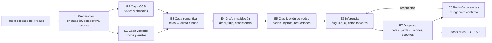

# Lectura de croquis unifilares con visión: del dibujo al despiece cotizable

> **Documento de diseño · COTIZAP · 8-oct-2026.** Para quienes programarán el pipeline de visión y para los analistas de ingeniería que lo integran con el cotizador.
> Lo acompañan tres archivos que se mantienen junto con este texto: el esquema de salida [`docs/unifilar-bom.schema.json`](unifilar-bom.schema.json), el caso de prueba [`docs/ejemplos/unifilar-caso-prueba.json`](ejemplos/unifilar-caso-prueba.json) —generado con el motor de COTIZAP, no escrito a mano— y la prueba de contrato [`tests/unifilar_contrato.test.js`](../tests/unifilar_contrato.test.js), que verifica que el caso cumple el esquema, que su red es un árbol consistente, que su despiece cuadra con el motor (aros, ménsulas, longitudes) y que este documento trae el esquema y el caso tal como están en sus archivos.

## Índice

1. [Principios](#1-principios)
2. [Arquitectura del pipeline](#2-arquitectura-del-pipeline)
3. [Gramática visual y reglas de mapeo](#3-gramática-visual-y-reglas-de-mapeo)
4. [Construcción del grafo topológico en tres capas](#4-construcción-del-grafo-topológico-en-tres-capas)
5. [Clasificación de nodos: de la topología a las piezas](#5-clasificación-de-nodos-de-la-topología-a-las-piezas)
6. [Reglas de inferencia para lo que el croquis no dice](#6-reglas-de-inferencia-para-lo-que-el-croquis-no-dice)
7. [Protocolo de ambigüedad, texto ilegible y cotas faltantes](#7-protocolo-de-ambigüedad-texto-ilegible-y-cotas-faltantes)
8. [Esquema de salida (JSON)](#8-esquema-de-salida-json)
9. [La capa multimodal: modelo, imágenes, salida estructurada y verificación](#9-la-capa-multimodal-modelo-imágenes-salida-estructurada-y-verificación)
10. [Integración con el cotizador](#10-integración-con-el-cotizador)
11. [Caso de prueba](#11-caso-de-prueba)
12. [Validación y métricas](#12-validación-y-métricas)
13. [Autoevaluación contra los criterios del encargo](#13-autoevaluación-contra-los-criterios-del-encargo)

---

## 1. Principios

1. **La IA lee; las reglas cuentan.** El modelo multimodal sólo transcribe lo que está dibujado —trazos, uniones, textos y símbolos, cada uno con su confianza—. Clasificar nodos, calcular longitudes netas, insertar transiciones, contar bridas, tornillos, sellador y ménsulas lo hacen reglas deterministas en código, las mismas del motor de COTIZAP. Así el despiece es reproducible, auditable y probable con pruebas; un modelo que «cuenta» bridas no lo es.
2. **Topología y cotas antes que geometría.** Un croquis a mano no está a escala. Lo que manda es la conectividad (qué se une con qué) y las anotaciones (Ø, L, ángulos). La medida en píxeles sólo sirve para clasificar direcciones y, como último recurso, para estimar una cota ilegible, siempre marcada.
3. **Nada se inventa en silencio.** Todo dato lleva su origen (`OCR`, `INFERIDO`, `DEFECTO_TALLER`, `ESCALA`, `USUARIO`) y su confianza. Si un dato inferido cambia el precio o la fabricación, va con una alerta y una pregunta concreta para el ingeniero.
4. **Cada pieza tiene identidad y lugar.** Todo elemento lleva un identificador único (`DUCT-001`, `CODO-002`, `JNT-014`…) y la referencia al nodo o la arista de la red donde está. No hay listados genéricos.
5. **No se omiten transiciones.** Todo cambio de diámetro en la red produce una pieza (reducción o reducción con injerto), esté dibujada o no.
6. **La salida se cotiza tal cual.** Cada pieza trae su `partida_cotizap`: la partida que `cotizar()` de `src/motor/cotizador.js` acepta sin traducción.

## 2. Arquitectura del pipeline



| Etapa | Quién la hace | Entra | Sale | Falla típica que debe atrapar |
| --- | --- | --- | --- | --- |
| E0 Preparación | Código (imagen) | Foto | Imagen rectificada ≤ 2576 px y recortes a resolución nativa | Foto girada, en perspectiva, con sombra o cuadrícula de libreta |
| E1 Capa vectorial | Modelo multimodal, verificado con visión clásica | Imagen y recortes | Nodos y aristas con coordenadas en píxeles | Trazos dobles, líneas que se cruzan sin unirse, extremos sueltos |
| E2 Capa OCR | Modelo multimodal | Imagen y recortes | Textos con caja, lectura cruda, normalizada y confianza | 1↔7, 0↔8, 5↔S, ″ vs ′, coma decimal |
| E3 Capa semántica | Código (puntaje y asignación) con desempate del modelo | Grafo y textos | Cada cota o Ø asignado a una arista, cada ángulo a un nodo | Una cota equidistante de dos aristas |
| E4 Grafo | Código | Lo anterior | Árbol dirigido hacia el colector | Ciclos, varios colectores, nodos sin equipo |
| E5 Clasificación | Código (reglas §5) | Árbol | Accesorios por nodo | Y simétrica, cruces, T a 90° |
| E6 Inferencia | Código (reglas §6) | Árbol con accesorios | Datos completos, cada uno con origen y confianza | Ángulos sin cota, Ø faltantes, cotas ilegibles |
| E7 Despiece | Código = motor de COTIZAP | Datos completos | `ductos_rectos`, `accesorios`, `elementos_union`, `soportes` | Accesorios encimados (longitud neta ≤ 0) |
| E8 Revisión | Ingeniero en la app | Alertas con pregunta | Respuestas (`origen: USUARIO`) | — |
| E9 Cotización | `cotizar()` | Partidas | Precio, compras, planos | — |

**Dos formas de construirlo.** La **mínima** hace E1–E3 con una sola llamada al modelo multimodal con salida estructurada (§9) y una segunda llamada de verificación visual. La **híbrida** añade detectores clásicos (segmentos por LSD/Hough, esqueleto morfológico, uniones por vecindad de píxeles) que proponen candidatos y miden la tinta bajo cada arista, y el modelo reconcilia. Se empieza por la mínima y se añade visión clásica sólo donde el conjunto de evaluación (§12) muestre fallas: el modelo actual lee diagramas técnicos con precisión, y lo que más le suma son imágenes a buena resolución y una herramienta de recorte, no capas de preprocesamiento.

## 3. Gramática visual y reglas de mapeo

### 3.1 Trazos y su componente físico

| Elemento gráfico | Cómo se reconoce | Componente | Familia en COTIZAP | Datos que pide |
| --- | --- | --- | --- | --- |
| Línea continua con etiqueta de Ø | Segmento (o polilínea recta) entre dos nodos | Tramo recto de ducto redondo | `RECTO` | Ø, L, posición (horizontal o vertical) |
| Línea doble (ducto a dos trazos) | Dos paralelas a distancia constante | Tramo recto (se toma el eje medio) | `RECTO` | La separación de las paralelas no es el Ø: el Ø sale de la cota |
| Vértice: la línea cambia de dirección | Nodo de grado 2 no colineal | Codo | `CODO` | Ángulo (30°, 45°, 60° o 90°), R/D = 1.5 |
| Bifurcación en Y o en T | Nodo de grado 3 | Injerto simple, reducción con injerto o pantalón (§5) | `RAMAL`, `REDUCCION_INJERTO` o `PANTALON` | Tronco y ramal, ángulo del ramal (30° o 45°) |
| Cambio de etiqueta de Ø en la misma línea, o cambio de grosor | Nodo de grado 2 colineal con Ø distintos | Reducción concéntrica (o excéntrica si se anota) | `REDUCCION` | D1 (lado del colector) y D2 |
| Cono o trapecio dibujado | Dos líneas que convergen | Reducción explícita | `REDUCCION` | Igual que arriba |
| Raya corta transversal al ducto | Marca perpendicular | Junta bridada visible | (se cuenta en `elementos_union`) | — |
| Onda, zigzag o línea punteada a una máquina | Trazo no recto en un extremo | Manguera flexible | `COMPRADO` (manguera del catálogo) | Ø, largo si se anota |
| Cuadro con X, mariposa | Símbolo sobre la línea | Compuerta (damper) | `COMPRADO` | Ø |
| Línea que «salta» (arco) sobre otra | Semicírculo en el cruce | Cruce sin unión | — (no hay nodo) | — |
| Flecha sobre la línea | Punta de flecha | Dirección del flujo | — | Confirma el sentido hacia el colector |

### 3.2 Anotaciones y su atributo

| Texto en el croquis | Tipo | Normalización | Nota |
| --- | --- | --- | --- |
| `Ø12"`, `12"`, `12 in`, `D=12` | Diámetro | 12 pulgadas | El ″ puede verse como `"`, `''` o `11` (¡ojo!: «12''» no es 1211) |
| `300`, `Ø300`, `300 mm` | Diámetro en mm | 300 mm → 11.8″ → se aproxima a la medida comercial (12″) si está a menos de 3 % | Si no hay medida comercial cercana, se conserva y se avisa |
| `L=2.5m`, `2.50`, `2,5 m`, `2500` | Longitud | 2 500 mm | Coma decimal; sin unidad: < 50 son metros, ≥ 100 son milímetros, entre 50 y 100 se avisa |
| `8'`, `8 ft` | Longitud en pies | 2 438.4 mm | El ′ se confunde con ″: un «8″» junto a una línea larga es casi siempre 8 ft |
| `45°`, `45º`, `45o` | Ángulo | 45° | Cerca de un vértice o de una derivación |
| `cal 22`, `C-22`, `#22` | Calibre | 22 | Global si está en el cuadro de datos o el título |
| `GALV`, `NEGRO`, `INOX` | Material | `GALVANIZADO`, `ACERO_CARBON`, `INOX_304` | |
| `EXC`, `CARA PLANA` | Reducción excéntrica | `excentrica: CARA_PLANA` | |
| `MANG 6"` | Manguera | Artículo `MANGUERA_6` del catálogo | |
| `SUBE`, `BAJA`, `↑`, `↓` | Posición vertical | `posicion: VERTICAL` | Decide el espaciamiento de las ménsulas |

### 3.3 Símbolos de equipo

| Símbolo habitual | Equipo | Cómo se conecta por omisión | Efecto en el despiece |
| --- | --- | --- | --- |
| Rectángulo o tolva con texto «COLECTOR», «DC», «BAGHOUSE» | Colector de polvo | Brida del equipo | Raíz de la red: el flujo va hacia él; junta de equipo (media junta del taller) |
| Rectángulo con «MAQ.», nombre o número de máquina | Máquina | Manguera flexible | Extremo liso del ducto; manguera y abrazaderas del catálogo |
| Trapecio o embudo, «CAMPANA» | Campana de captación | Brida del taller | Junta de equipo |
| Círculo con aspas, «VENT» | Ventilador | Brida del equipo | Junta de equipo y alerta si está en medio de la red |

### 3.4 Vistas: planta e isométrico

En **planta** los ángulos del dibujo son los reales. En **isométrico** los tres ejes del espacio se dibujan a 30°, 150° y 90° (vertical) en la hoja, y un ángulo recto real se ve como 60° o 120°. El clasificador asigna cada arista al eje cuyo ángulo en pantalla esté a menos de ±8°: X (30°/210°), Y (150°/330°) o Z (90°/270°). Una arista que no cae en ningún eje es una **diagonal dentro de un plano** y necesita una cota de ángulo. Trampa conocida: una diagonal de 45° en planta, dibujada en isométrico, se ve **vertical**, igual que una bajada. Se resuelve con la cota del ángulo o con «SUBE/BAJA»; sin ellas se pregunta (`ORIENTACION_AMBIGUA`).

## 4. Construcción del grafo topológico en tres capas

### 4.1 Capa vectorial: aristas y nodos

1. **Preparación.** Orientación EXIF; rectificación de perspectiva (se detecta el cuadrilátero de la hoja y se lleva a rectángulo); corrección de contraste local; supresión de la cuadrícula de la libreta (filtro de frecuencia o apertura morfológica del tamaño del renglón). Se guarda el factor de escala entre la imagen enviada (≤ 2576 px en el lado largo, §9) y la original para traducir coordenadas.
2. **Lectura.** El modelo devuelve los **nodos** (extremos, vértices, uniones) con su posición en píxeles y las **aristas** como pares de nodos con su polilínea. En la variante híbrida, el esqueleto morfológico propone los nodos (píxeles con 1 vecino = extremo; con 3 o más = unión) y los segmentos (LSD), y el modelo los confirma.
3. **Saneamiento geométrico.** Se simplifica cada polilínea (Douglas–Peucker, tolerancia = 1.5 × grosor del trazo); dos segmentos consecutivos casi colineales (< 10°) sin texto de ángulo entre ellos se funden; dos extremos a menos de 3 × grosor del trazo se unen en un nodo (*snap*); un extremo que cae sobre el cuerpo de otra arista la parte en dos con un nodo de derivación.
4. **Verificación de tinta.** Cada arista se muestrea a lo largo: si menos del 80 % de los puntos caen sobre tinta, se baja su confianza y, por debajo de 0.5, se descarta con alerta `TRAZO_SIN_CONECTAR`.
5. **Cruces.** Dos aristas que se cruzan sin símbolo de salto **no** se unen automáticamente: si el cruce no tiene punto de unión dibujado ni Ø que cambie, es `CRUCE_SIN_NODO` y se pregunta. Una red de colección de polvo es un árbol: un ciclo indica un error de lectura (`CICLO_EN_RED`).

### 4.2 Capa OCR: textos y símbolos

1. El modelo transcribe **todo** texto con su caja (`bbox_px`), su lectura cruda tal cual (`contenido_crudo`), su lectura normalizada (`contenido_normalizado`, §3.2) y su confianza (0–1). Un texto que no se puede leer se transcribe como se ve («1.? m») con tipo `ILEGIBLE`: nunca se completa a ojo.
2. Se clasifica cada texto: `DIAMETRO`, `LONGITUD`, `ANGULO`, `CALIBRE`, `MATERIAL`, `EQUIPO`, `NOTA` o `ILEGIBLE`.
3. **Confusiones típicas** que el normalizador revisa contra el contexto: 1↔7 y 0↔8↔6 en cotas; 5↔S; «″» leído como «11»; «′» (pies) contra «″» (pulgadas); punto contra coma; «°» leído como «o» o «0» (un «450» junto a un vértice es 45°).
4. Los símbolos (colector, máquina, campana, compuerta, flechas) se reportan como equipos o marcas con su nodo más cercano.

### 4.3 Capa semántica: cada texto a su arista o nodo

Cada par (texto, candidato) recibe un puntaje; gana el mayor y cada arista acepta como máximo un Ø y una L:

| Criterio | Peso | Medida |
| --- | --- | --- |
| Distancia del centro del texto a la arista (perpendicular, dentro del segmento) | 0.45 | `exp(−d / (2 × alto del texto))` |
| Paralelismo del texto con la arista (cotas de L) | 0.20 | `abs(cos(ángulo entre ambos))` |
| Línea de llamada (*leader*) que apunta a la arista | 0.25 | 1 si la flecha termina sobre la arista |
| Compatibilidad de tipo (un ángulo va a un nodo; una L a una arista) | 0.10 | 1 o 0 |

Si los dos mejores candidatos de un texto quedan a menos de 15 % uno del otro, se registra `ASOCIACION_AMBIGUA` y se resuelve con una re-lectura dirigida (§7.4). Los textos globales (cuadro de datos, título: material, calibre, escala) se quedan sin asociar (`asociado_a: null`) y alimentan los valores por omisión.

### 4.4 Validación topológica y dirección del flujo

- **Un colector**: el equipo de tipo `COLECTOR` es la raíz (`metadatos.flujo_hacia`); si no hay, `SIN_COLECTOR` (bloqueante: sin él no se sabe qué lado de cada pieza es el mayor).
- **Árbol conexo**: aristas = nodos − 1 y todo nodo alcanzable desde la raíz.
- **Dirección**: un recorrido desde el colector orienta cada arista; su `nodo_a` es el lado del colector (aguas abajo del aire).
- **Monotonía del Ø**: alejándose del colector el diámetro no crece. Una violación casi siempre es un error de lectura (`DIAMETRO_INCONSISTENTE`): se revisan primero las confusiones de la §4.2.
- **Extremos**: todo nodo de grado 1 termina en un equipo o en una manguera; si no, `TRAZO_SIN_CONECTAR`.

## 5. Clasificación de nodos: de la topología a las piezas

| Nodo | Condición | Pieza | Familia | Campos de la partida |
| --- | --- | --- | --- | --- |
| Grado 1 | Toca un equipo | Extremo: junta de equipo, o manguera | — / `COMPRADO` | Ver §6.8 |
| Grado 2 | Colineal (desvío < 10°), mismo Ø | Unión entre tramos (junta) | — | Una junta bridada |
| Grado 2 | Colineal, Ø distinto | Reducción | `REDUCCION` | `D1_mm` (lado colector), `D2_mm`, `excentrica` |
| Grado 2 | No colineal, mismo Ø | Codo | `CODO` | `D_mm`, `theta_deg` = 180° − ángulo entre aristas, `k_R` = 1.5 |
| Grado 2 | No colineal, Ø distinto | Codo + reducción (dos piezas, la reducción del lado alejado) | `CODO` + `REDUCCION` | Alerta `TRANSICION_INSERTADA` |
| Grado 3 | Un par colineal (el tronco) y un ramal; tronco con el mismo Ø | Injerto simple | `RAMAL` | `D_mm`, `d_mm`, `beta_deg`, `L_cuerpo_mm`, `L_ramal_mm` |
| Grado 3 | Tronco con Ø distinto a cada lado | Reducción con injerto (el injerto va sobre el cono) | `REDUCCION_INJERTO` | `D1_mm` (lado colector), `D2_mm`, `d_mm`, `beta_deg` |
| Grado 3 | Sin par colineal (Y simétrica) | Pantalón | `PANTALON` (familia retirada) | Alerta `PANTALON_RETIRADO`: se propone injerto + codo |
| Grado ≥ 4 | Cruce de dos derivaciones | Dos injertos separados al menos 1 D | `RAMAL` × 2 | Alerta `CRUCE_SIN_NODO` |

**Reglas del taller que la clasificación respeta** (todas están en las tablas maestras del motor):

- Codos sólo a **30°, 45°, 60° o 90°** (`proceso.angulos_codo_deg`), con radio al eje **R = 1.5 D** (`k_R_defecto`) y los gajos que salen solos (α ≤ 22.5° por junta).
- Injertos sólo a **30° o 45°** (`proceso.angulos_injerto_deg`), siempre del extremo mayor al menor, a favor del flujo. En colección de polvo una T a 90° pierde carga y acumula material.
- Galvanizado: costuras **engargoladas** (Pittsburgh) y piezas que se unen entre sí **engargoladas** (familia `UNION`); las bridas van en los extremos que se desmontan.
- Bridas de **solera 1½″ × 3/16″**, barreno de 3/8″, tornillo de 5/16″ × 1¼″; número de barrenos **par, mínimo 6**, a no más de 150 mm (`herrajes.uniones.BRIDADO`).
- Junta sellada con **Sikaflex**: 40 mL por metro de círculo de barrenos.
- Tramos rectos armados por **yardas** de 914.4 o 1 220 mm en piezas de hasta 3 yardas, con un tramo de ajuste y su brida suelta en el extremo final.

## 6. Reglas de inferencia para lo que el croquis no dice

### 6.1 Ángulo de un codo sin cota

| Situación | Regla | Origen y confianza | Alerta |
| --- | --- | --- | --- |
| Hay cota de ángulo junto al vértice | Se usa la cota | `OCR` | Ninguna (o `ANGULO_NO_PERMITIDO` si no es 30/45/60/90: se usa el permitido más cercano) |
| Vista en planta, sin cota | Se mide el ángulo entre las aristas y se aproxima al permitido más cercano si está a ±7.5° | `INFERIDO`, 0.85 | `ANGULO_INFERIDO` (INFO) |
| Vista en planta, a más de 7.5° de todo permitido | Se usa el permitido más cercano | `INFERIDO`, 0.5 | `ANGULO_NO_PERMITIDO` (CONFIRMAR) |
| Isométrico, cambio entre dos ejes distintos (X↔Y, X↔Z, Y↔Z) | 90° | `INFERIDO`, 0.85 | `ANGULO_INFERIDO` (INFO) |
| Isométrico, una de las aristas no cae en ningún eje | No se puede medir: 45° si hay otra diagonal igual acotada en el croquis; si no, 45° por omisión | `DEFECTO_TALLER`, 0.4 | `ANGULO_INFERIDO` (CONFIRMAR) |
| Una arista vertical en la hoja que podría ser bajada o diagonal de 45° | Manda la cota del codo o «SUBE/BAJA»; sin ellas, bajada (90°) | `INFERIDO`, 0.5 | `ORIENTACION_AMBIGUA` (CONFIRMAR) |

### 6.2 Reducciones: dimensiones automáticas

- **D1 y D2.** D1 es el Ø de la arista del lado del colector y D2 el del lado alejado. Si D2 > D1, la red viola la monotonía (§4.4): no se inventa una ampliación; se revisa la lectura (`DIAMETRO_INCONSISTENTE`).
- **Siempre se inserta.** Si el Ø cambia en un nodo de grado 2 sin cono dibujado, se inserta la reducción (`TRANSICION_INSERTADA`, INFO). Si cambia en un nodo de derivación, la pieza es una reducción con injerto.
- **Longitud.** La del motor: con semiángulo máximo de 15° (`proceso.semiangulo_max_deg`), L = (D1 − D2) / 2 / tan 15°. De 10″ a 8″: 25.4 mm / 0.268 = **94.8 mm**. La reducción con injerto toma la menor longitud que aloja el injerto sobre el cono (12″→10″ con injerto de 6″ a 45°: **246.5 mm**, y el injerto **410.5 mm** desde el eje del tronco).
- **Concéntrica** por omisión; excéntrica (cara plana) sólo si se anota.
- Una reducción de más de la mitad (D2 / D1 < 0.5) se avisa: suele ser una derivación mal leída.

### 6.3 Derivaciones

- **Tronco y ramal.** El tronco es el par de aristas más colineal; si hay empate, el de mayor Ø. El ramal es la tercera.
- **Ángulo del ramal.** El anotado; si no hay, el medido y aproximado a 30° o 45°. Una T dibujada a 90° se propone a 45° (`ANGULO_DERIVACION_NO_PERMITIDO`, CONFIRMAR): es la práctica del taller y de diseño de colección de polvo, pero cambia la pieza.
- **Sentido.** El ramal debe entrar a favor del flujo: el ángulo entre el ramal (hacia el nodo) y el tronco (hacia el colector) es agudo. Si no, `DERIVACION_CONTRA_FLUJO` (CONFIRMAR).
- **Longitudes de un injerto simple.** Ramal: la mínima que acepta el motor + 100 mm, a múltiplos de 50. Tronco: d / sen β + 150 mm (75 mm por lado para la brida y la silleta), a múltiplos de 50. Para 10″ con injerto de 5″ a 45°: tronco **350 mm** y ramal **350 mm** (el mínimo del motor es 244 mm).

### 6.4 Diámetros faltantes

1. **Continuidad.** Pasando por una unión colineal, un codo o el tronco de un injerto simple, el Ø no cambia: la arista sin Ø hereda el de su vecina (`DIAMETRO_INFERIDO`, INFO, confianza 0.8).
2. **Equipo.** La boca de un equipo, si está anotada.
3. **Ramal.** El Ø del ramal no se hereda del tronco: sin cota es `DIAMETRO_FALTANTE` (BLOQUEANTE).
4. **Medidas comerciales.** Todo Ø se lleva a la lista comercial (3″ a 24″ de pulgada en pulgada hasta 12″, de dos en dos después) si está a menos de 3 %; si no, se conserva y se avisa.

### 6.5 Longitudes: de la cota al tramo neto

Las cotas de un unifilar se toman **a ejes** —de centro a centro de nodo— salvo que el croquis diga lo contrario (`convencion_cotas`). El tramo recto que se fabrica es lo que queda después de lo que ocupan los accesorios de sus extremos:

```text
longitud_neta = cota_a_ejes − Σ ocupación de cada accesorio sobre esa arista
```

| Accesorio en el extremo | Ocupa sobre la arista | Ejemplo |
| --- | --- | --- |
| Codo de ángulo θ, radio R | R · tan(θ/2) + tangente | 90°, 12″, R = 457.2 mm → **457.2 mm** |
| Reducción de largo L | L / 2 a cada lado | 10″→8″, L = 94.8 mm → **47.4 mm** |
| Reducción con injerto | L_reducción / 2 en el tronco; L_ramal en el ramal | 12″→10″ con 6″: **123.2 mm** y **410.5 mm** |
| Injerto simple | L_cuerpo / 2 en el tronco; L_ramal en el ramal | 10″ con 5″: **175 mm** y **350 mm** |
| Equipo | 0 (la cota llega a la boca) | — |

- Si la longitud neta queda en menos de 150 mm, los accesorios están **encimados** (`ACCESORIOS_ENCIMADOS`): se arman pegados (`UNION` engargolada, sin bridas en esa cara) y se confirma.
- **Cadenas de cotas.** Si hay una cota total y varias parciales, la que falta sale por diferencia (`COTA_FALTANTE` resuelta, INFO).
- **Estimación por escala (último recurso).** Si una cota es ilegible y no sale por diferencia, se estima con la mediana de px/m de las aristas acotadas **del mismo eje** (en isométrico cada eje tiene su escala). Sólo si su dispersión es menor que 25 %; si no, no se estima (`COTA_FALTANTE`, BLOQUEANTE). Una cota estimada lleva `origen: ESCALA`, confianza ≤ 0.4 y alerta CONFIRMAR, siempre.

### 6.6 Material y calibre

Prioridad: anotación en la arista → anotación global (cuadro de datos, título) → la de la cotización → la del taller (galvanizado cal. 22). Si se usa la del taller, `CALIBRE_FALTANTE` (CONFIRMAR). El motor avisa además si el calibre es más delgado que el de la tabla de servicio (`CALIBRE_BAJO_TABLA`, ADVERTENCIA).

### 6.7 Posición de cada tramo

Vertical si es eje Z del isométrico, si está anotada «SUBE/BAJA» o si es vertical en una elevación; horizontal en todo lo demás. Decide el espaciamiento de las ménsulas (§6.9).

### 6.8 Elementos de unión automáticos

En cada nodo se genera la unión según lo que se encuentra; dentro de cada tramo, las juntas entre sus piezas de hasta 3 yardas:

| Unión | Cuándo | Aros (solera 1½″ × 3/16″) | Tornillos (juegos) | Sellador | Otros | ¿Ya lo cobran las partidas? |
| --- | --- | --- | --- | --- | --- | --- |
| `JUNTA_BRIDADA` | Pieza del taller contra pieza del taller | 2 (uno en cada pieza) | n | π · D_perf × 40 mL/m | — | Completo (cada brida lleva media junta) |
| `JUNTA_EQUIPO` | Pieza del taller contra un equipo con brida propia | 1 | n | π · D_perf × 40 mL/m | Confirmar el patrón de barrenos del equipo | Media junta: la otra mitad la pone el equipo |
| `JUNTA_MANGUERA` | Extremo hacia una máquina por manguera | 0 (extremo liso) | 0 | 0 | 1 tramo de manguera del catálogo y 2 abrazaderas | No: van como partidas compradas |
| `UNION_ENGARGOLADA` | Dos accesorios pegados sin tramo entre ellos | 0 | 0 | — | Engargolado al perímetro | Familia `UNION` |
| Junta interna | Entre las piezas de un tramo largo (armado por yardas) | 2 | n | Igual | — | Completo |
| Brida suelta | En el extremo final de cada tramo con ajuste | (uno de los 2 aros de esa junta es suelto) | — | — | Se suelda en obra después de cortar el ajuste | Completo |

Con las fórmulas del motor:

```text
D_int  = D + 2·e                          (e = espesor de la lámina; cal. 22 galvanizada = 0.853 mm)
D_perf = D_int + 2·24 mm                  (gramil de 24 mm de los planos de pedido)
n      = máx(6, par(⌈π · D_perf / 150 mm⌉))     → 12″ y 10″: 8 · 8″, 6″ y 5″: 6
solera por aro ≈ π · (D + 81 mm)          (regla del taller: incluye las puntas que la roladora no curva) → 12″: 1 211.6 mm
sellador por junta = π · D_perf × 40 mL/m (sin la reserva de 15 % de la compra) → 12″: 44.5 mL
```

**Sin doble conteo.** El motor ya cobra en cada partida sus bridas, su tornillería y su sellador (media junta por brida). `elementos_union` es el **despiece de verificación**: la prueba de contrato comprueba que sus aros —30 en el caso de prueba, 6 de ellos sueltos— son los mismos que cobra el motor. Sólo se cotiza aparte lo que ninguna partida trae: las mangueras con sus abrazaderas y, si el equipo no la incluye, la otra media junta de una conexión a equipo.

### 6.9 Soportes

Con la regla del taller (`proceso.soportes.espaciado`, documento de arquitectura §3.6.2): una ménsula cada 2.5 m en lo horizontal (máximo 3.0 m), cada 3.0 m en lo vertical con una de carga en la base, y una junto a cada codo e injerto; cada ménsula lleva una abrazadera tipo cuna del Ø del ducto que sostiene. La partida de ménsulas va en modo automático (`cantidad_modo: AUTO`) y las abrazaderas, una partida por diámetro.

## 7. Protocolo de ambigüedad, texto ilegible y cotas faltantes

### 7.1 Umbrales de confianza

| Confianza del dato | Qué se hace |
| --- | --- |
| ≥ 0.90 | Se acepta. |
| 0.70 – 0.90 | Se acepta y se marca. Si cambia el precio (Ø, L, ángulo), alerta ADVERTENCIA. |
| 0.50 – 0.70 | Re-lectura dirigida (§7.4). Si no sube de 0.70, alerta CONFIRMAR con el valor leído como propuesta. |
| < 0.50 | No se usa el valor leído. Se aplica la regla de inferencia que corresponda (§6). Si ninguna aplica, BLOQUEANTE. |

### 7.2 Severidades y estado de la cotización

| Severidad | Significa | Estado del despiece |
| --- | --- | --- |
| `BLOQUEANTE` | Falta un dato sin el cual la pieza no existe (un Ø de ramal, una cota sin escala posible, no hay colector) | `NO_COTIZABLE`: no se generan partidas de esa rama |
| `CONFIRMAR` | Se tomó una decisión que cambia la fabricación o el precio; se cotiza con ella | `PRELIMINAR`: se puede mandar como precio estimado, no como pedido |
| `ADVERTENCIA` | Un dato raro que no cambia la pieza (calibre bajo tabla, manguera sin largo) | No cambia el estado |
| `INFO` | Una inferencia segura (Ø heredado, transición insertada) | No cambia el estado |

`DEFINITIVA` exige cero BLOQUEANTE y cero CONFIRMAR sin resolver. Cada alerta CONFIRMAR o BLOQUEANTE trae una **pregunta** concreta y cerrada para el ingeniero; su respuesta se guarda con `origen: USUARIO`, confianza 1, y se vuelve a correr la etapa E6.

### 7.3 Catálogo de alertas

| Código | Cuándo | Decisión por omisión | Severidad |
| --- | --- | --- | --- |
| `COTA_ILEGIBLE` | La L de una arista no se lee (< 0.5) | Por diferencia de cadena; si no, escala del mismo eje | CONFIRMAR (BLOQUEANTE si no hay escala confiable) |
| `COTA_FALTANTE` | Una arista sin L | Igual | Igual |
| `DIAMETRO_FALTANTE` | Ø no anotado ni heredable | Ninguna | BLOQUEANTE |
| `DIAMETRO_INFERIDO` | Ø heredado por continuidad | El de la vecina | INFO |
| `DIAMETRO_INCONSISTENTE` | El Ø crece al alejarse del colector | Revisar confusiones de OCR | CONFIRMAR |
| `ANGULO_INFERIDO` | Codo sin cota | §6.1 | INFO o CONFIRMAR |
| `ANGULO_NO_PERMITIDO` | Codo fuera de 30/45/60/90 | El permitido más cercano | CONFIRMAR |
| `ANGULO_DERIVACION_NO_PERMITIDO` | Injerto fuera de 30/45 (T a 90°) | 45° a favor del flujo | CONFIRMAR |
| `DERIVACION_CONTRA_FLUJO` | El ramal entra contra el flujo | Se voltea | CONFIRMAR |
| `ORIENTACION_AMBIGUA` | Vertical en la hoja que puede ser diagonal de 45° | La cota manda; si no, bajada | CONFIRMAR |
| `TRANSICION_INSERTADA` | Cambio de Ø sin accesorio dibujado | Reducción concéntrica | INFO |
| `ACCESORIOS_ENCIMADOS` | Longitud neta < 150 mm | Unión engargolada | CONFIRMAR |
| `CONEXION_EQUIPO` | Boca de equipo sin medida ni barrenos | Brida compatible del Ø del ducto | CONFIRMAR |
| `MANGUERA_SIN_LARGO` | Manguera sin largo | Un tramo del catálogo | ADVERTENCIA |
| `CALIBRE_BAJO_TABLA` | Calibre más delgado que la tabla de servicio | El anotado | ADVERTENCIA |
| `CALIBRE_FALTANTE` / `MATERIAL_FALTANTE` | Sin anotación | El del taller | CONFIRMAR |
| `TEXTO_SIN_ASOCIAR` | Un texto lejos de todo | Se descarta | INFO |
| `ASOCIACION_AMBIGUA` | Dos candidatos casi iguales | Re-lectura dirigida | CONFIRMAR si persiste |
| `TRAZO_SIN_CONECTAR` | Extremo sin equipo, arista sin tinta | Se descarta la arista | CONFIRMAR |
| `CRUCE_SIN_NODO` | Dos aristas se cruzan sin unión dibujada | Pasan por encima (no se unen) | CONFIRMAR |
| `CICLO_EN_RED` | La red tiene un ciclo | Ninguna | BLOQUEANTE |
| `PANTALON_RETIRADO` | Y simétrica | Injerto + codo | CONFIRMAR |
| `SIN_COLECTOR` | No se identifica el colector | Ninguna | BLOQUEANTE |

### 7.4 Re-lectura dirigida

Para todo texto con confianza < 0.70, toda asociación ambigua y todo nodo de grado ≥ 3 dudoso, se recorta la zona (la caja ampliada 3 veces, a resolución nativa de la foto original) y se hace al modelo una pregunta cerrada sobre ese recorte («¿qué número está escrito junto a esta línea?», «¿esta línea se une con la otra o pasa por encima?»). Se guardan las dos lecturas; si discrepan, gana la de mayor confianza y la alerta lo dice. Esto es más eficaz que pedirle más razonamiento: en dibujos técnicos, el modelo mejora sobre todo con más resolución y con una herramienta para recortar y ampliar (§9).

### 7.5 Lo que el sistema nunca hace

- Completar a ojo un texto ilegible o «redondear» una cota dudosa sin marcarla.
- Escalar el dibujo como si fuera a escala, salvo la estimación de §6.5, marcada y con pregunta.
- Omitir una transición en un cambio de diámetro.
- Unir dos líneas que se cruzan sin evidencia de unión.
- Cambiar la topología leída (quitar o agregar nodos) sin dejar una alerta que lo diga.
- Calcular bridas, tornillos o sellador en el modelo: eso lo hace el motor.

## 8. Esquema de salida (JSON)

### 8.1 Secciones

| Sección | La llena | Contenido |
| --- | --- | --- |
| `metadatos` | Modelo (lectura) | Imagen, recortes, vista, unidades, convención de cotas, colector, material y calibre globales, yarda |
| `red` | Modelo (lectura) | `nodos`, `aristas` y `textos` con coordenadas, medidas con origen y confianza |
| `equipos` | Modelo (lectura) | Colector, máquinas, campanas, con su nodo y cómo se conectan |
| `alertas_ambiguedad` | Modelo y reglas | Lo dudoso, la decisión tomada y la pregunta |
| `ductos_rectos` | Reglas (despiece) | Tramos con cota, descuentos, longitud neta, posición, extremos, armado por yardas y su partida |
| `accesorios` | Reglas (despiece) | Codos, reducciones, injertos, con su nodo, ángulo (con origen) y su partida |
| `elementos_union` | Reglas (despiece) | Juntas por nodo y por armado: aros, sueltos, barrenos, tornillos, sellador, abrazaderas de manguera |
| `soportes` | Reglas (despiece) | Ménsulas (automáticas) y abrazaderas por diámetro, con su partida |
| `partidas_compradas` | Reglas (despiece) | Mangueras y abrazaderas de manguera del catálogo |
| `resumen` | Reglas (despiece) | Estado, totales, conteos, alertas por severidad y las entradas de la cotización rápida |

### 8.2 Identificadores

| Prefijo | Qué | Ejemplo |
| --- | --- | --- |
| `N-###` · `A-###` · `T-###` | Nodo, arista y texto de la red | `N-003`, `A-005`, `T-011` |
| `EQ-##` | Equipo | `EQ-01` (colector) |
| `DUCT-###` | Tramo recto (uno por arista) | `DUCT-005` |
| `CODO-###` · `RED-###` · `RINJ-###` · `INJ-###` · `PANT-###` · `TRAN-###` | Accesorios (uno por nodo que lo pide) | `RINJ-001` |
| `JNT-###` | Elemento de unión | `JNT-013` |
| `SOP-###` | Soporte | `SOP-001` |
| `ALR-###` · `R-##` | Alerta · recorte de la imagen | `ALR-002` |

Todo elemento del despiece apunta a la red: un `DUCT` a su arista y sus nodos, un accesorio a su nodo y sus aristas (lado del colector primero; en una derivación el ramal al último), una junta a su nodo y a las dos piezas que une.

### 8.3 Esquema completo

Es el archivo [`docs/unifilar-bom.schema.json`](unifilar-bom.schema.json) (JSON Schema 2020-12). La prueba de contrato comprueba que el bloque de abajo es idéntico al archivo.

```json
{
  "$schema": "https://json-schema.org/draft/2020-12/schema",
  "$id": "https://cotizap.local/esquemas/unifilar-bom-1.0.json",
  "title": "Lista de materiales (BOM) de un croquis unifilar de ductería",
  "description": "Salida del pipeline de lectura de unifilares (docs/vision-unifilares.md). Las secciones metadatos, red, equipos y alertas_ambiguedad son la LECTURA (la llena el modelo multimodal); ductos_rectos, accesorios, elementos_union, soportes, partidas_compradas y resumen son el DESPIECE (lo calculan las reglas deterministas). Los rangos numéricos y los patrones de identificador se validan en código.",
  "type": "object",
  "additionalProperties": false,
  "required": ["version", "metadatos", "red", "equipos", "ductos_rectos", "accesorios", "elementos_union", "soportes", "partidas_compradas", "alertas_ambiguedad", "resumen"],
  "properties": {
    "version": { "type": "string", "enum": ["1.0"] },
    "metadatos": { "$ref": "#/$defs/metadatos" },
    "red": {
      "type": "object",
      "additionalProperties": false,
      "required": ["nodos", "aristas", "textos"],
      "properties": {
        "nodos": { "type": "array", "items": { "$ref": "#/$defs/nodo" } },
        "aristas": { "type": "array", "items": { "$ref": "#/$defs/arista" } },
        "textos": { "type": "array", "items": { "$ref": "#/$defs/texto" } }
      }
    },
    "equipos": { "type": "array", "items": { "$ref": "#/$defs/equipo" } },
    "ductos_rectos": { "type": "array", "items": { "$ref": "#/$defs/ducto_recto" } },
    "accesorios": { "type": "array", "items": { "$ref": "#/$defs/accesorio" } },
    "elementos_union": { "type": "array", "items": { "$ref": "#/$defs/elemento_union" } },
    "soportes": { "type": "array", "items": { "$ref": "#/$defs/soporte" } },
    "partidas_compradas": { "type": "array", "items": { "$ref": "#/$defs/partida_comprada" } },
    "alertas_ambiguedad": { "type": "array", "items": { "$ref": "#/$defs/alerta" } },
    "resumen": { "$ref": "#/$defs/resumen" }
  },
  "$defs": {
    "confianza": { "type": "number", "minimum": 0, "maximum": 1, "description": "0 = no se sabe, 1 = certeza. Umbrales en §6 del documento." },
    "id_red": { "type": "string", "pattern": "^(N|A|T)-[0-9]{3}$" },
    "id_pieza": { "type": "string", "pattern": "^(DUCT|CODO|RED|RINJ|INJ|PANT|TRAN|EQ|JNT|SOP)-[0-9]{2,3}$" },
    "medida": {
      "type": "object",
      "description": "Un dato leído o inferido, con su procedencia. valor null = faltante (y entonces hay una alerta).",
      "additionalProperties": false,
      "required": ["valor", "unidad", "origen", "confianza", "texto_id"],
      "properties": {
        "valor": { "type": ["number", "string", "null"] },
        "unidad": { "type": ["string", "null"], "enum": ["mm", "m", "in", "deg", null] },
        "origen": { "type": "string", "enum": ["OCR", "INFERIDO", "DEFECTO_TALLER", "ESCALA", "USUARIO"] },
        "confianza": { "$ref": "#/$defs/confianza" },
        "texto_id": { "type": ["string", "null"], "description": "El texto (T-###) del que sale el dato, si lo hay." }
      }
    },
    "punto": {
      "type": "object", "additionalProperties": false, "required": ["x", "y"],
      "properties": { "x": { "type": "number" }, "y": { "type": "number" } }
    },
    "caja": {
      "type": "object", "additionalProperties": false, "required": ["x", "y", "w", "h"],
      "properties": { "x": { "type": "number" }, "y": { "type": "number" }, "w": { "type": "number", "minimum": 0 }, "h": { "type": "number", "minimum": 0 } }
    },
    "metadatos": {
      "type": "object",
      "additionalProperties": false,
      "required": ["fuente", "vista", "unidades_diametro", "unidades_longitud", "convencion_cotas", "flujo_hacia", "material", "calibre", "yarda_mm", "modelo", "fecha"],
      "properties": {
        "fuente": {
          "type": "object",
          "additionalProperties": false,
          "required": ["archivo", "ancho_px", "alto_px", "ancho_enviado_px", "alto_enviado_px", "recortes"],
          "properties": {
            "archivo": { "type": "string" },
            "ancho_px": { "type": "integer", "minimum": 1 },
            "alto_px": { "type": "integer", "minimum": 1 },
            "ancho_enviado_px": { "type": "integer", "minimum": 1, "maximum": 2576 },
            "alto_enviado_px": { "type": "integer", "minimum": 1, "maximum": 2576 },
            "recortes": {
              "type": "array",
              "items": {
                "type": "object", "additionalProperties": false, "required": ["id", "x", "y", "w", "h", "motivo"],
                "properties": {
                  "id": { "type": "string", "pattern": "^R-[0-9]{2}$" },
                  "x": { "type": "number" }, "y": { "type": "number" }, "w": { "type": "number" }, "h": { "type": "number" },
                  "motivo": { "type": "string" }
                }
              }
            }
          }
        },
        "vista": { "type": "string", "enum": ["PLANTA", "ISOMETRICO", "ELEVACION", "MIXTA"] },
        "unidades_diametro": { "type": "string", "enum": ["IN", "MM"] },
        "unidades_longitud": { "type": "string", "enum": ["M", "MM", "FT"] },
        "convencion_cotas": { "type": "string", "enum": ["EJES", "NETAS", "MIXTA"], "description": "EJES: de centro a centro de nodos (por omisión). NETAS: el tramo recto solo." },
        "flujo_hacia": { "type": ["string", "null"], "description": "El equipo (EQ-##) hacia el que va el aire: el colector." },
        "material": { "$ref": "#/$defs/medida" },
        "calibre": { "$ref": "#/$defs/medida" },
        "yarda_mm": { "type": "number", "enum": [914.4, 1220] },
        "modelo": { "type": "string" },
        "fecha": { "type": "string", "format": "date-time" }
      }
    },
    "nodo": {
      "type": "object",
      "additionalProperties": false,
      "required": ["id", "tipo", "grado", "pos_px", "aristas", "equipo_id", "accesorio_id", "confianza"],
      "properties": {
        "id": { "$ref": "#/$defs/id_red" },
        "tipo": { "type": "string", "enum": ["EXTREMO", "VERTICE", "DERIVACION", "CAMBIO_DIAMETRO", "UNION_COLINEAL", "CRUCE"] },
        "grado": { "type": "integer", "minimum": 1 },
        "pos_px": { "$ref": "#/$defs/punto" },
        "aristas": { "type": "array", "items": { "$ref": "#/$defs/id_red" } },
        "equipo_id": { "type": ["string", "null"] },
        "accesorio_id": { "type": ["string", "null"] },
        "confianza": { "$ref": "#/$defs/confianza" }
      }
    },
    "arista": {
      "type": "object",
      "additionalProperties": false,
      "required": ["id", "nodo_a", "nodo_b", "orientacion_pantalla", "eje_iso", "angulo_pantalla_deg", "diametro", "longitud_cota", "ducto_id"],
      "properties": {
        "id": { "$ref": "#/$defs/id_red" },
        "nodo_a": { "$ref": "#/$defs/id_red", "description": "El extremo del lado del colector (aguas abajo)." },
        "nodo_b": { "$ref": "#/$defs/id_red" },
        "orientacion_pantalla": { "type": "string", "enum": ["HORIZONTAL", "VERTICAL", "INCLINADA"] },
        "eje_iso": { "type": "string", "enum": ["X", "Y", "Z", "NINGUNO"] },
        "angulo_pantalla_deg": { "type": "number", "minimum": 0, "maximum": 360 },
        "diametro": { "$ref": "#/$defs/medida" },
        "longitud_cota": { "$ref": "#/$defs/medida" },
        "ducto_id": { "type": ["string", "null"] }
      }
    },
    "texto": {
      "type": "object",
      "additionalProperties": false,
      "required": ["id", "contenido_crudo", "contenido_normalizado", "tipo", "bbox_px", "confianza_ocr", "asociado_a"],
      "properties": {
        "id": { "$ref": "#/$defs/id_red" },
        "contenido_crudo": { "type": "string" },
        "contenido_normalizado": { "type": ["string", "null"] },
        "tipo": { "type": "string", "enum": ["DIAMETRO", "LONGITUD", "ANGULO", "CALIBRE", "MATERIAL", "EQUIPO", "NOTA", "ILEGIBLE"] },
        "bbox_px": { "$ref": "#/$defs/caja" },
        "confianza_ocr": { "$ref": "#/$defs/confianza" },
        "asociado_a": { "type": ["string", "null"], "description": "La arista, el nodo o el equipo al que se asoció; null = global o sin asociar." }
      }
    },
    "equipo": {
      "type": "object",
      "additionalProperties": false,
      "required": ["id", "tipo", "nombre", "nodo_id", "conexion", "texto_id", "confianza"],
      "properties": {
        "id": { "type": "string", "pattern": "^EQ-[0-9]{2}$" },
        "tipo": { "type": "string", "enum": ["COLECTOR", "MAQUINA", "CAMPANA", "COMPUERTA", "VENTILADOR", "OTRO"] },
        "nombre": { "type": "string" },
        "nodo_id": { "$ref": "#/$defs/id_red" },
        "conexion": { "type": "string", "enum": ["BRIDA_EQUIPO", "BRIDA_TALLER", "MANGUERA", "LISO"] },
        "texto_id": { "type": ["string", "null"] },
        "confianza": { "$ref": "#/$defs/confianza" }
      }
    },
    "partida_cotizap": {
      "type": "object",
      "description": "Partida lista para cotizar() de src/motor/cotizador.js (familia y campos del motor). La valida normalizarPartida del motor, no este esquema.",
      "required": ["familia", "cantidad"],
      "properties": {
        "familia": { "type": "string", "enum": ["RECTO", "CODO", "REDUCCION", "TRANSICION", "RAMAL", "REDUCCION_INJERTO", "PANTALON", "BRIDA", "UNION", "SOPORTE", "COMPRADO", "INSTALACION"] },
        "cantidad": { "type": "integer", "minimum": 1 }
      }
    },
    "ducto_recto": {
      "type": "object",
      "additionalProperties": false,
      "required": ["id", "arista_id", "nodo_inicio", "nodo_fin", "diametro_in", "diametro_mm", "longitud_cota_mm", "convencion_cota", "descuentos", "longitud_neta_mm", "posicion", "material", "calibre", "tipo_union", "extremo_inicio", "extremo_fin", "armado", "confianza", "partida_cotizap"],
      "properties": {
        "id": { "type": "string", "pattern": "^DUCT-[0-9]{3}$" },
        "arista_id": { "$ref": "#/$defs/id_red" },
        "nodo_inicio": { "$ref": "#/$defs/id_red" },
        "nodo_fin": { "$ref": "#/$defs/id_red" },
        "diametro_in": { "type": "number", "minimum": 1 },
        "diametro_mm": { "type": "number", "minimum": 25 },
        "longitud_cota_mm": { "type": "number", "minimum": 0 },
        "convencion_cota": { "type": "string", "enum": ["EJES", "NETAS"] },
        "descuentos": {
          "type": "array",
          "description": "Lo que ocupan los accesorios de cada extremo sobre la cota a ejes.",
          "items": {
            "type": "object", "additionalProperties": false, "required": ["accesorio_id", "mm"],
            "properties": { "accesorio_id": { "type": "string" }, "mm": { "type": "number", "minimum": 0 } }
          }
        },
        "longitud_neta_mm": { "type": "number", "minimum": 0 },
        "posicion": { "type": "string", "enum": ["HORIZONTAL", "VERTICAL"] },
        "material": { "type": "string", "enum": ["GALVANIZADO", "ACERO_CARBON", "INOX_304", "INOX_316"] },
        "calibre": { "type": "integer", "minimum": 10, "maximum": 28 },
        "tipo_union": { "type": "string", "enum": ["BRIDADO", "ESPIGA", "LISO"] },
        "extremo_inicio": { "$ref": "#/$defs/extremo" },
        "extremo_fin": { "$ref": "#/$defs/extremo" },
        "armado": {
          "type": "object", "additionalProperties": false, "required": ["yarda_mm", "piezas", "juntas_internas", "ajuste_mm"],
          "properties": {
            "yarda_mm": { "type": "number" },
            "piezas": { "type": "integer", "minimum": 1 },
            "juntas_internas": { "type": "integer", "minimum": 0 },
            "ajuste_mm": { "type": "number", "minimum": 0 }
          }
        },
        "confianza": { "$ref": "#/$defs/confianza" },
        "partida_cotizap": { "$ref": "#/$defs/partida_cotizap" }
      }
    },
    "extremo": { "type": "string", "enum": ["BRIDA", "BRIDA_EQUIPO", "LISO_MANGUERA", "ENGARGOLADO", "ABIERTO"] },
    "accesorio": {
      "type": "object",
      "additionalProperties": false,
      "required": ["id", "tipo", "nodo_id", "aristas", "diametro_entrada_in", "diametro_salida_in", "d_ramal_in", "angulo", "k_R", "gajos", "excentrica", "partida_cotizap"],
      "properties": {
        "id": { "type": "string", "pattern": "^(CODO|RED|RINJ|INJ|PANT|TRAN)-[0-9]{3}$" },
        "tipo": { "type": "string", "enum": ["CODO", "REDUCCION", "REDUCCION_INJERTO", "INJERTO", "PANTALON", "TRANSICION"] },
        "nodo_id": { "$ref": "#/$defs/id_red" },
        "aristas": { "type": "array", "description": "Lado del colector primero; en una derivación, el ramal al último.", "items": { "$ref": "#/$defs/id_red" } },
        "diametro_entrada_in": { "type": "number", "minimum": 1, "description": "Del lado del colector (el mayor)." },
        "diametro_salida_in": { "type": "number", "minimum": 1 },
        "d_ramal_in": { "type": ["number", "null"] },
        "angulo": { "anyOf": [{ "$ref": "#/$defs/medida" }, { "type": "null" }] },
        "k_R": { "type": ["number", "null"], "description": "Radio al eje ÷ diámetro de un codo (taller: 1.5)." },
        "gajos": { "type": ["integer", "null"] },
        "excentrica": { "type": ["boolean", "null"] },
        "partida_cotizap": { "$ref": "#/$defs/partida_cotizap" }
      }
    },
    "elemento_union": {
      "type": "object",
      "additionalProperties": false,
      "required": ["id", "tipo", "nodo_id", "piezas", "diametro_in", "aros", "aros_sueltos", "perfil", "solera_por_aro_mm", "barrenos_por_aro", "tornillos_juegos", "tornillo", "sellador_ml", "abrazaderas_manguera", "incluido_en_partidas", "origen", "articulo_manguera"],
      "properties": {
        "id": { "type": "string", "pattern": "^JNT-[0-9]{3}$" },
        "tipo": { "type": "string", "enum": ["JUNTA_BRIDADA", "JUNTA_EQUIPO", "JUNTA_MANGUERA", "UNION_ENGARGOLADA"] },
        "nodo_id": { "type": ["string", "null"], "description": "null = junta interna de un tramo (entre piezas de hasta 3 yardas)." },
        "piezas": { "type": "array", "items": { "type": "string" } },
        "diametro_in": { "type": "number", "minimum": 1 },
        "aros": { "type": "integer", "minimum": 0 },
        "aros_sueltos": { "type": "integer", "minimum": 0 },
        "perfil": { "type": ["string", "null"] },
        "solera_por_aro_mm": { "type": ["number", "null"] },
        "barrenos_por_aro": { "type": ["integer", "null"] },
        "tornillos_juegos": { "type": "integer", "minimum": 0 },
        "tornillo": { "type": ["string", "null"] },
        "sellador_ml": { "type": "number", "minimum": 0, "description": "Cordón de Sikaflex sobre el círculo de barrenos, sin la reserva." },
        "abrazaderas_manguera": { "type": "integer", "minimum": 0 },
        "incluido_en_partidas": { "type": "string", "enum": ["COMPLETO", "MEDIA_JUNTA", "NO"], "description": "Qué parte de la junta ya cobran las partidas (cada brida lleva media junta)." },
        "origen": { "type": "string", "enum": ["NODO", "ARMADO_YARDAS"] },
        "articulo_manguera": { "type": ["string", "null"] }
      }
    },
    "soporte": {
      "type": "object",
      "additionalProperties": false,
      "required": ["id", "tipo", "cantidad", "regla", "diametro_in", "partida_cotizap"],
      "properties": {
        "id": { "type": "string", "pattern": "^SOP-[0-9]{3}$" },
        "tipo": { "type": "string", "enum": ["MENSULA", "ABRAZADERA"] },
        "cantidad": { "type": "integer", "minimum": 0 },
        "regla": { "type": "string" },
        "diametro_in": { "type": ["number", "null"] },
        "partida_cotizap": { "$ref": "#/$defs/partida_cotizap" }
      }
    },
    "partida_comprada": {
      "type": "object",
      "additionalProperties": false,
      "required": ["familia", "descripcion", "articulo_id", "cantidad"],
      "properties": {
        "familia": { "type": "string", "enum": ["COMPRADO"] },
        "descripcion": { "type": "string" },
        "articulo_id": { "type": "string" },
        "cantidad": { "type": "integer", "minimum": 1 }
      }
    },
    "alerta": {
      "type": "object",
      "additionalProperties": false,
      "required": ["id", "severidad", "codigo", "referencias", "mensaje", "decision_tomada", "pregunta", "resuelta"],
      "properties": {
        "id": { "type": "string", "pattern": "^ALR-[0-9]{3}$" },
        "severidad": { "type": "string", "enum": ["BLOQUEANTE", "CONFIRMAR", "ADVERTENCIA", "INFO"] },
        "codigo": {
          "type": "string",
          "enum": [
            "COTA_ILEGIBLE", "COTA_FALTANTE", "DIAMETRO_FALTANTE", "DIAMETRO_INFERIDO", "DIAMETRO_INCONSISTENTE", "ANGULO_INFERIDO", "ANGULO_NO_PERMITIDO",
            "ANGULO_DERIVACION_NO_PERMITIDO", "DERIVACION_CONTRA_FLUJO", "ORIENTACION_AMBIGUA", "TRANSICION_INSERTADA", "ACCESORIOS_ENCIMADOS", "CONEXION_EQUIPO",
            "MANGUERA_SIN_LARGO", "CALIBRE_BAJO_TABLA", "CALIBRE_FALTANTE", "MATERIAL_FALTANTE", "TEXTO_SIN_ASOCIAR", "ASOCIACION_AMBIGUA", "TRAZO_SIN_CONECTAR",
            "CRUCE_SIN_NODO", "CICLO_EN_RED", "PANTALON_RETIRADO", "SIN_COLECTOR"
          ]
        },
        "referencias": { "type": "array", "items": { "type": "string" } },
        "mensaje": { "type": "string" },
        "decision_tomada": { "type": ["string", "null"] },
        "pregunta": { "type": ["string", "null"] },
        "resuelta": { "type": "boolean" }
      }
    },
    "resumen": {
      "type": "object",
      "additionalProperties": false,
      "required": ["estado", "diametro_max_in", "longitud_total_cotas_m", "longitud_total_neta_m", "punto_mas_alejado", "longitud_al_punto_mas_alejado_m", "conteo", "alertas", "cotizacion_rapida"],
      "properties": {
        "estado": { "type": "string", "enum": ["DEFINITIVA", "PRELIMINAR", "NO_COTIZABLE"] },
        "diametro_max_in": { "type": "number" },
        "longitud_total_cotas_m": { "type": "number" },
        "longitud_total_neta_m": { "type": "number" },
        "punto_mas_alejado": { "$ref": "#/$defs/id_red" },
        "longitud_al_punto_mas_alejado_m": { "type": "number" },
        "conteo": {
          "type": "object",
          "additionalProperties": false,
          "required": ["ductos_rectos", "accesorios", "juntas_bridadas", "juntas_equipo", "juntas_manguera", "aros", "aros_sueltos", "tornillos_juegos", "sellador_ml", "menulas"],
          "properties": {
            "ductos_rectos": { "type": "integer" }, "accesorios": { "type": "integer" }, "juntas_bridadas": { "type": "integer" }, "juntas_equipo": { "type": "integer" },
            "juntas_manguera": { "type": "integer" }, "aros": { "type": "integer" }, "aros_sueltos": { "type": "integer" }, "tornillos_juegos": { "type": "integer" },
            "sellador_ml": { "type": "number" }, "menulas": { "type": "integer" }
          }
        },
        "alertas": {
          "type": "object",
          "additionalProperties": false,
          "required": ["BLOQUEANTE", "CONFIRMAR", "ADVERTENCIA", "INFO"],
          "properties": { "BLOQUEANTE": { "type": "integer" }, "CONFIRMAR": { "type": "integer" }, "ADVERTENCIA": { "type": "integer" }, "INFO": { "type": "integer" } }
        },
        "cotizacion_rapida": {
          "type": "object",
          "additionalProperties": false,
          "description": "Las entradas de la cotización rápida (src/motor/rapida.js) que salen de la red.",
          "required": ["D_mm", "L_m", "yarda_mm", "menulas", "mangueras_tramos"],
          "properties": {
            "D_mm": { "type": "number" }, "L_m": { "type": "number" }, "yarda_mm": { "type": "number" }, "menulas": { "type": "integer" }, "mangueras_tramos": { "type": "integer" }
          }
        }
      }
    }
  }
}
```

### 8.4 Con salida estructurada

La **lectura** (`metadatos`, `red`, `equipos`, `alertas_ambiguedad`) está escrita para pasarse tal cual como esquema de salida estructurada del modelo (§9): todos sus objetos son cerrados (`additionalProperties: false`), todas sus propiedades son requeridas —lo opcional va como `null`— y no hay recursión. La prueba de contrato lo verifica. Los rangos numéricos (`minimum`, `maximum`) y los patrones de identificador no los aplica la API; el SDK los quita del esquema que envía y los valida del lado del cliente, y además los valida este proyecto. El **despiece** no se le pide al modelo: lo calcula el código.

## 9. La capa multimodal: modelo, imágenes, salida estructurada y verificación

**Modelo.** Claude Opus 5.5 (`claude-opus-5-5`), el modelo por omisión. Para lectura de dibujos técnicos conviene subir el esfuerzo a `high` (`output_config.effort`; el de omisión en este modelo es `medium`): en dibujos técnicos, más esfuerzo mejora la lectura. El razonamiento adaptativo está siempre activo y no se desactiva.

**Imágenes.**

- Resolución: hasta **2576 px en el lado largo** (alrededor de 3.75 MP, hasta unos 4 784 tokens visuales por imagen). Las coordenadas que devuelve el modelo corresponden 1:1 a los píxeles de la imagen enviada: se traducen a la foto original con el factor de escala de la preparación (E0).
- Una foto de celular (p. ej., 4032 × 3024) se envía reducida a 2576 × 1932 como vista general, más **recortes a resolución nativa** de las zonas densas (cada uno ≤ 2576 px, con 15 % de traslape). Mejor aún, se le da al modelo una **herramienta de recorte** (`recortar(x, y, w, h)`) para que amplíe lo que necesite: en dibujos técnicos, dar herramientas para recortar, ampliar y verificar rinde más que pedir más razonamiento.
- Antes de enviar: orientación EXIF corregida y perspectiva rectificada (E0). El costo crece con el área en píxeles (alrededor de un token por parche de 28 × 28): se mide con el conteo de tokens sobre fotos reales antes de fijar tamaños.

**Salida estructurada.**

- Con `output_config.format` y el esquema de la lectura (§8.4), la respuesta es JSON válido y analizable.
- En Claude Opus 5.5 no se puede forzar el uso de una herramienta (`tool_choice` `any` o `tool` devuelven 400). Si la lectura se entrega por herramienta, se usa `auto` con `strict: true` y una instrucción explícita, o directamente la salida estructurada.
- Antes de leer el contenido se revisa la razón de paro. Con `max_tokens` la salida puede venir incompleta (hay que subir el límite). Con `refusal` puede no cumplir el esquema, y conviene activar el respaldo del lado del servidor.

**Instrucciones (prompt).**

- Un mensaje de sistema estable con la gramática de la §3 y las reglas de la §4, para que se aproveche la caché de prompts. Después, la imagen y los recortes.
- Pedir explícitamente:
  - transcribir sólo lo que está dibujado;
  - usar `null` con una alerta para lo que no se ve;
  - copiar los textos tal como se leen;
  - no calcular piezas.
- No hacen falta pasos guiados de «lee primero los números, luego…»: el modelo actual lee diagramas con precisión sin esa ayuda. Las instrucciones se quitan o se agregan midiendo contra el conjunto de evaluación (§12).

**Verificación, en cuatro capas.**

1. Validación del JSON contra el esquema, incluidos rangos y patrones.
2. Consistencia topológica (§4.4): árbol, colector, monotonía del Ø.
3. **Verificación visual.** Se dibuja el grafo leído encima de la foto (aristas con su ID, Ø y L) y se le pide al modelo, en una segunda llamada, que liste las diferencias entre el dibujo original y la superposición. El modelo es bueno verificando visualmente su propio trabajo.
4. Métricas contra el conjunto de evaluación (§12).

**Operación.** Para el procesamiento que no urge (cotizaciones de un día para otro) existe el procesamiento por lotes, a la mitad del costo.

## 10. Integración con el cotizador

| Del JSON | Familia del motor | Campos de la partida | Nota |
| --- | --- | --- | --- |
| `ductos_rectos[i]` | `RECTO` | `D_mm`, `L_mm` = longitud neta, `yarda_mm`, `posicion`, `extremo_ajuste` (`SIN_BRIDA` hacia manguera) | El motor arma las piezas de hasta 3 yardas y el ajuste |
| `accesorios` tipo `CODO` | `CODO` | `D_mm`, `theta_deg`, `k_R` | Gajos automáticos |
| `REDUCCION` | `REDUCCION` | `D1_mm`, `D2_mm`, `excentrica` | Longitud automática (15°) |
| `REDUCCION_INJERTO` | `REDUCCION_INJERTO` | `D1_mm`, `D2_mm`, `d_mm`, `beta_deg` | Longitudes automáticas |
| `INJERTO` | `RAMAL` | `D_mm`, `d_mm`, `beta_deg`, `L_cuerpo_mm`, `L_ramal_mm` | |
| `UNION_ENGARGOLADA` | `UNION` | `D_mm`, `n_uniones` | |
| `soportes` | `SOPORTE` | Ménsulas `cantidad_modo: AUTO`; abrazaderas por Ø | §6.9 |
| `partidas_compradas` | `COMPRADO` | `articulo_id`, `cantidad` | Mangueras y abrazaderas del catálogo |
| `elementos_union` | — | — | Verificación: el motor ya los cobra (§6.8) |
| `resumen.cotizacion_rapida` | Cotización rápida | `D_mm` (Ø máximo), `L_m` (al punto más alejado), `menulas`, `mangueras_tramos` | Precio en minutos con la misma lectura |

**En la aplicación** (siguiente paso, no construido todavía): un botón *Importar unifilar* en la cotización detallada que reciba este JSON. Debe hacer tres cosas:

- Agregar las partidas a la cotización.
- Mostrar el panel de alertas con sus preguntas.
- Al responder una pregunta, volver a correr las reglas y actualizar las partidas.

Las partidas importadas llevan en su descripción el ID de la pieza (`DUCT-005`…), para ubicarlas en el croquis.

## 11. Caso de prueba

### 11.1 El croquis

Foto de celular (4032 × 3024 px) de un isométrico a mano alzada:

- Un **colector** en el piso del que sube un ducto de Ø12″ de 3.0 m.
- En lo alto, un codo sin ángulo anotado gira hacia el eje X del isométrico.
- Un tramo de Ø12″ de 4.5 m llega a una derivación: el tronco sigue en Ø10″ y sale un ramal de Ø6″ «45°» de 1.8 m, por manguera a la **máquina A**.
- El tronco de Ø10″ corre 3.6 m hasta una **T a 90°** con un ramal de Ø5″ cuya cota se lee «1.? m», por manguera a la **máquina B**.
- Sigue un tramo sin Ø anotado de 2.0 m, la etiqueta cambia a Ø8″ sin accesorio dibujado y corre 2.5 m.
- Un codo «45°» lleva, en un trazo vertical en la hoja, 1.5 m sin Ø a una **campana**.
- En el título: «GALV CAL 22». Hay además una marca «x» suelta.

```text
                                                  N-008  45°
                                    Ø8"  2.5 m   ●
                                   ╱────────────╱│
                           N-007 ●╱             │ 1.5 m (sin Ø)
                  (sin Ø) 2.0 m ╱               │
                    N-005 ●────╱                ● N-009  CAMPANA
                  T 90° ╱ ╲
            Ø10" 3.6 m ╱   ╲ Ø5"  «1.? m»
                      ╱     ● N-006 → MAQ. B (MANG 5")
             N-003 ●─╱
             45° ╱  ╲ Ø6"  1.8 m
                ╱    ● N-004 → MAQ. A (MANG 6")
     Ø12" 4.5 m ╱
         N-002 ●
               │ Ø12"  3.0 m
         N-001 ■ COLECTOR                    GALV CAL 22
```

### 11.2 Lectura (capas 1 a 3)

| Arista | Nodos | Eje iso | Ø (origen, confianza) | L (origen, confianza) |
| --- | --- | --- | --- | --- |
| A-001 | N-001 → N-002 | Z | 12″ (OCR, 0.96) | 3.0 m (OCR, 0.94) |
| A-002 | N-002 → N-003 | X | 12″ (OCR, 0.91) | 4.5 m (OCR, 0.95) |
| A-003 | N-003 → N-004 | — | 6″ (OCR, 0.97) | 1.8 m (OCR, 0.90) |
| A-004 | N-003 → N-005 | X | 10″ (OCR, 0.95) | 3.6 m (OCR, 0.92) |
| A-005 | N-005 → N-006 | Y | 5″ (OCR, 0.88) | **1.3 m (ESCALA, 0.35)** — «1.? m» ilegible |
| A-006 | N-005 → N-007 | X | **10″ (INFERIDO, 0.80)** | 2.0 m (OCR, 0.90) |
| A-007 | N-007 → N-008 | X | 8″ (OCR, 0.94) | 2.5 m (OCR, 0.93) |
| A-008 | N-008 → N-009 | — (vertical en la hoja) | **8″ (INFERIDO, 0.80)** | 1.5 m (OCR, 0.92) |

24 textos leídos: 22 asociados a una arista, un nodo o un equipo (uno de ellos ilegible, «1.? m»), 1 global («GALV CAL 22») y 1 descartado («x», confianza 0.30).

### 11.3 Reglas aplicadas

1. **N-002**, grado 2, del eje Z al eje X → **codo de 90°** inferido (`ALR-005`); R = 1.5 × 304.8 = 457.2 mm ocupa 457.2 mm de cada pierna.
2. **N-003**, grado 3, tronco 12″ → 10″ con ramal de 6″ «45°» → **reducción con injerto** `RINJ-001`. La reducción mide 246.5 mm (123.2 mm por lado) y el injerto 410.5 mm.
3. **N-005**, grado 3, tronco de 10″ igual a ambos lados con ramal de 5″ dibujado a 90° → **injerto simple a 45°**, propuesto porque el taller no hace T a 90° (`ALR-002`, CONFIRMAR). Tronco de 350 mm y ramal de 350 mm.
4. **A-006** hereda 10″ del tronco y **A-008** hereda 8″ del codo (`ALR-006`, `ALR-007`).
5. **N-007**, grado 2 colineal, 10″ → 8″ sin cono dibujado → **reducción concéntrica insertada** de 94.8 mm (`ALR-008`).
6. **N-008**, codo «45°». El tramo siguiente se ve vertical en la hoja, pero la cota de 45° lo hace una diagonal horizontal en planta (`ALR-003`, CONFIRMAR: si fuera bajada, el codo sería de 90°).
7. **A-005** «1.? m»: no hay cadena de cotas; se estima 1.3 m con la escala del eje Y (`ALR-001`, CONFIRMAR).
8. Extremos: el colector y la campana van con junta de equipo (el colector sin medida de boca: `ALR-004`); las máquinas, con manguera (`ALR-009`).

### 11.4 Despiece

| Tramo | Ø | Cota a ejes | Descuentos | Neta | Posición | Piezas (yarda 914.4) | Extremos |
| --- | --- | --- | --- | --- | --- | --- | --- |
| DUCT-001 | 12″ | 3 000 | CODO-001 457.2 | **2 542.8** | Vertical | 1 (ajuste 714) | Brida a equipo · brida |
| DUCT-002 | 12″ | 4 500 | CODO-001 457.2 + RINJ-001 123.2 | **3 919.6** | Horizontal | 2 (ajuste 262) | Brida · brida |
| DUCT-003 | 6″ | 1 800 | RINJ-001 410.5 | **1 389.5** | Horizontal | 1 | Brida · liso a manguera |
| DUCT-004 | 10″ | 3 600 | RINJ-001 123.2 + INJ-001 175 | **3 301.8** | Horizontal | 2 | Brida · brida |
| DUCT-005 | 5″ | 1 300 (estimada) | INJ-001 350 | **950** | Horizontal | 1 | Brida · liso a manguera |
| DUCT-006 | 10″ | 2 000 | INJ-001 175 + RED-001 47.4 | **1 777.6** | Horizontal | 1 | Brida · brida |
| DUCT-007 | 8″ | 2 500 | RED-001 47.4 + CODO-002 126.3 | **2 326.3** | Horizontal | 1 | Brida · brida |
| DUCT-008 | 8″ | 1 500 | CODO-002 126.3 | **1 373.7** | Horizontal | 1 | Brida · brida a equipo |

| Accesorio | Nodo | Pieza | Datos |
| --- | --- | --- | --- |
| CODO-001 | N-002 | Codo 90° Ø12″ | R/D 1.5, 5 gajos, ángulo inferido |
| RINJ-001 | N-003 | Reducción con injerto 12″ → 10″ con injerto de 6″ | 45° (anotado) |
| INJ-001 | N-005 | Injerto simple Ø10″ con 5″ | 45° (propuesto), tronco 350 y ramal 350 mm |
| RED-001 | N-007 | Reducción concéntrica 10″ → 8″ | Insertada, 94.8 mm |
| CODO-002 | N-008 | Codo 45° Ø8″ | R/D 1.5, 3 gajos |

Uniones (18 elementos):

- **12 juntas bridadas en nodos** y **2 juntas internas** de armado.
- **2 juntas a equipo**: el colector y la campana.
- **2 conexiones a manguera**.

En total, **30 aros** de solera 1½″ × 3/16″ (**6 sueltos**, en los ajustes), **116 juegos de tornillos** de 5/16″ × 1¼″ y **588.3 mL** de Sikaflex sin reserva. Los mismos 30 aros los cobra el motor.

| Diámetro | Juntas bridadas | Aros | Tornillos por junta | Sellador por junta |
| --- | --- | --- | --- | --- |
| 12″ | 4 + 1 a equipo | 9 | 8 | 44.5 mL |
| 10″ | 5 | 10 | 8 | 38.2 mL |
| 8″ | 3 + 1 a equipo | 7 | 6 | 31.8 mL |
| 6″ | 1 | 2 | 6 | 25.4 mL |
| 5″ | 1 | 2 | 6 | 22.2 mL |

Soportes: **14 ménsulas** (automáticas) con su abrazadera: 5 de 12″, 4 de 10″, 3 de 8″, 1 de 6″ y 1 de 5″. Compras: una manguera de 6″, una de 5″ y 4 abrazaderas de manguera.

### 11.5 Alertas

| Alerta | Severidad | Código | Pregunta |
| --- | --- | --- | --- |
| ALR-001 | CONFIRMAR | `COTA_ILEGIBLE` | ¿Cuánto mide el ramal de 5″ a la máquina B? |
| ALR-002 | CONFIRMAR | `ANGULO_DERIVACION_NO_PERMITIDO` | ¿Se acepta el injerto a 45°? |
| ALR-003 | CONFIRMAR | `ORIENTACION_AMBIGUA` | ¿El tramo a la campana es horizontal (codo de 45°) o baja (codo de 90°)? |
| ALR-004 | CONFIRMAR | `CONEXION_EQUIPO` | Confirmar el diámetro de la boca y el patrón de barrenos del colector. |
| ALR-005 | INFO | `ANGULO_INFERIDO` | — |
| ALR-006 · ALR-007 | INFO | `DIAMETRO_INFERIDO` | — |
| ALR-008 | INFO | `TRANSICION_INSERTADA` | — |
| ALR-009 | ADVERTENCIA | `MANGUERA_SIN_LARGO` | ¿Cuántos metros de manguera lleva cada máquina? |
| ALR-010 | ADVERTENCIA | `CALIBRE_BAJO_TABLA` | — |
| ALR-011 | INFO | `TEXTO_SIN_ASOCIAR` | — |

Estado: **PRELIMINAR** (4 por confirmar, ninguna bloqueante).

### 11.6 En el cotizador

Las **22 partidas** se cotizan sin errores: 8 tramos, 5 accesorios, 6 de soportería y 3 compradas. Con las tablas de arranque —cuyos indirectos son ilustrativos— dan:

- **$39,476.19** antes de IVA (incluye el sobrante de compra, que siempre se cobra) y **$45,792.38** con IVA.
- Costo directo de $20,367.28 y 183.8 kg netos.

Con las mismas entradas, la **cotización rápida** da **$36,918.02** con IVA: Ø 12″, 17.1 m al punto más alejado, yardas de 3 ft, 7 láminas, 14 ménsulas y 2 tramos de manguera. Sin ménsulas ni mangueras serían $24,348.00.

### 11.7 JSON completo

Es el archivo [`docs/ejemplos/unifilar-caso-prueba.json`](ejemplos/unifilar-caso-prueba.json). Lo generó, con el motor, el mismo procedimiento de las reglas de este documento; la prueba de contrato comprueba que este bloque es idéntico al archivo.

<details>
<summary>Ver el JSON del caso de prueba</summary>

```json
{
  "version": "1.0",
  "metadatos": {
    "fuente": {
      "archivo": "croquis-unifilar.jpg",
      "ancho_px": 4032,
      "alto_px": 3024,
      "ancho_enviado_px": 2576,
      "alto_enviado_px": 1932,
      "recortes": [{ "id": "R-01", "x": 0, "y": 0, "w": 1400, "h": 1932, "motivo": "subida y derivación de 6″" }, { "id": "R-02", "x": 1176, "y": 0, "w": 1400, "h": 1932, "motivo": "derivación de 5″, reducción y campana" }]
    },
    "vista": "ISOMETRICO",
    "unidades_diametro": "IN",
    "unidades_longitud": "M",
    "convencion_cotas": "EJES",
    "flujo_hacia": "EQ-01",
    "material": { "valor": "GALVANIZADO", "unidad": null, "origen": "OCR", "confianza": 0.93, "texto_id": "T-023" },
    "calibre": { "valor": 22, "unidad": null, "origen": "OCR", "confianza": 0.93, "texto_id": "T-023" },
    "yarda_mm": 914.4,
    "modelo": "claude-opus-5-5",
    "fecha": "2026-10-08T12:00:00Z"
  },
  "red": {
    "nodos": [
      { "id": "N-001", "tipo": "EXTREMO", "grado": 1, "pos_px": { "x": 420, "y": 1850 }, "aristas": ["A-001"], "equipo_id": "EQ-01", "accesorio_id": null, "confianza": 0.97 },
      { "id": "N-002", "tipo": "VERTICE", "grado": 2, "pos_px": { "x": 420, "y": 1420 }, "aristas": ["A-001", "A-002"], "equipo_id": null, "accesorio_id": "CODO-001", "confianza": 0.95 },
      { "id": "N-003", "tipo": "DERIVACION", "grado": 3, "pos_px": { "x": 1080, "y": 1040 }, "aristas": ["A-002", "A-003", "A-004"], "equipo_id": null, "accesorio_id": "RINJ-001", "confianza": 0.93 },
      { "id": "N-004", "tipo": "EXTREMO", "grado": 1, "pos_px": { "x": 1000, "y": 1250 }, "aristas": ["A-003"], "equipo_id": "EQ-02", "accesorio_id": null, "confianza": 0.92 },
      { "id": "N-005", "tipo": "DERIVACION", "grado": 3, "pos_px": { "x": 1610, "y": 735 }, "aristas": ["A-004", "A-005", "A-006"], "equipo_id": null, "accesorio_id": "INJ-001", "confianza": 0.9 },
      { "id": "N-006", "tipo": "EXTREMO", "grado": 1, "pos_px": { "x": 1350, "y": 885 }, "aristas": ["A-005"], "equipo_id": "EQ-03", "accesorio_id": null, "confianza": 0.9 },
      { "id": "N-007", "tipo": "CAMBIO_DIAMETRO", "grado": 2, "pos_px": { "x": 1905, "y": 565 }, "aristas": ["A-006", "A-007"], "equipo_id": null, "accesorio_id": "RED-001", "confianza": 0.88 },
      { "id": "N-008", "tipo": "VERTICE", "grado": 2, "pos_px": { "x": 2270, "y": 355 }, "aristas": ["A-007", "A-008"], "equipo_id": null, "accesorio_id": "CODO-002", "confianza": 0.91 },
      { "id": "N-009", "tipo": "EXTREMO", "grado": 1, "pos_px": { "x": 2270, "y": 655 }, "aristas": ["A-008"], "equipo_id": "EQ-04", "accesorio_id": null, "confianza": 0.94 }
    ],
    "aristas": [
      {
        "id": "A-001",
        "nodo_a": "N-001",
        "nodo_b": "N-002",
        "orientacion_pantalla": "VERTICAL",
        "eje_iso": "Z",
        "angulo_pantalla_deg": 90,
        "diametro": { "valor": 12, "unidad": "in", "origen": "OCR", "confianza": 0.96, "texto_id": "T-001" },
        "longitud_cota": { "valor": 3, "unidad": "m", "origen": "OCR", "confianza": 0.94, "texto_id": "T-002" },
        "ducto_id": "DUCT-001"
      },
      {
        "id": "A-002",
        "nodo_a": "N-002",
        "nodo_b": "N-003",
        "orientacion_pantalla": "INCLINADA",
        "eje_iso": "X",
        "angulo_pantalla_deg": 30,
        "diametro": { "valor": 12, "unidad": "in", "origen": "OCR", "confianza": 0.91, "texto_id": "T-003" },
        "longitud_cota": { "valor": 4.5, "unidad": "m", "origen": "OCR", "confianza": 0.95, "texto_id": "T-004" },
        "ducto_id": "DUCT-002"
      },
      {
        "id": "A-003",
        "nodo_a": "N-003",
        "nodo_b": "N-004",
        "orientacion_pantalla": "INCLINADA",
        "eje_iso": "NINGUNO",
        "angulo_pantalla_deg": 249,
        "diametro": { "valor": 6, "unidad": "in", "origen": "OCR", "confianza": 0.97, "texto_id": "T-005" },
        "longitud_cota": { "valor": 1.8, "unidad": "m", "origen": "OCR", "confianza": 0.9, "texto_id": "T-006" },
        "ducto_id": "DUCT-003"
      },
      {
        "id": "A-004",
        "nodo_a": "N-003",
        "nodo_b": "N-005",
        "orientacion_pantalla": "INCLINADA",
        "eje_iso": "X",
        "angulo_pantalla_deg": 30,
        "diametro": { "valor": 10, "unidad": "in", "origen": "OCR", "confianza": 0.95, "texto_id": "T-008" },
        "longitud_cota": { "valor": 3.6, "unidad": "m", "origen": "OCR", "confianza": 0.92, "texto_id": "T-009" },
        "ducto_id": "DUCT-004"
      },
      {
        "id": "A-005",
        "nodo_a": "N-005",
        "nodo_b": "N-006",
        "orientacion_pantalla": "INCLINADA",
        "eje_iso": "Y",
        "angulo_pantalla_deg": 150,
        "diametro": { "valor": 5, "unidad": "in", "origen": "OCR", "confianza": 0.88, "texto_id": "T-010" },
        "longitud_cota": { "valor": 1.3, "unidad": "m", "origen": "ESCALA", "confianza": 0.35, "texto_id": "T-011" },
        "ducto_id": "DUCT-005"
      },
      {
        "id": "A-006",
        "nodo_a": "N-005",
        "nodo_b": "N-007",
        "orientacion_pantalla": "INCLINADA",
        "eje_iso": "X",
        "angulo_pantalla_deg": 30,
        "diametro": { "valor": 10, "unidad": "in", "origen": "INFERIDO", "confianza": 0.8, "texto_id": null },
        "longitud_cota": { "valor": 2, "unidad": "m", "origen": "OCR", "confianza": 0.9, "texto_id": "T-012" },
        "ducto_id": "DUCT-006"
      },
      {
        "id": "A-007",
        "nodo_a": "N-007",
        "nodo_b": "N-008",
        "orientacion_pantalla": "INCLINADA",
        "eje_iso": "X",
        "angulo_pantalla_deg": 30,
        "diametro": { "valor": 8, "unidad": "in", "origen": "OCR", "confianza": 0.94, "texto_id": "T-013" },
        "longitud_cota": { "valor": 2.5, "unidad": "m", "origen": "OCR", "confianza": 0.93, "texto_id": "T-014" },
        "ducto_id": "DUCT-007"
      },
      {
        "id": "A-008",
        "nodo_a": "N-008",
        "nodo_b": "N-009",
        "orientacion_pantalla": "VERTICAL",
        "eje_iso": "NINGUNO",
        "angulo_pantalla_deg": 270,
        "diametro": { "valor": 8, "unidad": "in", "origen": "INFERIDO", "confianza": 0.8, "texto_id": null },
        "longitud_cota": { "valor": 1.5, "unidad": "m", "origen": "OCR", "confianza": 0.92, "texto_id": "T-015" },
        "ducto_id": "DUCT-008"
      }
    ],
    "textos": [
      { "id": "T-001", "contenido_crudo": "Ø12\"", "contenido_normalizado": "12", "tipo": "DIAMETRO", "bbox_px": { "x": 380, "y": 1560, "w": 92, "h": 40 }, "confianza_ocr": 0.96, "asociado_a": "A-001" },
      { "id": "T-002", "contenido_crudo": "L=3.0m", "contenido_normalizado": "3.0", "tipo": "LONGITUD", "bbox_px": { "x": 300, "y": 1630, "w": 120, "h": 38 }, "confianza_ocr": 0.94, "asociado_a": "A-001" },
      { "id": "T-003", "contenido_crudo": "12\"", "contenido_normalizado": "12", "tipo": "DIAMETRO", "bbox_px": { "x": 700, "y": 1180, "w": 70, "h": 36 }, "confianza_ocr": 0.91, "asociado_a": "A-002" },
      { "id": "T-004", "contenido_crudo": "4.5 m", "contenido_normalizado": "4.5", "tipo": "LONGITUD", "bbox_px": { "x": 760, "y": 1300, "w": 96, "h": 36 }, "confianza_ocr": 0.95, "asociado_a": "A-002" },
      { "id": "T-005", "contenido_crudo": "Ø6", "contenido_normalizado": "6", "tipo": "DIAMETRO", "bbox_px": { "x": 960, "y": 1150, "w": 60, "h": 34 }, "confianza_ocr": 0.97, "asociado_a": "A-003" },
      { "id": "T-006", "contenido_crudo": "1.8m", "contenido_normalizado": "1.8", "tipo": "LONGITUD", "bbox_px": { "x": 890, "y": 1230, "w": 80, "h": 34 }, "confianza_ocr": 0.9, "asociado_a": "A-003" },
      { "id": "T-007", "contenido_crudo": "45°", "contenido_normalizado": "45", "tipo": "ANGULO", "bbox_px": { "x": 1110, "y": 1090, "w": 58, "h": 32 }, "confianza_ocr": 0.93, "asociado_a": "N-003" },
      { "id": "T-008", "contenido_crudo": "Ø10\"", "contenido_normalizado": "10", "tipo": "DIAMETRO", "bbox_px": { "x": 1300, "y": 830, "w": 88, "h": 38 }, "confianza_ocr": 0.95, "asociado_a": "A-004" },
      { "id": "T-009", "contenido_crudo": "3.6 m", "contenido_normalizado": "3.6", "tipo": "LONGITUD", "bbox_px": { "x": 1350, "y": 950, "w": 96, "h": 36 }, "confianza_ocr": 0.92, "asociado_a": "A-004" },
      { "id": "T-010", "contenido_crudo": "5\"", "contenido_normalizado": "5", "tipo": "DIAMETRO", "bbox_px": { "x": 1440, "y": 860, "w": 46, "h": 34 }, "confianza_ocr": 0.88, "asociado_a": "A-005" },
      { "id": "T-011", "contenido_crudo": "1.? m", "contenido_normalizado": null, "tipo": "ILEGIBLE", "bbox_px": { "x": 1430, "y": 930, "w": 86, "h": 36 }, "confianza_ocr": 0.41, "asociado_a": "A-005" },
      { "id": "T-012", "contenido_crudo": "2.0 m", "contenido_normalizado": "2.0", "tipo": "LONGITUD", "bbox_px": { "x": 1740, "y": 700, "w": 96, "h": 36 }, "confianza_ocr": 0.9, "asociado_a": "A-006" },
      { "id": "T-013", "contenido_crudo": "Ø8\"", "contenido_normalizado": "8", "tipo": "DIAMETRO", "bbox_px": { "x": 2050, "y": 420, "w": 80, "h": 38 }, "confianza_ocr": 0.94, "asociado_a": "A-007" },
      { "id": "T-014", "contenido_crudo": "2.5m", "contenido_normalizado": "2.5", "tipo": "LONGITUD", "bbox_px": { "x": 2100, "y": 520, "w": 86, "h": 36 }, "confianza_ocr": 0.93, "asociado_a": "A-007" },
      { "id": "T-015", "contenido_crudo": "1.5 m", "contenido_normalizado": "1.5", "tipo": "LONGITUD", "bbox_px": { "x": 2300, "y": 500, "w": 96, "h": 36 }, "confianza_ocr": 0.92, "asociado_a": "A-008" },
      { "id": "T-016", "contenido_crudo": "45°", "contenido_normalizado": "45", "tipo": "ANGULO", "bbox_px": { "x": 2310, "y": 330, "w": 58, "h": 32 }, "confianza_ocr": 0.9, "asociado_a": "N-008" },
      { "id": "T-017", "contenido_crudo": "COLECTOR", "contenido_normalizado": "COLECTOR", "tipo": "EQUIPO", "bbox_px": { "x": 330, "y": 1900, "w": 170, "h": 40 }, "confianza_ocr": 0.97, "asociado_a": "N-001" },
      { "id": "T-018", "contenido_crudo": "MAQ. A", "contenido_normalizado": "MAQUINA", "tipo": "EQUIPO", "bbox_px": { "x": 930, "y": 1300, "w": 120, "h": 38 }, "confianza_ocr": 0.92, "asociado_a": "N-004" },
      { "id": "T-019", "contenido_crudo": "MANG 6\"", "contenido_normalizado": "MANGUERA 6", "tipo": "NOTA", "bbox_px": { "x": 930, "y": 1345, "w": 130, "h": 36 }, "confianza_ocr": 0.89, "asociado_a": "N-004" },
      { "id": "T-020", "contenido_crudo": "MAQ. B", "contenido_normalizado": "MAQUINA", "tipo": "EQUIPO", "bbox_px": { "x": 1250, "y": 930, "w": 120, "h": 38 }, "confianza_ocr": 0.91, "asociado_a": "N-006" },
      { "id": "T-021", "contenido_crudo": "MANG 5\"", "contenido_normalizado": "MANGUERA 5", "tipo": "NOTA", "bbox_px": { "x": 1250, "y": 975, "w": 130, "h": 36 }, "confianza_ocr": 0.87, "asociado_a": "N-006" },
      { "id": "T-022", "contenido_crudo": "CAMPANA", "contenido_normalizado": "CAMPANA", "tipo": "EQUIPO", "bbox_px": { "x": 2220, "y": 700, "w": 150, "h": 40 }, "confianza_ocr": 0.95, "asociado_a": "N-009" },
      { "id": "T-023", "contenido_crudo": "GALV CAL 22", "contenido_normalizado": "GALVANIZADO 22", "tipo": "CALIBRE", "bbox_px": { "x": 120, "y": 120, "w": 230, "h": 44 }, "confianza_ocr": 0.93, "asociado_a": null },
      { "id": "T-024", "contenido_crudo": "x", "contenido_normalizado": null, "tipo": "ILEGIBLE", "bbox_px": { "x": 1820, "y": 1500, "w": 22, "h": 22 }, "confianza_ocr": 0.3, "asociado_a": null }
    ]
  },
  "equipos": [
    { "id": "EQ-01", "tipo": "COLECTOR", "nombre": "Colector de polvo", "nodo_id": "N-001", "conexion": "BRIDA_EQUIPO", "texto_id": "T-017", "confianza": 0.97 },
    { "id": "EQ-02", "tipo": "MAQUINA", "nombre": "Máquina A", "nodo_id": "N-004", "conexion": "MANGUERA", "texto_id": "T-018", "confianza": 0.92 },
    { "id": "EQ-03", "tipo": "MAQUINA", "nombre": "Máquina B", "nodo_id": "N-006", "conexion": "MANGUERA", "texto_id": "T-020", "confianza": 0.91 },
    { "id": "EQ-04", "tipo": "CAMPANA", "nombre": "Campana", "nodo_id": "N-009", "conexion": "BRIDA_TALLER", "texto_id": "T-022", "confianza": 0.95 }
  ],
  "ductos_rectos": [
    {
      "id": "DUCT-001",
      "arista_id": "A-001",
      "nodo_inicio": "N-001",
      "nodo_fin": "N-002",
      "diametro_in": 12,
      "diametro_mm": 304.8,
      "longitud_cota_mm": 3000,
      "convencion_cota": "EJES",
      "descuentos": [{ "accesorio_id": "CODO-001", "mm": 457.2 }],
      "longitud_neta_mm": 2542.8,
      "posicion": "VERTICAL",
      "material": "GALVANIZADO",
      "calibre": 22,
      "tipo_union": "BRIDADO",
      "extremo_inicio": "BRIDA_EQUIPO",
      "extremo_fin": "BRIDA",
      "armado": { "yarda_mm": 914.4, "piezas": 1, "juntas_internas": 0, "ajuste_mm": 714 },
      "confianza": 0.94,
      "partida_cotizap": { "material_id": "GALVANIZADO", "calibre": "22", "ref_diametro": "INTERIOR", "tipo_union": "BRIDADO", "clase_sellado": "C", "cantidad": 1, "familia": "RECTO", "D_mm": 304.8, "L_mm": 2542.8, "yarda_mm": 914.4, "posicion": "VERTICAL" }
    },
    {
      "id": "DUCT-002",
      "arista_id": "A-002",
      "nodo_inicio": "N-002",
      "nodo_fin": "N-003",
      "diametro_in": 12,
      "diametro_mm": 304.8,
      "longitud_cota_mm": 4500,
      "convencion_cota": "EJES",
      "descuentos": [{ "accesorio_id": "CODO-001", "mm": 457.2 }, { "accesorio_id": "RINJ-001", "mm": 123.2 }],
      "longitud_neta_mm": 3919.6,
      "posicion": "HORIZONTAL",
      "material": "GALVANIZADO",
      "calibre": 22,
      "tipo_union": "BRIDADO",
      "extremo_inicio": "BRIDA",
      "extremo_fin": "BRIDA",
      "armado": { "yarda_mm": 914.4, "piezas": 2, "juntas_internas": 1, "ajuste_mm": 262 },
      "confianza": 0.91,
      "partida_cotizap": { "material_id": "GALVANIZADO", "calibre": "22", "ref_diametro": "INTERIOR", "tipo_union": "BRIDADO", "clase_sellado": "C", "cantidad": 1, "familia": "RECTO", "D_mm": 304.8, "L_mm": 3919.6, "yarda_mm": 914.4, "posicion": "HORIZONTAL" }
    },
    {
      "id": "DUCT-003",
      "arista_id": "A-003",
      "nodo_inicio": "N-003",
      "nodo_fin": "N-004",
      "diametro_in": 6,
      "diametro_mm": 152.4,
      "longitud_cota_mm": 1800,
      "convencion_cota": "EJES",
      "descuentos": [{ "accesorio_id": "RINJ-001", "mm": 410.5 }],
      "longitud_neta_mm": 1389.5,
      "posicion": "HORIZONTAL",
      "material": "GALVANIZADO",
      "calibre": 22,
      "tipo_union": "BRIDADO",
      "extremo_inicio": "BRIDA",
      "extremo_fin": "LISO_MANGUERA",
      "armado": { "yarda_mm": 914.4, "piezas": 1, "juntas_internas": 0, "ajuste_mm": 475.1 },
      "confianza": 0.9,
      "partida_cotizap": {
        "material_id": "GALVANIZADO",
        "calibre": "22",
        "ref_diametro": "INTERIOR",
        "tipo_union": "BRIDADO",
        "clase_sellado": "C",
        "cantidad": 1,
        "familia": "RECTO",
        "D_mm": 152.4,
        "L_mm": 1389.5,
        "yarda_mm": 914.4,
        "posicion": "HORIZONTAL",
        "extremo_ajuste": "SIN_BRIDA"
      }
    },
    {
      "id": "DUCT-004",
      "arista_id": "A-004",
      "nodo_inicio": "N-003",
      "nodo_fin": "N-005",
      "diametro_in": 10,
      "diametro_mm": 254,
      "longitud_cota_mm": 3600,
      "convencion_cota": "EJES",
      "descuentos": [{ "accesorio_id": "RINJ-001", "mm": 123.2 }, { "accesorio_id": "INJ-001", "mm": 175 }],
      "longitud_neta_mm": 3301.8,
      "posicion": "HORIZONTAL",
      "material": "GALVANIZADO",
      "calibre": 22,
      "tipo_union": "BRIDADO",
      "extremo_inicio": "BRIDA",
      "extremo_fin": "BRIDA",
      "armado": { "yarda_mm": 914.4, "piezas": 2, "juntas_internas": 1, "ajuste_mm": 558.6 },
      "confianza": 0.92,
      "partida_cotizap": { "material_id": "GALVANIZADO", "calibre": "22", "ref_diametro": "INTERIOR", "tipo_union": "BRIDADO", "clase_sellado": "C", "cantidad": 1, "familia": "RECTO", "D_mm": 254, "L_mm": 3301.8, "yarda_mm": 914.4, "posicion": "HORIZONTAL" }
    },
    {
      "id": "DUCT-005",
      "arista_id": "A-005",
      "nodo_inicio": "N-005",
      "nodo_fin": "N-006",
      "diametro_in": 5,
      "diametro_mm": 127,
      "longitud_cota_mm": 1300,
      "convencion_cota": "EJES",
      "descuentos": [{ "accesorio_id": "INJ-001", "mm": 350 }],
      "longitud_neta_mm": 950,
      "posicion": "HORIZONTAL",
      "material": "GALVANIZADO",
      "calibre": 22,
      "tipo_union": "BRIDADO",
      "extremo_inicio": "BRIDA",
      "extremo_fin": "LISO_MANGUERA",
      "armado": { "yarda_mm": 914.4, "piezas": 1, "juntas_internas": 0, "ajuste_mm": 35.6 },
      "confianza": 0.35,
      "partida_cotizap": {
        "material_id": "GALVANIZADO",
        "calibre": "22",
        "ref_diametro": "INTERIOR",
        "tipo_union": "BRIDADO",
        "clase_sellado": "C",
        "cantidad": 1,
        "familia": "RECTO",
        "D_mm": 127,
        "L_mm": 950,
        "yarda_mm": 914.4,
        "posicion": "HORIZONTAL",
        "extremo_ajuste": "SIN_BRIDA"
      }
    },
    {
      "id": "DUCT-006",
      "arista_id": "A-006",
      "nodo_inicio": "N-005",
      "nodo_fin": "N-007",
      "diametro_in": 10,
      "diametro_mm": 254,
      "longitud_cota_mm": 2000,
      "convencion_cota": "EJES",
      "descuentos": [{ "accesorio_id": "INJ-001", "mm": 175 }, { "accesorio_id": "RED-001", "mm": 47.4 }],
      "longitud_neta_mm": 1777.6,
      "posicion": "HORIZONTAL",
      "material": "GALVANIZADO",
      "calibre": 22,
      "tipo_union": "BRIDADO",
      "extremo_inicio": "BRIDA",
      "extremo_fin": "BRIDA",
      "armado": { "yarda_mm": 914.4, "piezas": 1, "juntas_internas": 0, "ajuste_mm": 863.2 },
      "confianza": 0.8,
      "partida_cotizap": { "material_id": "GALVANIZADO", "calibre": "22", "ref_diametro": "INTERIOR", "tipo_union": "BRIDADO", "clase_sellado": "C", "cantidad": 1, "familia": "RECTO", "D_mm": 254, "L_mm": 1777.6, "yarda_mm": 914.4, "posicion": "HORIZONTAL" }
    },
    {
      "id": "DUCT-007",
      "arista_id": "A-007",
      "nodo_inicio": "N-007",
      "nodo_fin": "N-008",
      "diametro_in": 8,
      "diametro_mm": 203.2,
      "longitud_cota_mm": 2500,
      "convencion_cota": "EJES",
      "descuentos": [{ "accesorio_id": "RED-001", "mm": 47.4 }, { "accesorio_id": "CODO-002", "mm": 126.3 }],
      "longitud_neta_mm": 2326.3,
      "posicion": "HORIZONTAL",
      "material": "GALVANIZADO",
      "calibre": 22,
      "tipo_union": "BRIDADO",
      "extremo_inicio": "BRIDA",
      "extremo_fin": "BRIDA",
      "armado": { "yarda_mm": 914.4, "piezas": 1, "juntas_internas": 0, "ajuste_mm": 497.5 },
      "confianza": 0.93,
      "partida_cotizap": { "material_id": "GALVANIZADO", "calibre": "22", "ref_diametro": "INTERIOR", "tipo_union": "BRIDADO", "clase_sellado": "C", "cantidad": 1, "familia": "RECTO", "D_mm": 203.2, "L_mm": 2326.3, "yarda_mm": 914.4, "posicion": "HORIZONTAL" }
    },
    {
      "id": "DUCT-008",
      "arista_id": "A-008",
      "nodo_inicio": "N-008",
      "nodo_fin": "N-009",
      "diametro_in": 8,
      "diametro_mm": 203.2,
      "longitud_cota_mm": 1500,
      "convencion_cota": "EJES",
      "descuentos": [{ "accesorio_id": "CODO-002", "mm": 126.3 }],
      "longitud_neta_mm": 1373.7,
      "posicion": "HORIZONTAL",
      "material": "GALVANIZADO",
      "calibre": 22,
      "tipo_union": "BRIDADO",
      "extremo_inicio": "BRIDA",
      "extremo_fin": "BRIDA_EQUIPO",
      "armado": { "yarda_mm": 914.4, "piezas": 1, "juntas_internas": 0, "ajuste_mm": 459.3 },
      "confianza": 0.8,
      "partida_cotizap": { "material_id": "GALVANIZADO", "calibre": "22", "ref_diametro": "INTERIOR", "tipo_union": "BRIDADO", "clase_sellado": "C", "cantidad": 1, "familia": "RECTO", "D_mm": 203.2, "L_mm": 1373.7, "yarda_mm": 914.4, "posicion": "HORIZONTAL" }
    }
  ],
  "accesorios": [
    {
      "id": "CODO-001",
      "tipo": "CODO",
      "nodo_id": "N-002",
      "aristas": ["A-001", "A-002"],
      "diametro_entrada_in": 12,
      "diametro_salida_in": 12,
      "d_ramal_in": null,
      "angulo": { "valor": 90, "unidad": "deg", "origen": "INFERIDO", "confianza": 0.85, "texto_id": null },
      "k_R": 1.5,
      "gajos": 5,
      "excentrica": null,
      "partida_cotizap": { "material_id": "GALVANIZADO", "calibre": "22", "ref_diametro": "INTERIOR", "tipo_union": "BRIDADO", "clase_sellado": "C", "cantidad": 1, "familia": "CODO", "D_mm": 304.8, "theta_deg": 90, "k_R": 1.5 }
    },
    {
      "id": "RINJ-001",
      "tipo": "REDUCCION_INJERTO",
      "nodo_id": "N-003",
      "aristas": ["A-002", "A-004", "A-003"],
      "diametro_entrada_in": 12,
      "diametro_salida_in": 10,
      "d_ramal_in": 6,
      "angulo": { "valor": 45, "unidad": "deg", "origen": "OCR", "confianza": 0.93, "texto_id": "T-007" },
      "k_R": null,
      "gajos": null,
      "excentrica": false,
      "partida_cotizap": { "material_id": "GALVANIZADO", "calibre": "22", "ref_diametro": "INTERIOR", "tipo_union": "BRIDADO", "clase_sellado": "C", "cantidad": 1, "familia": "REDUCCION_INJERTO", "D1_mm": 304.8, "D2_mm": 254, "d_mm": 152.4, "beta_deg": 45 }
    },
    {
      "id": "INJ-001",
      "tipo": "INJERTO",
      "nodo_id": "N-005",
      "aristas": ["A-004", "A-006", "A-005"],
      "diametro_entrada_in": 10,
      "diametro_salida_in": 10,
      "d_ramal_in": 5,
      "angulo": { "valor": 45, "unidad": "deg", "origen": "DEFECTO_TALLER", "confianza": 0.5, "texto_id": null },
      "k_R": null,
      "gajos": null,
      "excentrica": null,
      "partida_cotizap": { "material_id": "GALVANIZADO", "calibre": "22", "ref_diametro": "INTERIOR", "tipo_union": "BRIDADO", "clase_sellado": "C", "cantidad": 1, "familia": "RAMAL", "D_mm": 254, "d_mm": 127, "beta_deg": 45, "L_cuerpo_mm": 350, "L_ramal_mm": 350 }
    },
    {
      "id": "RED-001",
      "tipo": "REDUCCION",
      "nodo_id": "N-007",
      "aristas": ["A-006", "A-007"],
      "diametro_entrada_in": 10,
      "diametro_salida_in": 8,
      "d_ramal_in": null,
      "angulo": null,
      "k_R": null,
      "gajos": null,
      "excentrica": false,
      "partida_cotizap": { "material_id": "GALVANIZADO", "calibre": "22", "ref_diametro": "INTERIOR", "tipo_union": "BRIDADO", "clase_sellado": "C", "cantidad": 1, "familia": "REDUCCION", "D1_mm": 254, "D2_mm": 203.2, "excentrica": "NO" }
    },
    {
      "id": "CODO-002",
      "tipo": "CODO",
      "nodo_id": "N-008",
      "aristas": ["A-007", "A-008"],
      "diametro_entrada_in": 8,
      "diametro_salida_in": 8,
      "d_ramal_in": null,
      "angulo": { "valor": 45, "unidad": "deg", "origen": "OCR", "confianza": 0.9, "texto_id": "T-016" },
      "k_R": 1.5,
      "gajos": 3,
      "excentrica": null,
      "partida_cotizap": { "material_id": "GALVANIZADO", "calibre": "22", "ref_diametro": "INTERIOR", "tipo_union": "BRIDADO", "clase_sellado": "C", "cantidad": 1, "familia": "CODO", "D_mm": 203.2, "theta_deg": 45, "k_R": 1.5 }
    }
  ],
  "elementos_union": [
    {
      "id": "JNT-001",
      "tipo": "JUNTA_BRIDADA",
      "nodo_id": "N-002",
      "piezas": ["DUCT-001", "CODO-001"],
      "diametro_in": 12,
      "aros": 2,
      "aros_sueltos": 1,
      "perfil": "SOL_1_1_2X3_16",
      "solera_por_aro_mm": 1211.6,
      "barrenos_por_aro": 8,
      "tornillos_juegos": 8,
      "tornillo": "5/16\" × 1¼\"",
      "sellador_ml": 44.5,
      "abrazaderas_manguera": 0,
      "incluido_en_partidas": "COMPLETO",
      "origen": "NODO",
      "articulo_manguera": null
    },
    {
      "id": "JNT-002",
      "tipo": "JUNTA_BRIDADA",
      "nodo_id": "N-002",
      "piezas": ["DUCT-002", "CODO-001"],
      "diametro_in": 12,
      "aros": 2,
      "aros_sueltos": 0,
      "perfil": "SOL_1_1_2X3_16",
      "solera_por_aro_mm": 1211.6,
      "barrenos_por_aro": 8,
      "tornillos_juegos": 8,
      "tornillo": "5/16\" × 1¼\"",
      "sellador_ml": 44.5,
      "abrazaderas_manguera": 0,
      "incluido_en_partidas": "COMPLETO",
      "origen": "NODO",
      "articulo_manguera": null
    },
    {
      "id": "JNT-003",
      "tipo": "JUNTA_BRIDADA",
      "nodo_id": "N-003",
      "piezas": ["DUCT-002", "RINJ-001"],
      "diametro_in": 12,
      "aros": 2,
      "aros_sueltos": 1,
      "perfil": "SOL_1_1_2X3_16",
      "solera_por_aro_mm": 1211.6,
      "barrenos_por_aro": 8,
      "tornillos_juegos": 8,
      "tornillo": "5/16\" × 1¼\"",
      "sellador_ml": 44.5,
      "abrazaderas_manguera": 0,
      "incluido_en_partidas": "COMPLETO",
      "origen": "NODO",
      "articulo_manguera": null
    },
    {
      "id": "JNT-004",
      "tipo": "JUNTA_BRIDADA",
      "nodo_id": "N-003",
      "piezas": ["DUCT-004", "RINJ-001"],
      "diametro_in": 10,
      "aros": 2,
      "aros_sueltos": 0,
      "perfil": "SOL_1_1_2X3_16",
      "solera_por_aro_mm": 1052,
      "barrenos_por_aro": 8,
      "tornillos_juegos": 8,
      "tornillo": "5/16\" × 1¼\"",
      "sellador_ml": 38.2,
      "abrazaderas_manguera": 0,
      "incluido_en_partidas": "COMPLETO",
      "origen": "NODO",
      "articulo_manguera": null
    },
    {
      "id": "JNT-005",
      "tipo": "JUNTA_BRIDADA",
      "nodo_id": "N-003",
      "piezas": ["DUCT-003", "RINJ-001"],
      "diametro_in": 6,
      "aros": 2,
      "aros_sueltos": 0,
      "perfil": "SOL_1_1_2X3_16",
      "solera_por_aro_mm": 732.8,
      "barrenos_por_aro": 6,
      "tornillos_juegos": 6,
      "tornillo": "5/16\" × 1¼\"",
      "sellador_ml": 25.4,
      "abrazaderas_manguera": 0,
      "incluido_en_partidas": "COMPLETO",
      "origen": "NODO",
      "articulo_manguera": null
    },
    {
      "id": "JNT-006",
      "tipo": "JUNTA_BRIDADA",
      "nodo_id": "N-005",
      "piezas": ["DUCT-004", "INJ-001"],
      "diametro_in": 10,
      "aros": 2,
      "aros_sueltos": 1,
      "perfil": "SOL_1_1_2X3_16",
      "solera_por_aro_mm": 1052,
      "barrenos_por_aro": 8,
      "tornillos_juegos": 8,
      "tornillo": "5/16\" × 1¼\"",
      "sellador_ml": 38.2,
      "abrazaderas_manguera": 0,
      "incluido_en_partidas": "COMPLETO",
      "origen": "NODO",
      "articulo_manguera": null
    },
    {
      "id": "JNT-007",
      "tipo": "JUNTA_BRIDADA",
      "nodo_id": "N-005",
      "piezas": ["DUCT-006", "INJ-001"],
      "diametro_in": 10,
      "aros": 2,
      "aros_sueltos": 0,
      "perfil": "SOL_1_1_2X3_16",
      "solera_por_aro_mm": 1052,
      "barrenos_por_aro": 8,
      "tornillos_juegos": 8,
      "tornillo": "5/16\" × 1¼\"",
      "sellador_ml": 38.2,
      "abrazaderas_manguera": 0,
      "incluido_en_partidas": "COMPLETO",
      "origen": "NODO",
      "articulo_manguera": null
    },
    {
      "id": "JNT-008",
      "tipo": "JUNTA_BRIDADA",
      "nodo_id": "N-005",
      "piezas": ["DUCT-005", "INJ-001"],
      "diametro_in": 5,
      "aros": 2,
      "aros_sueltos": 0,
      "perfil": "SOL_1_1_2X3_16",
      "solera_por_aro_mm": 653,
      "barrenos_por_aro": 6,
      "tornillos_juegos": 6,
      "tornillo": "5/16\" × 1¼\"",
      "sellador_ml": 22.2,
      "abrazaderas_manguera": 0,
      "incluido_en_partidas": "COMPLETO",
      "origen": "NODO",
      "articulo_manguera": null
    },
    {
      "id": "JNT-009",
      "tipo": "JUNTA_BRIDADA",
      "nodo_id": "N-007",
      "piezas": ["DUCT-006", "RED-001"],
      "diametro_in": 10,
      "aros": 2,
      "aros_sueltos": 1,
      "perfil": "SOL_1_1_2X3_16",
      "solera_por_aro_mm": 1052,
      "barrenos_por_aro": 8,
      "tornillos_juegos": 8,
      "tornillo": "5/16\" × 1¼\"",
      "sellador_ml": 38.2,
      "abrazaderas_manguera": 0,
      "incluido_en_partidas": "COMPLETO",
      "origen": "NODO",
      "articulo_manguera": null
    },
    {
      "id": "JNT-010",
      "tipo": "JUNTA_BRIDADA",
      "nodo_id": "N-007",
      "piezas": ["DUCT-007", "RED-001"],
      "diametro_in": 8,
      "aros": 2,
      "aros_sueltos": 0,
      "perfil": "SOL_1_1_2X3_16",
      "solera_por_aro_mm": 892.4,
      "barrenos_por_aro": 6,
      "tornillos_juegos": 6,
      "tornillo": "5/16\" × 1¼\"",
      "sellador_ml": 31.8,
      "abrazaderas_manguera": 0,
      "incluido_en_partidas": "COMPLETO",
      "origen": "NODO",
      "articulo_manguera": null
    },
    {
      "id": "JNT-011",
      "tipo": "JUNTA_BRIDADA",
      "nodo_id": "N-008",
      "piezas": ["DUCT-007", "CODO-002"],
      "diametro_in": 8,
      "aros": 2,
      "aros_sueltos": 1,
      "perfil": "SOL_1_1_2X3_16",
      "solera_por_aro_mm": 892.4,
      "barrenos_por_aro": 6,
      "tornillos_juegos": 6,
      "tornillo": "5/16\" × 1¼\"",
      "sellador_ml": 31.8,
      "abrazaderas_manguera": 0,
      "incluido_en_partidas": "COMPLETO",
      "origen": "NODO",
      "articulo_manguera": null
    },
    {
      "id": "JNT-012",
      "tipo": "JUNTA_BRIDADA",
      "nodo_id": "N-008",
      "piezas": ["DUCT-008", "CODO-002"],
      "diametro_in": 8,
      "aros": 2,
      "aros_sueltos": 0,
      "perfil": "SOL_1_1_2X3_16",
      "solera_por_aro_mm": 892.4,
      "barrenos_por_aro": 6,
      "tornillos_juegos": 6,
      "tornillo": "5/16\" × 1¼\"",
      "sellador_ml": 31.8,
      "abrazaderas_manguera": 0,
      "incluido_en_partidas": "COMPLETO",
      "origen": "NODO",
      "articulo_manguera": null
    },
    {
      "id": "JNT-013",
      "tipo": "JUNTA_EQUIPO",
      "nodo_id": "N-001",
      "piezas": ["DUCT-001", "EQ-01"],
      "diametro_in": 12,
      "aros": 1,
      "aros_sueltos": 0,
      "perfil": "SOL_1_1_2X3_16",
      "solera_por_aro_mm": 1211.6,
      "barrenos_por_aro": 8,
      "tornillos_juegos": 8,
      "tornillo": "5/16\" × 1¼\"",
      "sellador_ml": 44.5,
      "abrazaderas_manguera": 0,
      "incluido_en_partidas": "MEDIA_JUNTA",
      "origen": "NODO",
      "articulo_manguera": null
    },
    {
      "id": "JNT-014",
      "tipo": "JUNTA_EQUIPO",
      "nodo_id": "N-009",
      "piezas": ["DUCT-008", "EQ-04"],
      "diametro_in": 8,
      "aros": 1,
      "aros_sueltos": 1,
      "perfil": "SOL_1_1_2X3_16",
      "solera_por_aro_mm": 892.4,
      "barrenos_por_aro": 6,
      "tornillos_juegos": 6,
      "tornillo": "5/16\" × 1¼\"",
      "sellador_ml": 31.8,
      "abrazaderas_manguera": 0,
      "incluido_en_partidas": "MEDIA_JUNTA",
      "origen": "NODO",
      "articulo_manguera": null
    },
    {
      "id": "JNT-015",
      "tipo": "JUNTA_BRIDADA",
      "nodo_id": null,
      "piezas": ["DUCT-002", "DUCT-002"],
      "diametro_in": 12,
      "aros": 2,
      "aros_sueltos": 0,
      "perfil": "SOL_1_1_2X3_16",
      "solera_por_aro_mm": 1211.6,
      "barrenos_por_aro": 8,
      "tornillos_juegos": 8,
      "tornillo": "5/16\" × 1¼\"",
      "sellador_ml": 44.5,
      "abrazaderas_manguera": 0,
      "incluido_en_partidas": "COMPLETO",
      "origen": "ARMADO_YARDAS",
      "articulo_manguera": null
    },
    {
      "id": "JNT-016",
      "tipo": "JUNTA_BRIDADA",
      "nodo_id": null,
      "piezas": ["DUCT-004", "DUCT-004"],
      "diametro_in": 10,
      "aros": 2,
      "aros_sueltos": 0,
      "perfil": "SOL_1_1_2X3_16",
      "solera_por_aro_mm": 1052,
      "barrenos_por_aro": 8,
      "tornillos_juegos": 8,
      "tornillo": "5/16\" × 1¼\"",
      "sellador_ml": 38.2,
      "abrazaderas_manguera": 0,
      "incluido_en_partidas": "COMPLETO",
      "origen": "ARMADO_YARDAS",
      "articulo_manguera": null
    },
    {
      "id": "JNT-017",
      "tipo": "JUNTA_MANGUERA",
      "nodo_id": "N-004",
      "piezas": ["DUCT-003", "EQ-02"],
      "diametro_in": 6,
      "aros": 0,
      "aros_sueltos": 0,
      "perfil": null,
      "solera_por_aro_mm": null,
      "barrenos_por_aro": null,
      "tornillos_juegos": 0,
      "tornillo": null,
      "sellador_ml": 0,
      "abrazaderas_manguera": 2,
      "incluido_en_partidas": "NO",
      "origen": "NODO",
      "articulo_manguera": "MANGUERA_6"
    },
    {
      "id": "JNT-018",
      "tipo": "JUNTA_MANGUERA",
      "nodo_id": "N-006",
      "piezas": ["DUCT-005", "EQ-03"],
      "diametro_in": 5,
      "aros": 0,
      "aros_sueltos": 0,
      "perfil": null,
      "solera_por_aro_mm": null,
      "barrenos_por_aro": null,
      "tornillos_juegos": 0,
      "tornillo": null,
      "sellador_ml": 0,
      "abrazaderas_manguera": 2,
      "incluido_en_partidas": "NO",
      "origen": "NODO",
      "articulo_manguera": "MANGUERA_5"
    }
  ],
  "soportes": [
    {
      "id": "SOP-001",
      "tipo": "MENSULA",
      "cantidad": 14,
      "regla": "proceso.soportes.espaciado (2.5 m horizontal, 3.0 m vertical, 1 por accesorio)",
      "diametro_in": null,
      "partida_cotizap": { "familia": "SOPORTE", "descripcion": "Ménsulas del ducto", "cantidad": 14, "cantidad_modo": "AUTO", "barra_id": "ANG_1_1_4X1_8", "largo_pieza_mm": 1300, "anclajes_pieza": 4, "min_pieza": 137.14 }
    },
    {
      "id": "SOP-002",
      "tipo": "ABRAZADERA",
      "cantidad": 5,
      "regla": "una por ménsula, del diámetro del ducto que sostiene",
      "diametro_in": 12,
      "partida_cotizap": { "familia": "SOPORTE", "descripcion": "Abrazaderas tipo cuna Ø12″", "cantidad": 5, "cantidad_modo": "MANUAL", "barra_id": "SOL_1_1_4X1_8", "abrazadera_D_mm": 304.8, "abrazadera_vuelta": "MEDIA" }
    },
    {
      "id": "SOP-003",
      "tipo": "ABRAZADERA",
      "cantidad": 4,
      "regla": "una por ménsula, del diámetro del ducto que sostiene",
      "diametro_in": 10,
      "partida_cotizap": { "familia": "SOPORTE", "descripcion": "Abrazaderas tipo cuna Ø10″", "cantidad": 4, "cantidad_modo": "MANUAL", "barra_id": "SOL_1_1_4X1_8", "abrazadera_D_mm": 254, "abrazadera_vuelta": "MEDIA" }
    },
    {
      "id": "SOP-004",
      "tipo": "ABRAZADERA",
      "cantidad": 3,
      "regla": "una por ménsula, del diámetro del ducto que sostiene",
      "diametro_in": 8,
      "partida_cotizap": { "familia": "SOPORTE", "descripcion": "Abrazaderas tipo cuna Ø8″", "cantidad": 3, "cantidad_modo": "MANUAL", "barra_id": "SOL_1_1_4X1_8", "abrazadera_D_mm": 203.2, "abrazadera_vuelta": "MEDIA" }
    },
    {
      "id": "SOP-005",
      "tipo": "ABRAZADERA",
      "cantidad": 1,
      "regla": "una por ménsula, del diámetro del ducto que sostiene",
      "diametro_in": 6,
      "partida_cotizap": { "familia": "SOPORTE", "descripcion": "Abrazaderas tipo cuna Ø6″", "cantidad": 1, "cantidad_modo": "MANUAL", "barra_id": "SOL_1_1_4X1_8", "abrazadera_D_mm": 152.4, "abrazadera_vuelta": "MEDIA" }
    },
    {
      "id": "SOP-006",
      "tipo": "ABRAZADERA",
      "cantidad": 1,
      "regla": "una por ménsula, del diámetro del ducto que sostiene",
      "diametro_in": 5,
      "partida_cotizap": { "familia": "SOPORTE", "descripcion": "Abrazaderas tipo cuna Ø5″", "cantidad": 1, "cantidad_modo": "MANUAL", "barra_id": "SOL_1_1_4X1_8", "abrazadera_D_mm": 127, "abrazadera_vuelta": "MEDIA" }
    }
  ],
  "partidas_compradas": [
    { "familia": "COMPRADO", "descripcion": "Manguera de 6″ a la máquina A", "articulo_id": "MANGUERA_6", "cantidad": 1 },
    { "familia": "COMPRADO", "descripcion": "Manguera de 5″ a la máquina B", "articulo_id": "MANGUERA_5", "cantidad": 1 },
    { "familia": "COMPRADO", "descripcion": "Abrazaderas de manguera", "articulo_id": "ABRAZADERA_MANGUERA", "cantidad": 4 }
  ],
  "alertas_ambiguedad": [
    {
      "id": "ALR-001",
      "severidad": "CONFIRMAR",
      "codigo": "COTA_ILEGIBLE",
      "referencias": ["A-005", "T-011", "DUCT-005"],
      "mensaje": "La cota del ramal de 5″ dice «1.? m» (OCR 0.41).",
      "decision_tomada": "Se estimó 1.3 m por escala con las aristas acotadas del mismo eje (mediana de px/m); el croquis no es a escala.",
      "pregunta": "¿Cuánto mide el ramal de 5″ a la máquina B?",
      "resuelta": false
    },
    {
      "id": "ALR-002",
      "severidad": "CONFIRMAR",
      "codigo": "ANGULO_DERIVACION_NO_PERMITIDO",
      "referencias": ["N-005", "INJ-001"],
      "mensaje": "La derivación de 5″ se dibujó como T a 90°.",
      "decision_tomada": "El taller sólo hace injertos a 30° o 45° y una T a 90° en colección de polvo pierde carga: se propone injerto a 45° a favor del flujo.",
      "pregunta": "¿Se acepta el injerto a 45°?",
      "resuelta": false
    },
    {
      "id": "ALR-003",
      "severidad": "CONFIRMAR",
      "codigo": "ORIENTACION_AMBIGUA",
      "referencias": ["A-008", "CODO-002"],
      "mensaje": "El tramo final se dibujó vertical en la hoja.",
      "decision_tomada": "En isométrico una diagonal de 45° en planta también se ve vertical; la cota «45°» del codo la hace horizontal. Si fuera una bajada, el codo sería de 90°.",
      "pregunta": "¿El tramo a la campana es horizontal (codo de 45°) o baja (codo de 90°)?",
      "resuelta": false
    },
    {
      "id": "ALR-004",
      "severidad": "CONFIRMAR",
      "codigo": "CONEXION_EQUIPO",
      "referencias": ["N-001", "EQ-01", "JNT-013"],
      "mensaje": "La boca del colector no trae medida ni barrenos.",
      "decision_tomada": "Se supone boca de 12″ con brida compatible (8 barrenos de 3/8″); la otra media junta la pone el equipo.",
      "pregunta": "Confirmar el diámetro de la boca y el patrón de barrenos del colector.",
      "resuelta": false
    },
    { "id": "ALR-005", "severidad": "INFO", "codigo": "ANGULO_INFERIDO", "referencias": ["N-002", "CODO-001"], "mensaje": "El codo de la subida no trae ángulo.", "decision_tomada": "Cambio del eje vertical (Z) al eje X del isométrico: 90°.", "pregunta": null, "resuelta": false },
    { "id": "ALR-006", "severidad": "INFO", "codigo": "DIAMETRO_INFERIDO", "referencias": ["A-006"], "mensaje": "El tronco entre la derivación de 5″ y la reducción no trae diámetro.", "decision_tomada": "Se hereda 10″ del tramo anterior (un injerto simple no cambia el diámetro del tronco).", "pregunta": null, "resuelta": false },
    { "id": "ALR-007", "severidad": "INFO", "codigo": "DIAMETRO_INFERIDO", "referencias": ["A-008"], "mensaje": "El tramo a la campana no trae diámetro.", "decision_tomada": "Se hereda 8″ del tramo anterior (un codo no cambia el diámetro).", "pregunta": null, "resuelta": false },
    { "id": "ALR-008", "severidad": "INFO", "codigo": "TRANSICION_INSERTADA", "referencias": ["N-007", "RED-001"], "mensaje": "La etiqueta cambia de 10″ a 8″ sin accesorio dibujado.", "decision_tomada": "Se insertó una reducción concéntrica de 10″ a 8″ (semiángulo de 15°, 94.8 mm).", "pregunta": null, "resuelta": false },
    {
      "id": "ALR-009",
      "severidad": "ADVERTENCIA",
      "codigo": "MANGUERA_SIN_LARGO",
      "referencias": ["JNT-017", "JNT-018"],
      "mensaje": "Las mangueras a las máquinas no traen largo.",
      "decision_tomada": "Se cuenta un tramo del catálogo (5 m) por máquina y una abrazadera en cada punta.",
      "pregunta": "¿Cuántos metros de manguera lleva cada máquina?",
      "resuelta": false
    },
    {
      "id": "ALR-010",
      "severidad": "ADVERTENCIA",
      "codigo": "CALIBRE_BAJO_TABLA",
      "referencias": ["T-023"],
      "mensaje": "Calibre 22 en todo el sistema.",
      "decision_tomada": "La tabla de servicio POLVO (ilustrativa) pide calibre más grueso para estos diámetros; el taller usa cal. 22 (confirmado 7-oct-2026).",
      "pregunta": null,
      "resuelta": false
    },
    { "id": "ALR-011", "severidad": "INFO", "codigo": "TEXTO_SIN_ASOCIAR", "referencias": ["T-024"], "mensaje": "Una marca «x» sin significado claro (OCR 0.30).", "decision_tomada": "No está cerca de ninguna arista ni nodo: se descarta.", "pregunta": null, "resuelta": false }
  ],
  "resumen": {
    "estado": "PRELIMINAR",
    "diametro_max_in": 12,
    "longitud_total_cotas_m": 20.2,
    "longitud_total_neta_m": 17.58,
    "punto_mas_alejado": "N-009",
    "longitud_al_punto_mas_alejado_m": 17.1,
    "conteo": { "ductos_rectos": 8, "accesorios": 5, "juntas_bridadas": 14, "juntas_equipo": 2, "juntas_manguera": 2, "aros": 30, "aros_sueltos": 6, "tornillos_juegos": 116, "sellador_ml": 588.3, "menulas": 14 },
    "alertas": { "BLOQUEANTE": 0, "CONFIRMAR": 4, "ADVERTENCIA": 2, "INFO": 5 },
    "cotizacion_rapida": { "D_mm": 304.8, "L_m": 17.1, "yarda_mm": 914.4, "menulas": 14, "mangueras_tramos": 2 }
  }
}
```

</details>

## 12. Validación y métricas

**Conjunto de evaluación.** De 30 a 50 croquis reales del taller (fotos tal como llegan: a mano, con sombras, isométricos y plantas), cada uno con su despiece verdadero hecho por un ingeniero en COTIZAP. Se separan en uno de ajuste (para tocar instrucciones y umbrales) y uno de prueba que no se toca.

| Métrica | Qué mide | Meta para usarlo en cotizaciones preliminares |
| --- | --- | --- |
| F1 de nodos (a ≤ 2 % de la diagonal de la imagen) y de aristas | La topología | ≥ 0.95 |
| Exactitud de Ø y de L asociados | El OCR y la asociación | ≥ 0.97 en Ø, ≥ 0.95 en L |
| Exactitud de la clasificación de accesorios | Las reglas de §5 sobre la lectura | ≥ 0.95 |
| Diferencia de costo directo contra el despiece verdadero | Lo que importa al taller | ≤ 5 % en el 90 % de los croquis |
| Precisión de las alertas CONFIRMAR / BLOQUEANTE | Que pregunte lo que de verdad es dudoso | ≥ 0.7 (y ningún error grave sin alerta) |
| Errores silenciosos | Un dato mal leído con confianza ≥ 0.9 y sin alerta | 0 en el conjunto de prueba |

**Regresión.** La prueba de contrato (`tests/unifilar_contrato.test.js`) corre con el resto de las pruebas. Cada croquis del conjunto de evaluación se convierte en otro caso con su JSON esperado.

## 13. Autoevaluación contra los criterios del encargo

- [x] **El esquema cubre la conversión completa de líneas y nodos a un grafo conectivo.** Las tres capas (§4.1–4.3) producen `red.nodos`, `red.aristas` y `red.textos`. La validación (§4.4) exige un árbol conexo orientado al colector. Cada pieza del despiece apunta a su nodo o su arista (§8.2). La prueba de contrato verifica identificadores únicos, referencias, grados, conectividad y monotonía del Ø.
- [x] **El JSON diferencia tramos rectos, accesorios y elementos de unión indirectos.** Son secciones distintas: `ductos_rectos`, `accesorios` y `elementos_union` (bridas, aros sueltos, tornillos, sellador, abrazaderas de manguera), además de `soportes` y `partidas_compradas`. Se aclara qué ya cobra el motor y qué no (§6.8); la prueba de contrato comprueba que los aros del despiece son los del motor.
- [x] **Hay un protocolo explícito para texto ilegible y cotas faltantes.** Umbrales de confianza (§7.1), severidades y estado (§7.2), catálogo de alertas con su decisión por omisión (§7.3), re-lectura dirigida (§7.4), estimación por escala sólo como último recurso y siempre por confirmar (§6.5), y lo que el sistema nunca hace (§7.5). En el caso de prueba, la cota «1.? m» sigue ese camino.
- [x] **Reglas negativas del encargo.** No se supone escala (§1, §6.5). Cada pieza tiene un ID ligado a la red (§8.2). Las transiciones nunca se omiten (§6.2: `RED-001` se insertó en el caso de prueba).
